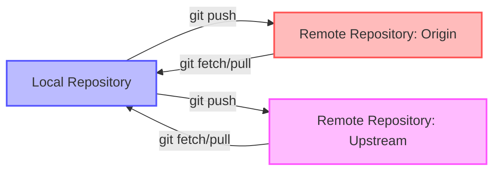

# Git Remote Viewing

## Introduction

When working with Git in collaborative environments, you'll often need to interact with remote repositories. Remote repositories are versions of your project hosted on the internet or network, allowing multiple developers to push and pull changes. Before making changes or resolving conflicts, it's essential to know how to view information about remote repositories connected to your local project.

This guide will walk you through various commands and techniques for viewing and inspecting remote repositories in Git.

## Prerequisites

Before diving into remote viewing commands, ensure you have:

- Git installed on your system
- A local Git repository initialized
- At least one remote repository connected to your local repository

If you haven't set up a remote yet, you can add one using:

```bash
git remote add origin https://github.com/username/repository.git
```

## Listing Remote Repositories

### Viewing All Remotes

To see a list of all remote repositories connected to your local repository:

```bash
git remote
```

**Output:**
```
origin
upstream
```

This command shows the shortnames of each remote handle you've specified.

### Viewing Remote URLs

To see the URLs associated with each remote:

```bash
git remote -v
```

**Output:**
```
origin  https://github.com/username/repository.git (fetch)
origin  https://github.com/username/repository.git (push)
upstream  https://github.com/original-owner/repository.git (fetch)
upstream  https://github.com/original-owner/repository.git (push)
```

The `-v` flag stands for "verbose" and shows both the URL for fetching data and the URL for pushing data for each remote.

## Inspecting a Specific Remote

For more detailed information about a specific remote:

```bash
git remote show [remote-name]
```

Example:

```bash
git remote show origin
```

**Output:**
```
* remote origin
  Fetch URL: https://github.com/username/repository.git
  Push  URL: https://github.com/username/repository.git
  HEAD branch: main
  Remote branches:
    main    tracked
    develop tracked
  Local branch configured for 'git pull':
    main merges with remote main
  Local ref configured for 'git push':
    main pushes to main (up to date)
```

This command shows:
- Fetch and push URLs
- The default branch (HEAD)
- All remote branches
- Mapping between local and remote branches for pull operations
- Mapping between local and remote branches for push operations

## Viewing Remote Branches

### Listing All Remote Branches

To see all branches on the remote repositories:

```bash
git branch -r
```

**Output:**
```
  origin/HEAD -> origin/main
  origin/main
  origin/develop
  origin/feature/login
  upstream/main
```

The `-r` flag stands for "remote" and shows branches that exist only on remote repositories.

### Listing All Branches (Local and Remote)

To see both local and remote branches:

```bash
git branch -a
```

**Output:**
```
* main
  feature/signup
  remotes/origin/HEAD -> origin/main
  remotes/origin/main
  remotes/origin/develop
  remotes/origin/feature/login
  remotes/upstream/main
```

The `-a` flag stands for "all" and shows both local and remote branches.

## Viewing Remote Commits

### Fetching Without Merging

To update your remote tracking branches without affecting your local branches:

```bash
git fetch [remote-name]
```

Example:

```bash
git fetch origin
```

This command downloads all changes from the remote but doesn't merge them into your local branches.

### Viewing Remote Branch Commits

After fetching, you can view commits on a remote branch:

```bash
git log origin/main
```

This shows the commit history of the remote main branch.

### Comparing Local and Remote Branches

To see differences between your local branch and its remote counterpart:

```bash
git diff main origin/main
```

This shows what changes would be merged if you pulled from the remote.

## Remote Repository Visualization

You can visualize the relationship between your local and remote repositories using a diagram:



## Practical Examples

### Scenario 1: Checking for New Work from Collaborators

Before starting your workday, it's good practice to check if there are any new changes on the remote:

```bash
# Update remote tracking branches
git fetch origin

# View new commits
git log HEAD..origin/main

# If there are changes you want to incorporate
git pull origin main
```

### Scenario 2: Fork Workflow - Staying Updated with Original Repository

When working with a forked repository, you'll want to keep your fork updated with the original:

```bash
# Add the original repository as "upstream"
git remote add upstream https://github.com/original-owner/repository.git

# Verify remotes
git remote -v

# Fetch changes from upstream
git fetch upstream

# View what's different
git log main..upstream/main

# Merge upstream changes into your main branch
git checkout main
git merge upstream/main
```

### Scenario 3: Checking Out Remote Branches

If you see an interesting branch on the remote that you want to explore:

```bash
# First, fetch all remote data
git fetch origin

# Create a local branch that tracks the remote branch
git checkout -b feature/login origin/feature/login

# Alternatively, use the shorthand
git checkout feature/login
```

## Common Issues and Solutions

### Remote Shows Outdated Information

If `git remote show origin` is displaying outdated information:

```bash
git remote update
git remote prune origin
```

This updates remote references and removes branches that no longer exist on the remote.

### Detached HEAD When Viewing Remote Branches

If you directly check out a remote branch reference, you'll end up in a "detached HEAD" state:

```bash
# Don't do this (leads to detached HEAD)
git checkout origin/main

# Do this instead (creates tracking branch)
git checkout -b main origin/main
# Or simply
git checkout main
```

## Summary

Remote viewing in Git allows you to inspect and interact with remote repositories efficiently. Key concepts covered include:

- Listing remote repositories and their URLs
- Inspecting specific remotes for detailed information
- Viewing remote branches and commits
- Comparing local branches with remote counterparts
- Practical workflows for various collaboration scenarios

By mastering these commands, you'll be better equipped to collaborate with other developers, stay updated with project changes, and manage your Git workflow more effectively.

## Additional Resources

- Try setting up a personal repository with multiple remotes to practice these commands
- Experiment with viewing and tracking changes across different branches
- Further reading:
  - Git official documentation on remotes
  - Learn about Git hooks for automating remote-related tasks
  - Explore GUI tools like GitKraken or SourceTree that visualize remote relationships

## Exercises

1. Create a local repository and add multiple remote repositories to it.
2. Fork a popular open-source project, add both your fork and the original as remotes, and practice viewing differences between them.
3. Set up a situation where local and remote branches have diverged, then use Git commands to view and understand the differences.
4. Practice fetching from a remote and reviewing changes before merging them.
5. Create and push a new branch to a remote, then view it using the commands learned in this guide.