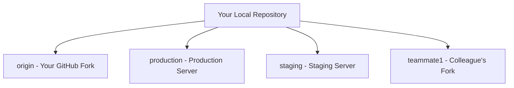

# Git Remote Renaming

## Introduction

When working with Git repositories, you often need to interact with remote repositories hosted on platforms like GitHub, GitLab, or Bitbucket. These remote connections are given names like `origin` by default, but as your project grows or your workflow changes, you might want to rename these remote references to something more descriptive or appropriate.

This guide will teach you how to rename Git remote repositories, why you might want to do this, and provide practical examples to help solidify your understanding.

## Why Rename a Remote?

There are several scenarios where renaming a remote makes sense:

- The default name (`origin`) doesn't describe the remote's purpose clearly
- You're working with multiple remotes and need more descriptive names
- The remote's purpose or location has changed
- You're setting up a more complex workflow involving multiple remote repositories

## Viewing Your Current Remotes

Before renaming a remote, you should first check what remotes you currently have configured. Use the `git remote` command:

```bash
git remote
```

This will display a list of your remote names. For a more detailed view including the URLs, add the `-v` (verbose) flag:

```bash
git remote -v
```

Example output:

```
origin  https://github.com/username/repository.git (fetch)
origin  https://github.com/username/repository.git (push)
```

## Renaming a Remote Repository

To rename a remote repository, use the `git remote rename` command with the following syntax:

```bash
git remote rename <old-name> <new-name>
```

### Step-by-Step Example

Let's say we have a remote called `origin` that we want to rename to `main-repo`:

1. First, check your current remotes:

```bash
git remote -v
```

Output:
```
origin  https://github.com/username/project.git (fetch)
origin  https://github.com/username/project.git (push)
```

2. Rename the remote:

```bash
git remote rename origin main-repo
```

3. Verify the change:

```bash
git remote -v
```

Output:
```
main-repo  https://github.com/username/project.git (fetch)
main-repo  https://github.com/username/project.git (push)
```

That's it! You've successfully renamed your remote.

## What Happens When You Rename a Remote?

When you rename a remote, Git updates:

1. All remote-tracking branch names
2. Your Git configuration file
3. Any references to the remote in your repository's config

For example, if you had a branch called `origin/master`, it would be renamed to `main-repo/master` automatically.

## Practical Examples

### Example 1: Organizing Multiple Remotes

When working on an open-source project, you might have your own fork and the original repository as remotes:

```bash
# Initial setup
git remote -v
```

Output:
```
origin  https://github.com/yourusername/project.git (fetch)
origin  https://github.com/yourusername/project.git (push)
upstream  https://github.com/original-owner/project.git (fetch)
upstream  https://github.com/original-owner/project.git (push)
```

Renaming for clarity:

```bash
git remote rename origin my-fork
git remote rename upstream official
```

Result:
```
my-fork  https://github.com/yourusername/project.git (fetch)
my-fork  https://github.com/yourusername/project.git (push)
official  https://github.com/original-owner/project.git (fetch)
official  https://github.com/original-owner/project.git (push)
```

### Example 2: Team Workflow

In a team environment, you might have remotes for different team members or environments:



You could rename these for better organization:

```bash
git remote rename origin personal
git remote rename production prod
git remote rename staging test
git remote rename teammate1 john
```

## Common Issues and Troubleshooting

### Error: Remote Name Already Exists

If you try to rename a remote to a name that already exists, Git will show an error:

```
error: remote test already exists.
```

Solution: Choose a different name or remove the existing remote first with `git remote remove <name>`.

### Error: Could Not Rename Config Section

This can happen if Git can't write to the config file:

```
error: Could not rename config section 'remote.origin' to 'remote.main-repo'
```

Solution: Check file permissions or if another process is using the Git config file.

## Integration with Git Workflows

Renaming remotes can be particularly useful when implementing Git workflows:

### GitHub Flow

When using GitHub Flow, you might rename remotes to better represent upstream relationships:

```bash
git remote rename origin upstream
git remote add origin https://github.com/yourusername/forked-repo.git
```

### GitLab Flow

In GitLab Flow with environment branches:

```bash
git remote rename origin gitlab
git remote add production https://gitlab.com/company/project.git
```

## Summary

Renaming Git remotes allows you to better organize your repository connections and create more intuitive workflows. The process is simple:

1. View your current remotes with `git remote -v`
2. Rename a remote with `git remote rename <old-name> <new-name>`
3. Verify the change with `git remote -v` again

This small change can significantly improve the clarity of your Git workflow, especially when working with multiple remotes in collaborative projects.

## Additional Resources

- [Git Official Documentation on Remotes](https://git-scm.com/book/en/v2/Git-Basics-Working-with-Remotes)
- [GitHub Docs on Managing Remotes](https://docs.github.com/en/get-started/getting-started-with-git/managing-remote-repositories)

## Practice Exercises

1. Create a new Git repository, add a remote named `origin`, and then rename it to `github`.
2. Set up a repository with multiple remotes representing different environments (development, staging, production) with appropriate names.
3. Clone an open-source project, add your fork as a remote, and organize the remotes with descriptive names.