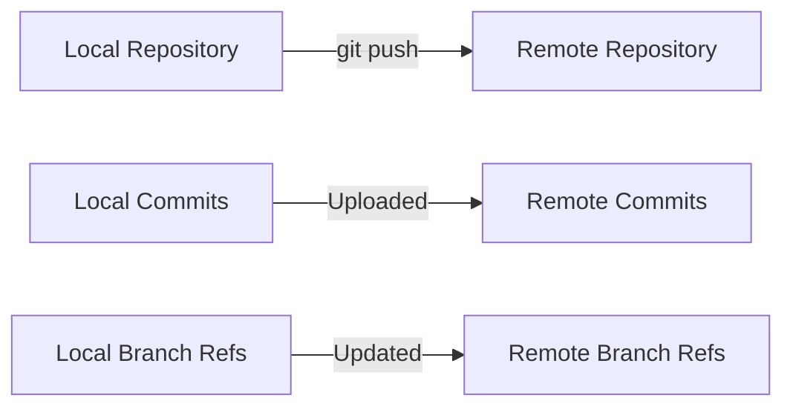

# Git Remote Pushing

## Introduction

After you've made changes to your local Git repository, you'll want to share those changes with your team or simply back them up to a remote location. This is where the `git push` command comes into play. Pushing is the process of uploading your local repository content to a remote repository.

In this tutorial, we'll explore how to push your changes to remote repositories, understand the different options available with the `git push` command, and learn how to handle common scenarios and issues.

## Prerequisites

Before diving into pushing to remote repositories, make sure you have:

- Git installed on your computer
- A local Git repository with commits
- A remote repository configured (on GitHub, GitLab, Bitbucket, etc.)
- Basic understanding of Git commits and branches

## Understanding Git Push

The `git push` command is used to upload local repository content to a remote repository. It transfers commits from your local repository to the remote repository.

Here's the basic syntax:

```bash
git push <remote> <branch>
```

Where:
- `<remote>` is the name of the remote repository (often "origin")
- `<branch>` is the name of the branch you want to push (e.g., "main" or "master")

## Basic Push Operation

Let's walk through a simple push operation step by step:

### 1. Check your remote repositories

First, verify that you have a remote repository configured:

```bash
git remote -v
```

Example output:
```
origin  https://github.com/username/repository.git (fetch)
origin  https://github.com/username/repository.git (push)
```

If you don't see any remotes, you'll need to add one:

```bash
git remote add origin https://github.com/username/repository.git
```

### 2. Push your changes

To push your local changes to the remote repository:

```bash
git push origin main
```

Example output:
```
Enumerating objects: 5, done.
Counting objects: 100% (5/5), done.
Delta compression using up to 8 threads
Compressing objects: 100% (3/3), done.
Writing objects: 100% (3/3), 289 bytes | 289.00 KiB/s, done.
Total 3 (delta 2), reused 0 (delta 0), pack-reused 0
remote: Resolving deltas: 100% (2/2), completed with 2 local objects.
To https://github.com/username/repository.git
   a1b2c3d..e4f5g6h  main -> main
```

This pushes your local "main" branch to the "main" branch on the remote repository named "origin".

## Push Options and Variations

### Pushing all branches

To push all branches to the remote repository:

```bash
git push --all origin
```

### Setting up upstream tracking

When you push a branch for the first time, you may want to set up tracking so that Git remembers which remote branch corresponds to your local branch:

```bash
git push -u origin feature-branch
```

With the `-u` (or `--set-upstream`) option, future pushes and pulls on this branch can be done without specifying the remote and branch names.

### Force push

Sometimes you may need to overwrite the remote branch with your local branch:

```bash
git push --force origin main
```

⚠️ **Warning**: Force pushing can cause problems for other team members as it rewrites the remote history. Use it with caution and only when necessary.

A safer alternative is to use `--force-with-lease`, which checks if the remote branch has been updated before force pushing:

```bash
git push --force-with-lease origin main
```

### Pushing tags

By default, `git push` doesn't transfer tags. To push tags to the remote repository:

```bash
# Push a specific tag
git push origin v1.0.0

# Push all tags
git push origin --tags
```

## Understanding the Push Process

Let's visualize what happens during a push operation:



When you push, Git:

1. Checks which commits exist in your local branch but not in the remote branch
2. Sends those commits to the remote repository
3. Updates the remote branch reference to point to the latest commit

## Common Push Scenarios

### Pushing a new branch

If you've created a new branch locally and want to push it to the remote:

```bash
git push -u origin feature-branch
```

Example output:
```
Total 0 (delta 0), reused 0 (delta 0), pack-reused 0
remote: 
remote: Create a pull request for 'feature-branch' on GitHub by visiting:
remote:      https://github.com/username/repository/pull/new/feature-branch
remote: 
To https://github.com/username/repository.git
 * [new branch]      feature-branch -> feature-branch
Branch 'feature-branch' set up to track remote branch 'feature-branch' from 'origin'.
```

### Pushing after rebasing

If you've rebased your local branch, you'll need to force push to update the remote branch:

```bash
git push --force-with-lease origin feature-branch
```

### Pushing to a different remote branch

You can push your local branch to a differently named remote branch:

```bash
git push origin local-branch:remote-branch
```

## Handling Push Errors

### Rejected pushes

If someone else has pushed changes to the same branch, your push might be rejected:

```
! [rejected]        main -> main (fetch first)
error: failed to push some refs to 'https://github.com/username/repository.git'
hint: Updates were rejected because the remote contains work that you do
hint: not have locally. This is usually caused by another repository pushing
hint: to the same ref. You may want to first integrate the remote changes
hint: (e.g., 'git pull ...') before pushing again.
hint: See the 'Note about fast-forwards' in 'git push --help' for details.
```

To resolve this:

1. Pull the remote changes first:
   ```bash
   git pull origin main
   ```

2. Resolve any merge conflicts if they occur

3. Push again:
   ```bash
   git push origin main
   ```

### Non-fast-forward errors

This happens when your local history has diverged from the remote history:

```
error: failed to push some refs to 'https://github.com/username/repository.git'
hint: Updates were rejected because the tip of your current branch is behind
hint: its remote counterpart. Integrate the remote changes (e.g.
hint: 'git pull ...') before pushing again.
hint: See the 'Note about fast-forwards' in 'git push --help' for details.
```

You can resolve this by:

1. Pulling with rebase:
   ```bash
   git pull --rebase origin main
   ```

2. Resolving any conflicts

3. Pushing again:
   ```bash
   git push origin main
   ```

## Best Practices for Pushing

1. **Pull before you push**: Always sync with the remote repository before pushing to avoid conflicts.

2. **Push small, logical changes**: Frequent small pushes are easier to review and less likely to cause conflicts.

3. **Write meaningful commit messages**: This helps your team understand what changes you've pushed.

4. **Use branches for features and fixes**: This keeps the main branch stable and makes collaboration smoother.

5. **Avoid force pushing to shared branches**: Force pushing rewrites history and can cause problems for others.

6. **Push to feature branches first**: Don't push directly to main/master in collaborative projects. Use pull/merge requests instead.

## Real-World Examples

### Example 1: Contributing to an open-source project

```bash
# Clone the repository
git clone https://github.com/open-source/project.git
cd project

# Create a feature branch
git checkout -b fix-login-bug

# Make changes and commit
git add .
git commit -m "Fix login authentication issue"

# Push to your fork (assuming you've added your fork as 'origin')
git push -u origin fix-login-bug

# Now you can create a pull request from your fork on GitHub/GitLab/etc.
```

### Example 2: Pushing to a deployment branch

Many teams use specific branches for deployment:

```bash
# Make sure you're on the staging branch
git checkout staging

# Merge the feature that's ready for deployment
git merge feature-user-profile

# Push to trigger the deployment
git push origin staging
```

### Example 3: Pushing multiple branches

```bash
# Push two specific branches
git push origin main develop

# Push all local branches
git push --all origin
```

## Troubleshooting Common Issues

### Authentication issues

If you see an authentication error:

```
remote: Invalid username or password.
fatal: Authentication failed for 'https://github.com/username/repository.git/'
```

Solutions:
- Check that your credentials are correct
- Use SSH keys instead of HTTPS
- Use a credential helper to store your credentials:
  ```bash
  git config --global credential.helper cache
  ```

### Large file issues

If your push is rejected because of large files:

```
remote: error: File large_file.zip is 150.00 MB; this exceeds GitHub's file size limit of 100.00 MB
remote: error: GH001: Large files detected.
```

Solutions:
- Remove the large file and commit the removal:
  ```bash
  git rm --cached large_file.zip
  git commit -m "Remove large file"
  ```
- Consider using Git LFS (Large File Storage) for large files

## Summary

In this tutorial, you've learned:

- How to push your local changes to a remote repository
- Different options and variations of the `git push` command
- How to set up tracking between local and remote branches
- Common scenarios and best practices for pushing
- How to troubleshoot push errors

Pushing is a fundamental Git operation that enables collaboration and sharing of code. By understanding how to push effectively, you're now better equipped to work with remote repositories and contribute to team projects.

## Practice Exercises

1. Create a new local repository, add a remote, and push your first commit.
2. Create a new branch, make changes, and push it to the remote repository.
3. Make changes to your local repository, pull changes from the remote, and then push your changes.
4. Try pushing to a different remote branch name than your local branch.
5. Simulate a rejected push by having a teammate push to the same branch, then resolve the conflict.

## Additional Resources

- [Git documentation on push](https://git-scm.com/docs/git-push)
- [GitHub documentation on pushing to a remote](https://docs.github.com/en/get-started/using-git/pushing-commits-to-a-remote-repository)
- [Pro Git Book - Chapter on Git Remotes](https://git-scm.com/book/en/v2/Git-Basics-Working-with-Remotes)