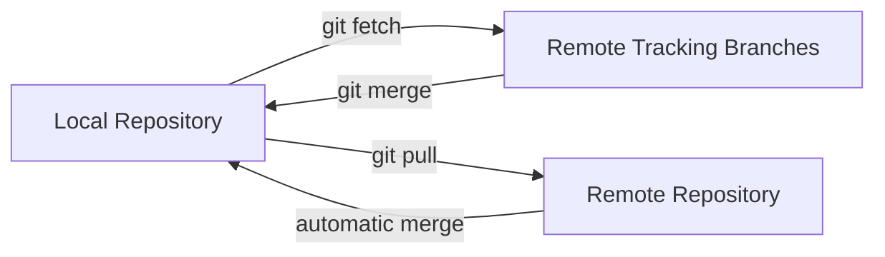
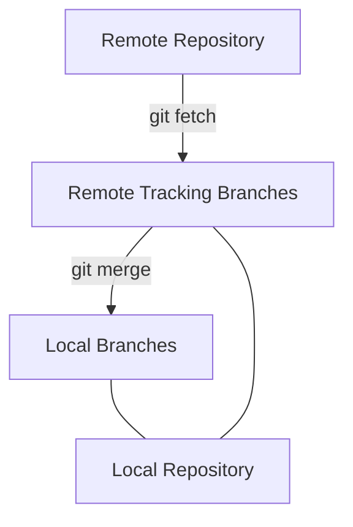

# Git Remote Fetching

## Introduction

When working with Git in collaborative environments, you'll often need to retrieve changes from remote repositories. While `git pull` is commonly used, it automatically merges changes into your local branch. This is where `git fetch` comes in - a more cautious approach that retrieves remote changes without automatically merging them, giving you the opportunity to review changes before integration.

In this tutorial, we'll explore how to use `git fetch` effectively and understand why it's an essential part of a robust Git workflow.

## Understanding Git Fetch vs Pull

Before diving into fetch commands, let's clarify the difference between `fetch` and `pull`:

| Git Fetch | Git Pull |
|-----------|----------|
| Downloads remote content but doesn't modify your working directory | Downloads remote content AND automatically merges it into your current working branch |
| Safe operation that never changes your local development work | Combination of `git fetch` followed by `git merge` |
| Lets you review changes before merging | More direct but potentially disruptive if there are conflicts |



## Basic Git Fetch Commands

### Fetching from a Remote Repository

The most basic form of the fetch command:

```bash
git fetch origin
```

This command will:
1. Connect to the remote repository named "origin"
2. Download all branches and their commits
3. Update your remote tracking branches (like `origin/main`) but not your local branches

### Checking What Was Fetched

After fetching, you can see what changes were retrieved:

```bash
git log --oneline HEAD..origin/main
```

This shows all commits that exist in the remote `main` branch that aren't in your current branch.

### Example Output:

```
$ git fetch origin
remote: Enumerating objects: 73, done.
remote: Counting objects: 100% (73/73), done.
remote: Compressing objects: 100% (38/38), done.
remote: Total 73 (delta 35), reused 70 (delta 32), pack-reused 0
Unpacking objects: 100% (73/73), 14.08 KiB | 1.76 MiB/s, done.
From https://github.com/username/repository
   a7d9222..b3d92c5  main       -> origin/main
   f9c0cbd..2b89cd0  feature-x  -> origin/feature-x
 * [new branch]      feature-y  -> origin/feature-y
```

## Advanced Fetch Options

### Fetching a Specific Branch

If you only want to fetch a specific branch from the remote:

```bash
git fetch origin feature-branch
```

### Fetching from All Remotes

If your project has multiple remotes, you can fetch from all of them:

```bash
git fetch --all
```

### Prune Option: Cleaning Up Remote Branches

When branches are deleted on the remote, they aren't automatically removed from your remote tracking branches. To clean these up:

```bash
git fetch --prune
```

Or the shorter version:

```bash
git fetch -p
```

This removes remote tracking branches that no longer exist on the remote.

## Practical Workflow Examples

### Scenario 1: Reviewing Changes Before Merging

A common workflow when collaborating:

```bash
# Fetch the latest changes
git fetch origin

# See what's changed
git log --oneline main..origin/main

# If you want to see the actual code changes
git diff main origin/main

# If you're happy with the changes, merge them
git merge origin/main
```

### Scenario 2: Updating a Feature Branch with Main Changes

When you need to update your feature branch with the latest changes from main:

```bash
# Make sure you're on your feature branch
git checkout feature-branch

# Fetch all changes from remote
git fetch origin

# Merge main branch into your feature branch
git merge origin/main
```

### Scenario 3: Checking a Teammate's Work in Progress

If you want to check out a branch your colleague is working on:

```bash
# Fetch all changes including your colleague's branch
git fetch origin

# Create a local branch based on their remote branch
git checkout -b review-feature origin/colleague-feature

# Now you can review their code without affecting their work
```

## Understanding Remote Tracking Branches

When you fetch from a remote, Git updates "remote tracking branches" which represent the state of the remote repository. These branches have names like `origin/main` or `origin/feature-x`.

Remote tracking branches are references to the state of branches on the remote. After fetching, your remote tracking branches are updated, but your local branches remain unchanged.



## Common Issues and Solutions

### "Cannot Lock Ref" Errors

Sometimes, you might see errors like:

```
error: cannot lock ref 'refs/remotes/origin/main': is at a123456 but expected b789012
```

This usually means you have a conflict in your remote tracking branch. You can fix it with:

```bash
git remote update --prune
```

### Merge Conflicts After Fetch and Merge

If you fetch and then merge, you might encounter merge conflicts:

```bash
git fetch origin
git merge origin/main
# CONFLICT (content): Merge conflict in src/file.js
```

In this case, you'll need to resolve the conflicts manually:

1. Open the conflicted files and look for the conflict markers (`<<<<<<<`, `=======`, `>>>>>>>`)
2. Edit the files to resolve the conflicts
3. Save the files
4. Stage the resolved files with `git add <filename>`
5. Complete the merge with `git merge --continue`

## Summary

`git fetch` is a powerful command that allows you to:

1. Download changes from remote repositories without automatically merging them
2. Review changes before integrating them into your work
3. Keep your local repository up-to-date with remote changes in a controlled manner
4. Maintain a clean and efficient workflow in collaborative projects

By understanding and utilizing `git fetch` effectively, you'll have greater control over your Git workflow and minimize the risk of unexpected conflicts when collaborating with others.

## Additional Resources

- Try the interactive exercise below to practice using `git fetch`
- Explore related Git concepts like rebasing, which offers an alternative to merging fetched changes
- Learn about more advanced Git workflows like Gitflow or GitHub Flow

## Practice Exercise

Set up a small Git repository locally and add a remote:

```bash
# Create a new repo
mkdir fetch-practice
cd fetch-practice
git init

# Create and commit a file
echo "# Fetch Practice" > README.md
git add README.md
git commit -m "Initial commit"

# Set up a remote
# (you would need a GitHub/GitLab/etc. repository for this)
git remote add origin https://github.com/yourusername/fetch-practice.git
git push -u origin main
```

Then, on another computer (or folder):

```bash
# Clone the repository
git clone https://github.com/yourusername/fetch-practice.git fetch-practice-clone
cd fetch-practice-clone

# Create a new branch and make changes
git checkout -b feature-branch
echo "New content" > feature.txt
git add feature.txt
git commit -m "Add feature"
git push -u origin feature-branch
```

Finally, back in your original repository:

```bash
# Fetch the new branch
git fetch origin

# See the new branch
git branch -r

# Check out the branch to review it
git checkout -b review-feature origin/feature-branch
```

This exercise will help you understand how `git fetch` enables collaborative workflows by letting you retrieve and review changes from remote repositories.