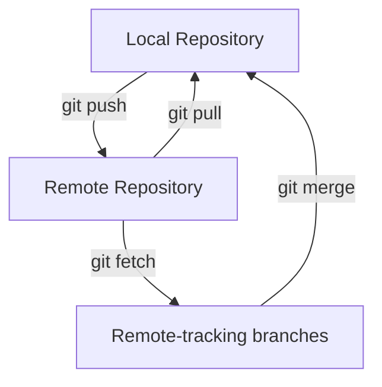

# Git Remote Tracking

## Introduction

When working with Git in a collaborative environment, understanding how Git tracks and manages remote repositories becomes essential. **Remote tracking** is a core concept in Git that allows you to monitor and synchronize your work with changes made by other developers on remote repositories.

In this guide, you'll learn how Git keeps track of remote branches, what tracking branches are, and how to effectively manage the relationship between your local and remote repositories.

## What is Remote Tracking?

Remote tracking in Git refers to the mechanism Git uses to maintain a connection between your local branches and their corresponding branches on remote repositories. This connection allows Git to:

- Know when your local branch is ahead (has commits the remote doesn't) or behind (remote has commits you don't)
- Enable simpler `git pull` and `git push` commands without specifying the remote and branch each time
- Show you information about remote changes without requiring an internet connection

Let's explore how this works in practice.

## Remote Tracking Branches

When you clone a repository, Git automatically creates special branches called **remote-tracking branches**. These branches represent the state of the branches on the remote repository at the time of your last fetch or pull.

Remote-tracking branches follow the naming convention `<remote-name>/<branch-name>`, such as `origin/main` or `upstream/develop`.

### Viewing Remote Tracking Branches

You can view all your remote-tracking branches using:

```bash
git branch -r
```

To see both local and remote-tracking branches:

```bash
git branch -a
```

Example output:

```
* main
  feature/login

  remotes/origin/HEAD -> origin/main
  remotes/origin/main
  remotes/origin/feature/login
  remotes/origin/develop
```

## Setting Up Tracking Relationships

There are several ways to establish tracking relationships between local and remote branches:

### 1. Automatic Tracking on Clone

When you clone a repository, Git automatically:

- Creates remote-tracking branches for each branch on the remote
- Sets up your local `main` branch to track `origin/main`

### 2. Creating a New Tracking Branch

To create a new local branch that tracks a remote branch:

```bash
git checkout -b feature-branch origin/feature-branch
```

Or using the newer syntax:

```bash
git switch -c feature-branch origin/feature-branch
```

### 3. Setting Up Tracking for an Existing Branch

If you already have a local branch and want it to track a remote branch:

```bash
git branch -u origin/feature-branch
# or
git branch --set-upstream-to=origin/feature-branch
```

Example:

```bash
$ git branch -u origin/feature-branch
Branch 'feature-branch' set up to track remote branch 'feature-branch' from 'origin'.
```

### 4. Automatic Tracking on Push

When pushing a new local branch to a remote for the first time, use the `-u` (or `--set-upstream`) flag to automatically set up tracking:

```bash
git push -u origin feature-branch
```

This pushes your local `feature-branch` to the remote `origin` and sets up tracking.

## How Git Stores Tracking Information

Git stores the tracking information in your Git configuration file. You can view this information using:

```bash
git config -l | grep branch
```

You might see something like:

```
branch.main.remote=origin
branch.main.merge=refs/heads/main
branch.feature-branch.remote=origin
branch.feature-branch.merge=refs/heads/feature-branch
```

This configuration tells Git which remote branches your local branches are tracking.

## Working with Remote Tracking Branches

Let's explore some common operations involving remote tracking:

### Checking Branch Status

To see how your branch relates to its tracked remote branch:

```bash
git status
```

Example output:

```
On branch main
Your branch is ahead of 'origin/main' by 2 commits.
  (use "git push" to publish your local commits)

nothing to commit, working tree clean
```

### Viewing Detailed Comparison

For more detailed information about how your branch differs from its tracked remote branch:

```bash
git log --oneline origin/main..main
```

This shows commits that exist in your local `main` branch but not in `origin/main`.

### Updating Remote Tracking Branches

Remote-tracking branches are updated when you perform a `git fetch`, `git pull`, or `git push` operation:

```bash
git fetch origin
```

This updates all your remote-tracking branches to match the current state of the remote repository, without changing your working directory.



## Practical Examples

Let's walk through some common scenarios to solidify your understanding:

### Example 1: Collaborating on a Feature

Imagine you and a colleague are working on a feature branch. Here's how to use remote tracking:

```bash
# Create a new branch for the feature
git switch -c login-feature

# Make changes and commit them
git add .
git commit -m "Add login form"

# Push your branch and set up tracking
git push -u origin login-feature

# Later, fetch updates from your colleague
git fetch origin

# See what changed
git log login-feature..origin/login-feature

# Merge the changes
git merge origin/login-feature
```

### Example 2: Keeping a Fork in Sync

When working with a forked repository, you typically have two remotes: `origin` (your fork) and `upstream` (the original repository):

```bash
# Add the original repository as a remote
git remote add upstream https://github.com/original/repo.git

# Fetch changes from the original repository
git fetch upstream

# Make sure you're on your main branch
git switch main

# Merge changes from the original repository's main branch
git merge upstream/main

# Push the updated main to your fork
git push origin main
```

## Common Issues and Solutions

### Divergent Branches

If your local branch and its remote counterpart have diverged (both have unique commits):

```bash
$ git status
On branch main
Your branch and 'origin/main' have diverged,
and have 2 and 3 different commits each.
  (use "git pull" to merge the remote branch into yours)
```

You have several options:

1. **Merge the changes**:
   ```bash
   git pull
   ```

2. **Rebase your changes**:
   ```bash
   git pull --rebase
   ```

3. **Compare the differences before deciding**:
   ```bash
   git log --oneline --graph --decorate --all
   ```

### Untracked Branch

If you see a message like:

```
There is no tracking information for the current branch.
```

You can set up tracking:

```bash
git branch --set-upstream-to=origin/branch-name
```

## Summary

Remote tracking is a fundamental Git concept that enables effective collaboration by maintaining connections between local and remote branches. Key points to remember:

- Remote-tracking branches (like `origin/main`) represent the state of the remote repository at the time of your last fetch
- Tracking relationships allow Git to show you how your branch relates to its remote counterpart
- You can establish tracking when creating a branch, on push with `-u`, or after the fact with `--set-upstream-to`
- Commands like `git fetch` update your remote-tracking branches without affecting your working directory
- Use `git status` and `git log` to see how your branch relates to its remote tracking branch

By understanding remote tracking, you can collaborate more effectively with others and maintain better synchronization between your local work and shared repositories.

## Practice Exercises

1. Create a new repository on GitHub, clone it, and observe the remote-tracking branches that are created
2. Create a new branch locally, make changes, and push it with tracking enabled
3. Have a friend or colleague make changes to the remote branch, then practice fetching and viewing those changes
4. Try working with multiple remotes by forking a popular open-source repository and adding both your fork and the original as remotes