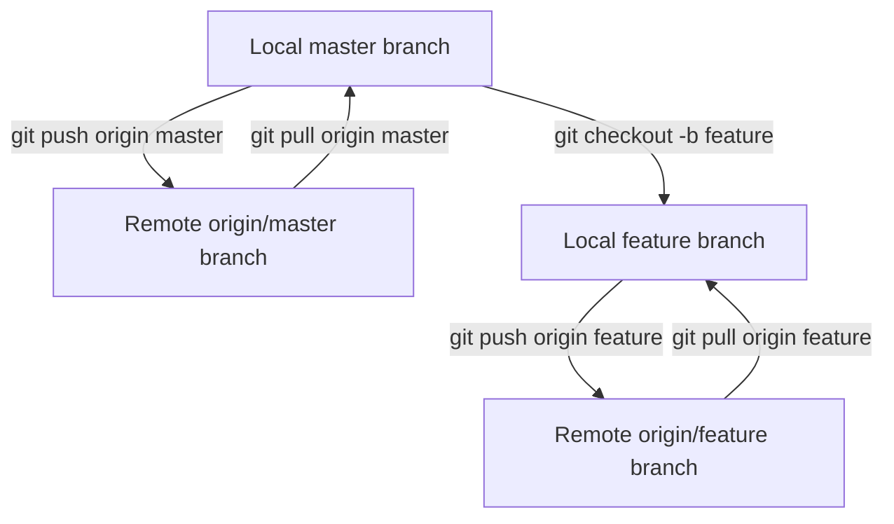

# Git Origin Master

## Introduction

If you've been using Git for a while, you've likely encountered commands like `git push origin master` or `git pull origin master`. These commands are fundamental to working with remote repositories in Git, but what exactly do "origin" and "master" mean? In this tutorial, we'll demystify these terms and understand how they form the foundation of Git's remote repository system.

## Understanding "Origin"

In Git, "origin" is simply a shorthand name or alias for the remote repository URL. When you clone a repository, Git automatically creates a remote connection called "origin" that points to the repository you cloned from.

### What is a Remote?

A remote in Git is a common repository that all team members use to exchange their changes. In most cases, it's stored on a code hosting service like GitHub, GitLab, or Bitbucket, or on an internal server in your organization.

### Viewing Your Remotes

To see what remote servers you have configured, you can run the `git remote` command. If you've cloned your repository, you should at least see "origin":

```bash
$ git remote
origin
```

For more detailed information, including the URLs that Git has stored for each remote, add the `-v` (verbose) option:

```bash
$ git remote -v
origin  https://github.com/username/repository.git (fetch)
origin  https://github.com/username/repository.git (push)
```

This output shows that the remote "origin" is set to the URL of your repository on GitHub.

### Adding a Remote

If you've started a new Git repository locally, you'll need to add a remote manually. This is done with the `git remote add` command:

```bash
$ git remote add origin https://github.com/username/repository.git
```

This command associates the name "origin" with the remote URL. While "origin" is the conventional name for your primary remote repository, you could name it anything:

```bash
$ git remote add github https://github.com/username/repository.git
```

Now, instead of `git push origin master`, you would use `git push github master`.

## Understanding "Master"

"Master" refers to the default branch name in Git. When you initialize a new Git repository, the default branch is typically named "master" (though this is changing in newer versions of Git to use "main" instead).

### What is a Branch?

A branch in Git is a lightweight movable pointer to a commit. The default branch that is created when you initialize a Git repository is called "master" (or "main" in newer versions).

### Viewing Your Branches

To see all branches in your repository, use:

```bash
$ git branch
* master
```

The asterisk indicates the branch you currently have checked out.

To see all branches, including remote branches, use:

```bash
$ git branch -a
* master
  remotes/origin/master
  remotes/origin/feature-x
```

### Creating and Switching Branches

To create a new branch, use:

```bash
$ git branch new-feature
```

To switch to that branch, use:

```bash
$ git checkout new-feature
```

Or, in newer versions of Git, you can create and switch to a branch in one command:

```bash
$ git checkout -b new-feature
```

## Putting It Together: "Origin Master"

When you see commands like `git push origin master`, here's what each part means:

- `git push`: The Git command to upload local repository content to a remote repository.
- `origin`: The name of the remote repository (which is typically a URL).
- `master`: The name of the branch you're pushing to on the remote repository.

So, `git push origin master` means "Push my local changes to the master branch on the remote repository named origin."

## Common Operations with Origin and Master

### Cloning a Repository

When you clone a repository, Git automatically sets up "origin" for you:

```bash
$ git clone https://github.com/username/repository.git
```

### Pushing Changes

To push your local changes to the remote repository:

```bash
$ git push origin master
```

If you're working on a different branch, replace "master" with your branch name:

```bash
$ git push origin feature-branch
```

### Pulling Changes

To fetch and integrate changes from the remote repository:

```bash
$ git pull origin master
```

This is actually a combination of two commands: `git fetch origin` followed by `git merge origin/master`.

### Fetching Changes

To download objects and refs from the remote repository without merging:

```bash
$ git fetch origin
```

### Setting Up Tracking

You can set up your local branch to track a remote branch, which simplifies pushing and pulling:

```bash
$ git branch --set-upstream-to=origin/master master
```

After this, you can simply use `git pull` and `git push` without specifying the remote and branch.

## Real-World Workflow Example

Let's walk through a common Git workflow involving "origin" and "master":

1. Clone the repository:

```bash
$ git clone https://github.com/username/project.git
$ cd project
```

2. Create a new branch for a feature:

```bash
$ git checkout -b feature-login
```

3. Make changes and commit them:

```bash
$ echo "// New login code" > login.js
$ git add login.js
$ git commit -m "Add login functionality"
```

4. Push the new branch to the remote repository:

```bash
$ git push origin feature-login
```

5. After code review, merge the feature branch into master:

```bash
$ git checkout master
$ git pull origin master  # Ensure master is up-to-date
$ git merge feature-login
$ git push origin master  # Push the merged changes
```

## Visual Representation of Remote Branches

Here's a visual representation of how local and remote branches relate:



## The Shift from "Master" to "Main"

It's worth noting that the Git community, along with major platforms like GitHub, GitLab, and Bitbucket, has been moving away from using "master" as the default branch name, preferring "main" instead. This change is part of an industry-wide effort to use more inclusive language.

When working with newer repositories, you might see commands like `git push origin main` instead of `git push origin master`.

To rename your default branch from "master" to "main", you can use:

```bash
# Rename the local branch
$ git branch -m master main

# Push the new branch and set remote tracking
$ git push -u origin main

# If you want to delete the old master branch on the remote
$ git push origin --delete master
```

## Summary

Understanding "origin" and "master" in Git is fundamental to working effectively with remote repositories:

- "origin" is just a conventional name for the remote repository URL.
- "master" (or increasingly "main") is the name of the default branch.
- Commands like `git push origin master` tell Git to push your local changes to the master branch on the remote repository named origin.

These concepts form the foundation of collaborative development with Git, allowing multiple developers to work together on the same codebase efficiently.

## Additional Resources and Exercises

### Resources

- [Git Documentation on Remotes](https://git-scm.com/book/en/v2/Git-Basics-Working-with-Remotes)
- [Git Branching - Remote Branches](https://git-scm.com/book/en/v2/Git-Branching-Remote-Branches)

### Exercises

1. **Set up a new remote repository:**
   - Create a new repository on GitHub or another Git hosting service
   - Initialize a local Git repository
   - Add the remote repository as "origin"
   - Make some changes, commit them, and push to the remote

2. **Work with multiple remotes:**
   - Add a second remote to your repository (perhaps call it "backup" or "upstream")
   - Push your changes to both remotes
   - Practice fetching and pulling from different remotes

3. **Branch management:**
   - Create a new branch locally
   - Push the branch to origin
   - Make changes on the branch and push them
   - Create a pull request (on GitHub or similar platform) to merge your branch into master/main
   - After the pull request is merged, pull the updated master/main branch

By mastering these concepts and practicing these exercises, you'll build a solid foundation for collaborative development with Git and remote repositories.