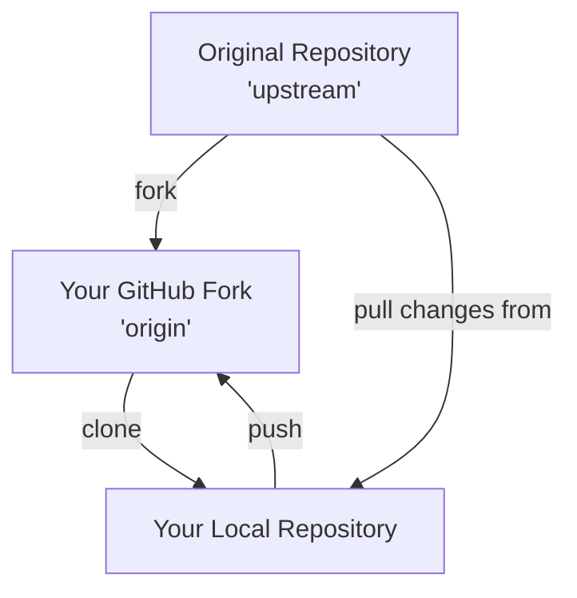

# Git Upstream Configuration

## Introduction

When working with Git in collaborative environments, you'll often need to interact with multiple remote repositories. One of the most important concepts to understand is **upstream configuration**, which enables you to keep your local or forked repository synchronized with the original source repository.

Upstream configuration is especially important when you're contributing to open source projects or working in a team where multiple developers contribute to the same codebase.

## What is an Upstream Repository?

An upstream repository is simply the original repository from which you forked or cloned your local copy. It's typically the central repository where all contributors push their changes.

Here's a typical workflow diagram:



In this diagram:
- **Upstream**: The original repository (often on GitHub, GitLab, etc.)
- **Origin**: Your fork of the repository on your GitHub account
- **Local**: Your clone of the repository on your local machine

## Setting Up an Upstream Remote

When you clone a repository directly, Git automatically sets up a remote called `origin` pointing to the repository you cloned from. However, when you fork a repository and then clone your fork, you need to manually set up a connection to the original repository (the upstream).

### Step 1: Check Current Remotes

First, let's check what remotes are currently configured:

```bash
git remote -v
```

This will output something like:

```
origin  https://github.com/YOUR-USERNAME/REPOSITORY-NAME.git (fetch)
origin  https://github.com/YOUR-USERNAME/REPOSITORY-NAME.git (push)
```

### Step 2: Add Upstream Remote

To add the original repository as an upstream remote:

```bash
git remote add upstream https://github.com/ORIGINAL-OWNER/REPOSITORY-NAME.git
```

### Step 3: Verify the New Remote

Check that the upstream remote has been added correctly:

```bash
git remote -v
```

You should now see both remotes:

```
origin    https://github.com/YOUR-USERNAME/REPOSITORY-NAME.git (fetch)
origin    https://github.com/YOUR-USERNAME/REPOSITORY-NAME.git (push)
upstream  https://github.com/ORIGINAL-OWNER/REPOSITORY-NAME.git (fetch)
upstream  https://github.com/ORIGINAL-OWNER/REPOSITORY-NAME.git (push)
```

## Fetching from Upstream

To get the latest changes from the upstream repository without merging them:

```bash
git fetch upstream
```

This downloads objects and refs from the upstream repository into your local repository without modifying your working directory.

## Syncing Your Fork with Upstream

### Pulling Changes from Upstream

To update your local branch with changes from the upstream repository:

1. Make sure you're on the branch you want to update:

```bash
git checkout main
```

2. Pull the changes from the upstream:

```bash
git pull upstream main
```

This will fetch and merge changes from the upstream's main branch into your current branch.

### Pushing Updated Branch to Your Fork

After syncing with upstream, you'll want to update your fork on GitHub (or other remote service):

```bash
git push origin main
```

## Practical Example: Contributing to an Open Source Project

Let's walk through a complete workflow for contributing to an open source project:

### 1. Fork the Repository

First, fork the repository on GitHub by clicking the "Fork" button on the original repository's page.

### 2. Clone Your Fork

```bash
git clone https://github.com/YOUR-USERNAME/REPOSITORY-NAME.git
cd REPOSITORY-NAME
```

### 3. Add Upstream

```bash
git remote add upstream https://github.com/ORIGINAL-OWNER/REPOSITORY-NAME.git
```

### 4. Create a Feature Branch

Always create a new branch for your changes:

```bash
git checkout -b feature-branch-name
```

### 5. Make Your Changes

Make the necessary changes to the code.

### 6. Commit Your Changes

```bash
git add .
git commit -m "Brief description of your changes"
```

### 7. Sync with Upstream Before Pushing

```bash
git checkout main
git pull upstream main
git checkout feature-branch-name
git rebase main
```

This ensures your feature branch includes the latest changes from the upstream repository.

### 8. Push to Your Fork

```bash
git push origin feature-branch-name
```

### 9. Create a Pull Request

Go to the original repository on GitHub and create a pull request from your feature branch.

## Common Upstream Operations

### Checking the Status of Upstream

To see how your local branch differs from the upstream:

```bash
git fetch upstream
git diff upstream/main
```

### Resetting to Match Upstream

If you want to completely sync your local branch with the upstream, discarding any local commits:

```bash
git fetch upstream
git checkout main
git reset --hard upstream/main
git push origin main --force
```

⚠️ **Warning**: This will overwrite your local changes and force-push to your fork, which can be destructive. Use with caution!

### Viewing Upstream History

To view the commit history of the upstream repository:

```bash
git fetch upstream
git log upstream/main
```

## Configuring Upstream for Tracking

You can configure your local branch to automatically track the upstream branch:

```bash
git branch --set-upstream-to=upstream/main main
```

With this configuration, you can simply use `git pull` and `git push` without specifying the remote and branch names.

## Troubleshooting Upstream Issues

### Dealing with Merge Conflicts

When syncing with upstream, you might encounter merge conflicts:

```bash
git pull upstream main
# If conflicts occur:
# Fix conflicts in your editor
git add .
git commit -m "Resolve merge conflicts"
```

### Undoing an Upstream Pull

If you've pulled from upstream and need to undo it:

```bash
git reflog
# Find the commit hash before the pull
git reset --hard COMMIT_HASH
```

## Summary

Configuring and working with upstream repositories is an essential skill for collaborative development with Git. It allows you to:

1. Keep your fork synchronized with the original repository
2. Contribute changes back to the original project
3. Incorporate updates from the main project into your fork
4. Manage multiple remote repositories effectively

By understanding these concepts and commands, you'll be well-equipped to collaborate on open source projects and work in team environments.

## Practice Exercises

1. Fork a popular open source repository, set up an upstream, and practice syncing your fork.
2. Create a feature branch, make some changes, sync with upstream, and create a pull request.
3. Try to resolve a merge conflict that occurs when syncing with upstream.
4. Configure your local branch to track the upstream branch and test the simplified pull/push commands.

## Additional Resources

- [GitHub Documentation on Syncing a Fork](https://docs.github.com/en/github/collaborating-with-issues-and-pull-requests/syncing-a-fork)
- [Pro Git Book: Working with Remotes](https://git-scm.com/book/en/v2/Git-Basics-Working-with-Remotes)
- [Atlassian Git Tutorial: Syncing](https://www.atlassian.com/git/tutorials/syncing)