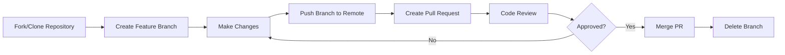
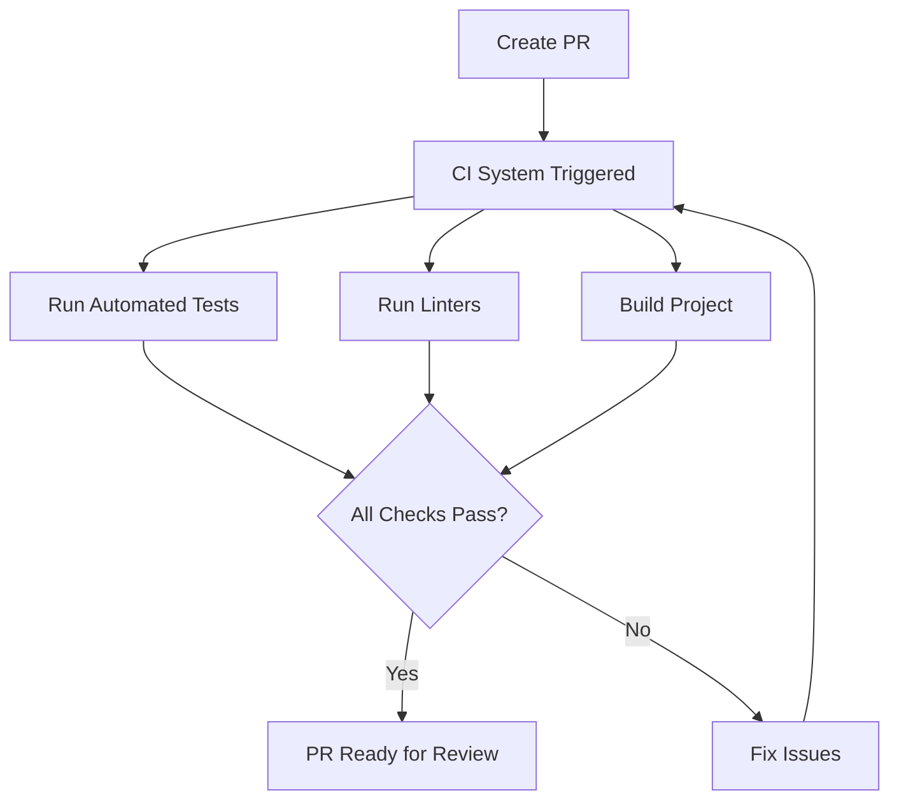

# Git Pull Requests

## Introduction

Pull requests (PRs) are a fundamental collaboration feature in Git-based workflows, especially when working with platforms like GitHub, GitLab, or Bitbucket. They provide a structured way to propose changes, review code, discuss modifications, and merge contributions into a project. Whether you're working on an open-source project or in a team environment, understanding pull requests is essential for modern collaborative development.

In essence, a pull request is a method of submitting contributions to a project by asking the repository maintainers to "pull" your changes into their codebase. It creates a formal process for code review and collaboration before changes are integrated into the main codebase.

## Why Use Pull Requests?

Pull requests offer several benefits for development teams:

- **Code Quality**: They enable thorough code reviews before changes are merged
- **Knowledge Sharing**: Team members learn from each other's code and feedback
- **Documentation**: They create a historical record of changes and discussions
- **Collaboration**: They facilitate discussion about implementation details
- **Continuous Integration**: They can be integrated with automated testing

## The Pull Request Workflow

At a high level, the typical pull request workflow looks like this:



Let's break this down step by step.

## Creating a Pull Request

### Step 1: Fork or Clone the Repository

If you're contributing to an external project, you'll typically start by forking the repository (creating your own copy on the hosting platform). For internal team projects, you might simply clone the repository.

```bash
# Clone a repository
git clone https://github.com/username/repository.git
cd repository
```

### Step 2: Create a Feature Branch

Always create a new branch for your changes. This keeps your work isolated and makes it easier to manage multiple contributions.

```bash
# Create and switch to a new branch
git checkout -b feature/add-login-page

# Alternatively, in newer Git versions
git switch -c feature/add-login-page
```

Branch naming conventions vary between teams, but common patterns include:
- `feature/feature-name`
- `bugfix/issue-description`
- `docs/update-readme`
- `refactor/component-name`

### Step 3: Make and Commit Your Changes

Make the necessary changes to the codebase and commit them with clear, descriptive messages.

```bash
# Make changes to files
# ...

# Add changes to staging area
git add .

# Commit changes with a descriptive message
git commit -m "Add user authentication to login page"
```

### Step 4: Push Your Branch to the Remote Repository

Push your feature branch to your remote repository (origin).

```bash
git push -u origin feature/add-login-page
```

The `-u` flag sets up tracking, which makes future pushes and pulls simpler.

### Step 5: Create the Pull Request

Navigate to the repository on GitHub/GitLab/Bitbucket and you'll typically see a prompt to create a pull request for your recently pushed branch.

Click the "New Pull Request" or "Create Pull Request" button and fill out the details:

1. The base branch (where you want your changes to be merged, usually `main` or `develop`)
2. The compare branch (your feature branch)
3. A title that clearly describes the purpose of the PR
4. A description that explains:
   - What changes you've made
   - Why you've made them
   - How to test them
   - Any related issues or tickets

Many projects have PR templates that guide you through providing the necessary information.

## Reviewing Pull Requests

### As a Reviewer

When reviewing a pull request, consider the following:

1. **Functionality**: Does the code work as intended?
2. **Code Quality**: Is the code well-structured, efficient, and maintainable?
3. **Tests**: Are there appropriate tests for the changes?
4. **Documentation**: Are the changes well-documented?
5. **Style**: Does the code follow the project's style guidelines?

To review a PR on GitHub:

1. Navigate to the "Pull Requests" tab
2. Select the PR you want to review
3. Click on the "Files changed" tab to see the diff
4. Add comments by clicking on specific lines
5. Submit your review with one of three options:
   - Comment: General feedback without explicit approval
   - Approve: Approve the changes
   - Request changes: Indicate that changes are needed before approval

### As a PR Author

When your PR is being reviewed:

1. Be receptive to feedback
2. Respond to comments promptly
3. Make requested changes and push them to the same branch
4. Explain your decisions when appropriate
5. Mark comments as resolved when addressed

## Example: Complete Pull Request Workflow

Let's walk through a complete example of creating a pull request to add a new feature to a project.

### Scenario: Adding a Dark Mode Toggle

Imagine you're working on a web application and want to add a dark mode toggle feature.

```bash
# Clone the repository
git clone https://github.com/team/awesome-app.git
cd awesome-app

# Create a feature branch
git switch -c feature/dark-mode-toggle

# Make changes to add the dark mode toggle
# For example, create a new component:
```

```jsx
// src/components/DarkModeToggle.js
import React, { useState, useEffect } from 'react';

const DarkModeToggle = () => {
  const [isDarkMode, setIsDarkMode] = useState(false);
  
  useEffect(() => {
    // Apply the current theme
    document.body.classList.toggle('dark-theme', isDarkMode);
    // Save preference
    localStorage.setItem('darkMode', isDarkMode);
  }, [isDarkMode]);

  const toggleDarkMode = () => {
    setIsDarkMode(!isDarkMode);
  };

  return (
    <button 
      className="theme-toggle" 
      onClick={toggleDarkMode}
      aria-label={isDarkMode ? "Switch to light mode" : "Switch to dark mode"}
    >
      {isDarkMode ? "🌞" : "🌙"}
    </button>
  );
};

export default DarkModeToggle;
```

```css
/* Add to your CSS */
body.dark-theme {
  --bg-color: #121212;
  --text-color: #e0e0e0;
  --primary-color: #bb86fc;
}

.theme-toggle {
  background: none;
  border: none;
  font-size: 1.5rem;
  cursor: pointer;
  padding: 0.5rem;
}
```

After implementing and testing your changes locally, commit them:

```bash
git add src/components/DarkModeToggle.js
git add src/styles/theme.css
git commit -m "Add dark mode toggle component with local storage persistence"

# Push to your remote repository
git push -u origin feature/dark-mode-toggle
```

Now, go to the repository on GitHub and create a pull request:

1. Click on "Compare & pull request"
2. Set the title: "Add dark mode toggle feature"
3. Write a description:

```
# Dark Mode Toggle Feature

This PR adds a dark mode toggle that allows users to switch between light and dark themes.

## Changes
- Created a new `DarkModeToggle` component
- Added CSS variables for theme colors
- Implemented theme persistence using localStorage

## How to Test
1. Pull the branch and run the app
2. Click the moon/sun icon in the header
3. Verify the theme changes
4. Refresh the page and verify the theme persists

## Screenshots
[You would attach screenshots here in a real PR]

Closes #123
```

4. Submit the pull request

### What Happens Next

Your team members will review the PR, potentially leaving comments like:

> "Can we add a smooth transition when switching themes?"

You would respond by making the requested change:

```css
/* Update CSS */
body {
  transition: background-color 0.3s ease, color 0.3s ease;
}
```

After pushing this update to the same branch, the PR will be automatically updated. Once all feedback has been addressed and approvals have been given, the PR can be merged.

## Advanced Pull Request Concepts

### 1. Rebasing vs. Merging

There are two main ways to integrate changes from a pull request:

**Merge Commit**:
```bash
git checkout main
git merge feature/dark-mode-toggle
```

This creates a merge commit that preserves the full history of the feature branch.

**Rebase and Merge**:
```bash
git checkout feature/dark-mode-toggle
git rebase main
git checkout main
git merge feature/dark-mode-toggle --ff-only
```

This creates a linear history by replaying your commits on top of the base branch.

Many platforms offer options for how to merge a PR:
- **Create a merge commit**: Preserves full history but can make the history more complex
- **Squash and merge**: Combines all commits into one before merging
- **Rebase and merge**: Creates a linear history

### 2. Draft Pull Requests

If you're working on a feature but aren't ready for review, you can create a draft pull request. This signals to others that the work is in progress but not yet ready for formal review.

On GitHub, you can:
- Create a new PR and select "Create draft pull request"
- Or convert an existing PR to draft status

### 3. CI/CD Integration

Pull requests often trigger automated checks through continuous integration systems:



These automated checks help ensure that your changes don't break existing functionality and conform to project standards.

## Best Practices for Pull Requests

### For PR Authors

1. **Keep PRs Focused**: Each PR should address a single concern
2. **Write Clear Descriptions**: Explain what, why, and how
3. **Include Tests**: Add tests that verify your changes
4. **Self-Review**: Review your own changes before requesting reviews
5. **Address All Feedback**: Don't ignore reviewer comments
6. **Update Regularly**: Rebase on the main branch to avoid conflicts

### For PR Reviewers

1. **Be Timely**: Review PRs promptly to maintain momentum
2. **Be Respectful**: Focus on the code, not the person
3. **Be Specific**: Explain issues clearly and suggest solutions
4. **Consider Context**: Understand the problem being solved
5. **Check Functionality**: Don't just review the code; test it if possible
6. **Acknowledge Good Work**: Point out well-written code, not just issues

## Common Pull Request Challenges

### Merge Conflicts

When the same file has been modified in both the target branch and your feature branch, Git may not be able to automatically merge the changes, resulting in a merge conflict.

To resolve merge conflicts:

```bash
# Update your local main branch
git checkout main
git pull

# Switch back to your feature branch
git checkout feature/dark-mode-toggle

# Rebase on main to bring in the latest changes
git rebase main

# If conflicts occur, Git will pause and show which files have conflicts
# Edit the files to resolve conflicts, then:
git add <conflict-file>
git rebase --continue

# Once all conflicts are resolved
git push --force-with-lease origin feature/dark-mode-toggle
```

The `--force-with-lease` flag is safer than `--force` as it ensures you don't overwrite others' changes.

### Large Pull Requests

Large PRs are difficult to review and more likely to contain errors. If your PR is growing too large:

1. Split it into smaller, logically separated PRs
2. Create a "meta" issue that tracks all related PRs
3. Focus each PR on a single concern or feature aspect

## Summary

Pull requests are a powerful collaboration tool that facilitates code review, discussion, and quality control. By following a structured pull request workflow, teams can maintain high code quality while effectively collaborating on complex projects.

Key takeaways:
- Pull requests provide a formal process for code review before changes are merged
- The basic workflow involves creating a branch, making changes, pushing, and creating a PR
- Good PRs are focused, well-described, and include tests
- Code reviews should be respectful, specific, and timely
- Advanced techniques like rebasing and CI integration can enhance the PR workflow

## Practice Exercises

1. **Create a Simple PR**: Fork an open-source project, make a small improvement (like fixing a typo in documentation), and submit a pull request.

2. **Review a PR**: Find an open PR in a public repository and practice reviewing it. What would you comment on?

3. **Handle Merge Conflicts**: Create two branches that modify the same file and practice resolving the resulting merge conflicts.

4. **Set Up CI for PRs**: Configure a simple CI workflow (using GitHub Actions or similar) that runs tests on pull requests.

## Additional Resources

- [GitHub's Documentation on Pull Requests](https://docs.github.com/en/github/collaborating-with-pull-requests)
- [GitLab Merge Requests Documentation](https://docs.gitlab.com/ee/user/project/merge_requests/)
- [Atlassian's Git Tutorial on Pull Requests](https://www.atlassian.com/git/tutorials/making-a-pull-request)
- [Effective Code Reviews](https://medium.com/palantir/code-review-best-practices-19e02780015f)