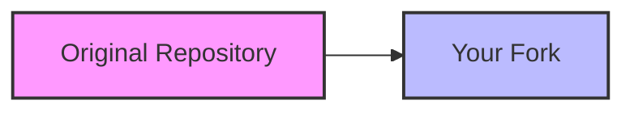
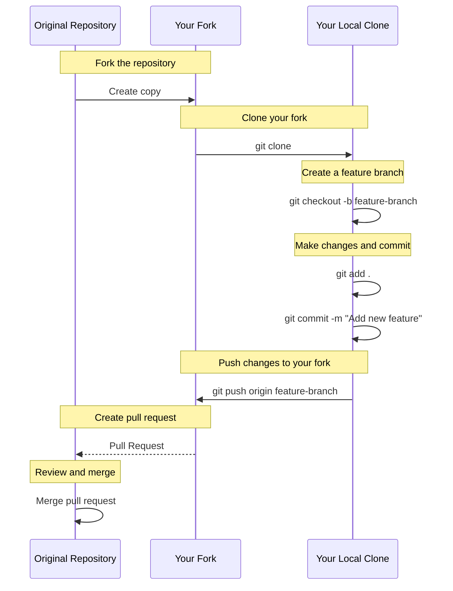

# Git Forks

## Introduction

When you're getting started with collaborative development, you'll quickly encounter the concept of **forking** in Git. Forking is a powerful feature that allows you to create your own copy of someone else's repository, so you can freely experiment with changes without affecting the original project.

Forking is especially important in open-source development, as it enables anyone to contribute to a project without needing direct write access to the original repository. It's the backbone of the collaborative model used by platforms like GitHub, GitLab, and Bitbucket.

## What is a Fork?

A fork is a personal copy of another user's repository. Forking a repository allows you to freely experiment with changes without affecting the original project. This process creates an independent copy of the repository under your account.



Key characteristics of forks:

- Forks are connected to the original repository (often called "upstream")
- You have full control over your fork
- Changes to the original repository don't automatically affect your fork
- You can sync your fork with the original repository when you want to incorporate updates

## When to Use Forks

You should consider forking a repository when:

1. You want to contribute to a project you don't have write access to
2. You want to use someone else's project as a starting point for your own idea
3. You're part of a team that wants to collaborate on a specific feature before integrating it into the main project
4. You want to experiment with changes without affecting the original codebase

## How to Fork a Repository

While Git itself doesn't have a built-in `fork` command, most Git hosting platforms like GitHub, GitLab, and Bitbucket provide a simple way to fork repositories. Here's the general process:

### On GitHub:

1. Navigate to the repository you want to fork
2. Click the "Fork" button in the top-right corner
3. Select your account as the destination for the fork
4. Wait for the forking process to complete

Once completed, you'll have your own copy of the repository under your account, typically with a URL like:
`https://github.com/YOUR-USERNAME/REPOSITORY-NAME`

## Working with Your Fork

After forking, you'll typically want to clone your fork to your local machine:

```bash
# Clone your fork to your local machine
git clone https://github.com/YOUR-USERNAME/REPOSITORY-NAME.git

# Navigate into the project directory
cd REPOSITORY-NAME
```

### Keeping Your Fork Updated

Since your fork is a separate copy, it won't automatically receive updates when the original repository changes. To keep your fork updated, you need to configure a remote that points to the original repository:

```bash
# Add the original repository as a remote called "upstream"
git remote add upstream https://github.com/ORIGINAL-OWNER/REPOSITORY-NAME.git

# Verify the new remote
git remote -v
```

This should show:

```
origin    https://github.com/YOUR-USERNAME/REPOSITORY-NAME.git (fetch)
origin    https://github.com/YOUR-USERNAME/REPOSITORY-NAME.git (push)
upstream  https://github.com/ORIGINAL-OWNER/REPOSITORY-NAME.git (fetch)
upstream  https://github.com/ORIGINAL-OWNER/REPOSITORY-NAME.git (push)
```

Now, whenever you want to update your fork with changes from the original repository:

```bash
# Fetch changes from the upstream repository
git fetch upstream

# Switch to your main branch
git checkout main

# Merge changes from upstream/main into your local main branch
git merge upstream/main

# Push the changes to your fork
git push origin main
```

## The Fork and Pull Request Workflow

The most common workflow when using forks is the "Fork and Pull Request" model, which follows these steps:



Here's a detailed breakdown of this workflow:

1. **Fork the repository** to your account
2. **Clone your fork** to your local machine
3. **Create a feature branch** for your changes:
   ```bash
   git checkout -b feature-branch
   ```
4. **Make your changes** and commit them:
   ```bash
   git add .
   git commit -m "Add new feature"
   ```
5. **Push your changes** to your fork:
   ```bash
   git push origin feature-branch
   ```
6. **Create a pull request** from your fork to the original repository
7. **Address any feedback** during the review process
8. Once approved, your changes will be **merged** into the original repository

## Real-World Example: Contributing to an Open-Source Project

Let's walk through a practical example of contributing to an open-source project using the fork workflow.

Imagine you found a bug in a popular JavaScript library and want to fix it:

### Step 1: Fork the Repository

Visit the project's GitHub page (e.g., `https://github.com/popular/javascript-library`) and click the "Fork" button.

### Step 2: Clone Your Fork

```bash
git clone https://github.com/YOUR-USERNAME/javascript-library.git
cd javascript-library
```

### Step 3: Create a Branch for Your Fix

```bash
git checkout -b fix-calculation-bug
```

### Step 4: Make Your Changes

Let's say you found a bug in the calculation logic. Edit the file:

```javascript
// Before: Bug in the calculation
function calculateTotal(items) {
  return items.reduce((sum, item) => sum + item.price, 0);
}

// After: Fixed calculation that handles null values
function calculateTotal(items) {
  return items.reduce((sum, item) => sum + (item.price || 0), 0);
}
```

### Step 5: Commit Your Changes

```bash
git add src/calculations.js
git commit -m "Fix calculation bug that caused errors with null prices"
```

### Step 6: Push Changes to Your Fork

```bash
git push origin fix-calculation-bug
```

### Step 7: Create a Pull Request

Go to your fork on GitHub and click the "Compare & pull request" button for your branch. Fill in a descriptive title and explanation, then submit the pull request.

### Step 8: Respond to Feedback

The project maintainers might ask you to make additional changes. If so, make the changes in your local branch, commit them, and push again. The pull request will update automatically.

## Common Issues and Solutions

### 1. Merge Conflicts

If your fork is out of date with the original repository, you might encounter merge conflicts when trying to create a pull request. To resolve them:

```bash
# Fetch and merge changes from the original repository
git fetch upstream
git checkout main
git merge upstream/main

# Checkout your feature branch and rebase it on the updated main
git checkout feature-branch
git rebase main

# Resolve any conflicts and continue the rebase
git add .
git rebase --continue

# Push the changes to your fork (may require force push)
git push origin feature-branch --force
```

:::caution
Be careful when using `git push --force` as it will overwrite your remote branch. Only use it when you're sure you want to replace your remote branch with your local version.
:::

### 2. Working on Multiple Features

If you want to work on multiple features or fixes simultaneously, create a separate branch for each one:

```bash
# Create and checkout a branch for the first feature
git checkout -b feature-a

# Make changes, commit, and push
# ...

# Switch back to main to create another branch
git checkout main

# Create and checkout a branch for the second feature
git checkout -b feature-b

# Make changes, commit, and push
# ...
```

## Best Practices for Forking

1. **Always create a feature branch** - Don't work directly on your main branch
2. **Keep your fork updated** - Regularly sync with the upstream repository
3. **Write clear commit messages** - Explain what changes you made and why
4. **Make focused, smaller pull requests** - One feature or fix per pull request
5. **Follow the project's guidelines** - Respect coding standards and contribution processes
6. **Be patient and responsive** - Maintainers are often busy; be ready to address feedback

## Summary

Forking is a powerful way to contribute to projects without needing direct write access to the original repository. It creates a complete copy under your control where you can experiment and develop new features or fixes. Combined with pull requests, forks enable a collaborative workflow that's the foundation of modern open-source development.

The fork workflow can be summarized as:
1. Fork the repository
2. Clone your fork
3. Create a feature branch
4. Make and commit changes
5. Push to your fork
6. Create a pull request
7. Address feedback and iterate

By mastering this workflow, you'll be well-equipped to contribute to open-source projects and collaborate effectively with other developers.

## Exercises

1. Find an open-source project on GitHub that interests you and fork it
2. Clone your fork to your local machine and set up the upstream remote
3. Create a feature branch and make a small improvement (fix a typo, improve documentation)
4. Push your changes and create a pull request to the original repository
5. Sync your fork with the upstream repository to practice keeping your fork updated

## Additional Resources

- [GitHub Docs: Working with Forks](https://docs.github.com/en/github/collaborating-with-pull-requests/working-with-forks)
- [GitLab Docs: Forking Workflow](https://docs.gitlab.com/ee/user/project/repository/forking_workflow.html)
- [Pro Git Book: Contributing to a Project](https://git-scm.com/book/en/v2/GitHub-Contributing-to-a-Project)