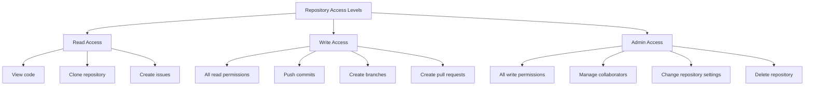
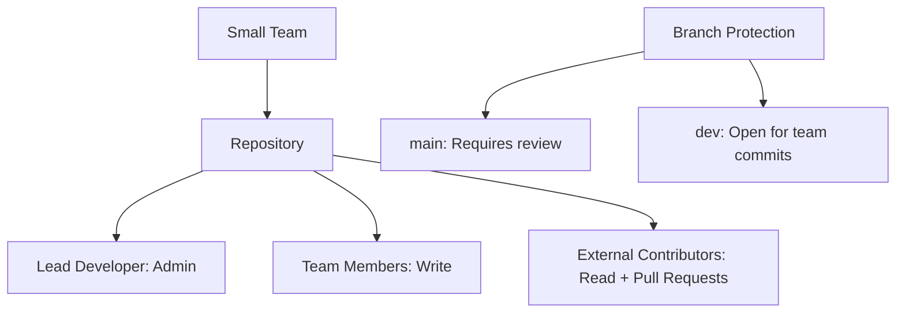
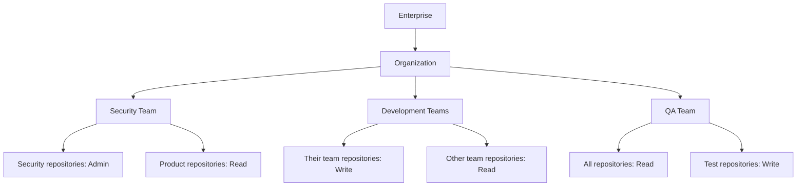

# Git Permissions

When working in a team environment, understanding how to manage access control in your Git repositories is crucial. Git permissions determine who can read, write, or administer your codebase, helping you protect your project while enabling effective collaboration.

## Introduction to Git Permissions

Git itself is a distributed version control system that doesn't enforce permissions at its core. However, when hosting Git repositories on services like GitHub, GitLab, or Bitbucket, you gain access to robust permission systems that help you manage who can do what with your code.

Understanding these permission systems is essential for:

- Protecting your codebase from unauthorized changes
- Enabling team members to contribute effectively
- Setting up review processes for code quality
- Managing sensitive information access

## Basic Permission Concepts

Git hosting services typically organize permissions around these fundamental concepts:

### Repository Access Levels

Most Git hosting platforms provide several levels of access:

- **Read**: Can view and clone the repository but cannot make changes
- **Write**: Can push changes directly to the repository
- **Admin**: Can manage repository settings and control access for other users

Let's visualize these access levels:



## Setting Up Permissions in GitHub

GitHub, being one of the most popular Git hosting platforms, offers a comprehensive permission system. Here's how to set it up:

### For Personal Repositories

1. Go to your repository page
2. Click on "Settings"
3. Select "Manage access" from the sidebar

```bash
# This is a conceptual example, not a command
# Adding a collaborator to your repository
github-repo add-collaborator username --permission write
```

When you add collaborators, they'll receive an invitation email. Once accepted, they'll have the specified level of access to your repository.

### For Organization Repositories

Organizations in GitHub allow more granular control through teams:

```bash
# Create a team (Admin command)
gh team create developers --org my-organization

# Add members to the team
gh team add developers username1 username2 --org my-organization

# Grant team access to a repository
gh team add-repo developers my-organization/project --permission write
```

## Branch Protection Rules

One of the most powerful features for enforcing good collaboration practices is branch protection:

```bash
# Navigate to your repository
cd my-project

# Check current branch protection rules (GitHub CLI)
gh api repos/owner/repo/branches/main/protection
```

To set up branch protection in GitHub's web interface:

1. Go to your repository
2. Click "Settings"
3. Select "Branches" from the sidebar
4. Click "Add rule" under "Branch protection rules"
5. Configure the protection settings:

```jsx
const branchProtectionSettings = {
  requirePullRequest: true,
  requiredReviews: 2,
  dismissStaleReviews: true,
  requireStatusChecks: true,
  enforceAdmins: false,
};
```

## Git Hooks for Enforcing Permissions Locally

Git hooks can complement server-side permissions by enforcing policies locally:

```bash
# Navigate to your git hooks directory
cd .git/hooks

# Create a pre-commit hook
touch pre-commit
chmod +x pre-commit
```

Sample pre-commit hook to prevent committing to the main branch directly:

```bash
#!/bin/bash

branch="$(git rev-parse --abbrev-ref HEAD)"

if [ "$branch" = "main" ]; then
  echo "You can't commit directly to the main branch!"
  exit 1
fi
```

## SSH Keys and Authentication

Proper authentication is a critical part of the Git permission system:

```bash
# Generate a new SSH key
ssh-keygen -t ed25519 -C "your_email@example.com"

# Start the SSH agent
eval "$(ssh-agent -s)"

# Add your SSH key to the agent
ssh-add ~/.ssh/id_ed25519

# Copy the public key to add to GitHub/GitLab
cat ~/.ssh/id_ed25519.pub
```

After generating your SSH key, add it to your Git hosting service:
1. Go to your account settings
2. Find the SSH keys section
3. Add a new SSH key
4. Paste your public key content

## Advanced Permission Scenarios

### Managing Sensitive Files

For files containing sensitive information, use `.gitignore` to prevent them from being committed:

```bash
# Create or edit .gitignore
echo "secrets.json" >> .gitignore
echo ".env" >> .gitignore
```

For already committed sensitive files:

```bash
# Remove file from Git but keep it locally
git rm --cached secrets.json

# Update .gitignore, then commit the change
git add .gitignore
git commit -m "Remove sensitive file from repository"
```

### Setting Up Protected Environments

For platforms that support environment protection (like GitHub):

1. Go to repository settings
2. Navigate to "Environments"
3. Create environments like "production", "staging"
4. Add protection rules:
   - Required reviewers
   - Wait timer
   - Deployment branches limitation

## Real-World Permission Strategies

### Small Team Strategy



### Enterprise Strategy



## Troubleshooting Permission Issues

### Permission Denied Errors

If you encounter a "Permission denied" error:

```bash
# Error example
$ git push origin main
Permission denied (publickey).
fatal: Could not read from remote repository.
```

Check the following:

1. Verify your SSH key is added to your account:

```bash
# Test your SSH connection
ssh -T git@github.com
```

2. Confirm you have the correct level of access:

```bash
# For GitHub CLI
gh repo view owner/repo --json permissions
```

3. Check branch protection rules if you can't push to a specific branch

### Lost Admin Access

If the original admin loses access:

- For GitHub personal repositories: Use account recovery
- For organizations: Other organization owners can restore access
- For self-hosted repositories: Server administrators can modify permissions

## Summary

Managing Git permissions effectively is essential for team collaboration. Here's what we've covered:

- Repository access levels (read, write, admin)
- Setting up permissions on GitHub for personal and organization repositories
- Branch protection rules to enforce code quality
- Git hooks for local policy enforcement
- SSH key authentication for secure access
- Strategies for protecting sensitive information
- Real-world permission models for different team sizes
- Troubleshooting common permission issues

By implementing appropriate permission structures, you can protect your codebase while promoting efficient collaboration among team members.

## Additional Resources

- [GitHub Documentation on Repository Permissions](https://docs.github.com/en/github/administering-a-repository/managing-repository-settings/managing-teams-and-people-with-access-to-your-repository)
- [GitLab Permissions Overview](https://docs.gitlab.com/ee/user/permissions.html)
- [Bitbucket Repository Access Control](https://support.atlassian.com/bitbucket-cloud/docs/repository-privacy-access-and-security/)

## Exercises

1. Set up a sample repository with branch protection for the main branch that requires at least one review.
2. Create a pre-commit hook that prevents secrets from being accidentally committed.
3. Design a permission structure for a hypothetical team of 10 developers working on 3 different projects.
4. Practice recovering from common permission errors like "Permission denied" when pushing.
5. Implement a role-based access control system using GitHub teams for an organization with development, testing, and operations departments.