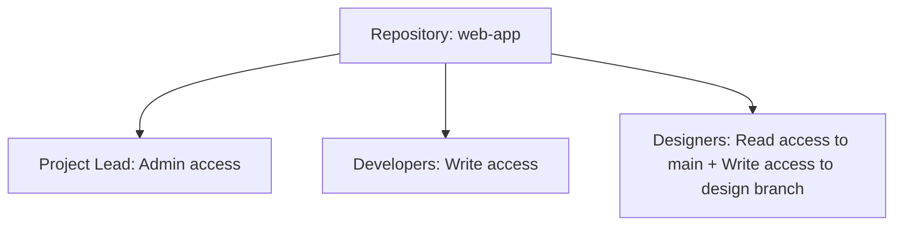
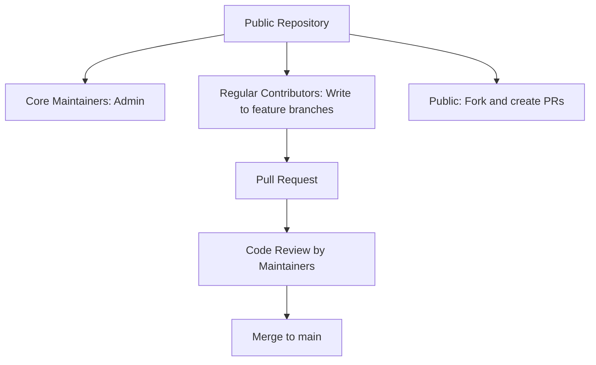

# Git Access Control

## Introduction

When working on projects with multiple contributors, managing who can access your Git repository and what actions they can perform becomes crucial. Git access control allows you to define permissions and restrictions for different team members, protecting your code while enabling effective collaboration.

In this guide, we'll explore the various methods to implement access control in Git repositories, from basic authentication to more sophisticated permission systems. Whether you're working on a personal project with a few collaborators or managing a large open-source repository, understanding Git access control will help you maintain code integrity and streamline your workflow.

## Authentication Basics

Before we dive into specific access control methods, let's understand the fundamental authentication mechanisms in Git.

### Local Authentication

When working with local repositories, Git identifies users based on their Git configuration:

```bash
# View your current Git identity
git config user.name
git config user.email

# Set your Git identity
git config --global user.name "Your Name"
git config --global user.email "your.email@example.com"
```

This configuration doesn't restrict access but helps identify who made specific changes.

### Remote Repository Authentication

For remote repositories, Git supports several authentication methods:

1. **HTTP/HTTPS** - Username/password or token-based
2. **SSH** - Public/private key pairs
3. **Git Protocol** - Usually anonymous, with limited access control options

Let's look at setting up SSH authentication, which is both secure and convenient:

```bash
# Generate an SSH key pair
ssh-keygen -t ed25519 -C "your.email@example.com"

# Output:
# Generating public/private ed25519 key pair.
# Enter file in which to save the key (/home/username/.ssh/id_ed25519):
# Enter passphrase (empty for no passphrase):
# Enter same passphrase again:
# Your identification has been saved in /home/username/.ssh/id_ed25519
# Your public key has been saved in /home/username/.ssh/id_ed25519.pub
```

After generating your key, add it to your Git hosting service (GitHub, GitLab, etc.).

## Repository Access Control Models

Git hosting platforms offer different access control models to manage permissions.

### GitHub Access Control

GitHub provides repository-level access with several permission levels:

| Role | Capabilities |
|------|-------------|
| Read | Can clone and pull, but cannot make changes |
| Triage | Can manage issues and pull requests, but cannot write code |
| Write | Can push to the repository and manage issues |
| Maintain | Can manage repository without access to sensitive or destructive actions |
| Admin | Complete control, including changing access permissions |

Here's how to add a collaborator with specific permissions on GitHub:

1. Navigate to your repository
2. Click on "Settings" > "Collaborators"
3. Click "Add people" and search for the user
4. Select the appropriate permission level

### GitLab Access Control

GitLab offers more granular access control through its role-based system:

| Role | Access Level |
|------|-------------|
| Guest | Issues and discussions |
| Reporter | Repository content (read-only) |
| Developer | Repository content (read-write) |
| Maintainer | Repository and most settings |
| Owner | Complete control |

### Self-Hosted Git Server Access Control

For self-hosted Git servers (like Gitolite or GitLab CE), you can implement custom access control rules.

Here's an example of a Gitolite configuration file:

```perl
# Gitolite access control configuration

repo project-x
    RW+     =   admin-user
    RW      =   developer1 developer2
    R       =   tester1 tester2
    -       =   @all
```

This configuration grants:
- `admin-user` full access (read, write, and force push)
- `developer1` and `developer2` read and write access
- `tester1` and `tester2` read-only access
- Denies access to everyone else

## Branch-Based Access Control

Git allows for more fine-grained control by restricting access to specific branches.

### Protected Branches

Most Git hosting platforms support protected branches, preventing unauthorized modifications to important branches like `main` or `release`.

For example, on GitHub:

1. Go to repository "Settings" > "Branches"
2. Click "Add rule" next to "Branch protection rules"
3. Enter the branch name pattern (e.g., `main`)
4. Configure protection options:
   - Require pull request reviews
   - Require status checks
   - Restrict who can push

### Git Hooks for Access Control

Git hooks can enforce custom access control rules. Here's an example `pre-receive` hook that restricts pushes to the `main` branch:

```bash
#!/bin/bash

while read oldrev newrev refname; do
  if [[ "$refname" == "refs/heads/main" ]]; then
    # Check if user is in the allowed list
    if ! echo "$USER" | grep -qE '^(admin|lead-dev)$'; then
      echo "Error: You don't have permission to push to main"
      exit 1
    fi
  fi
done
```

## Practical Examples

Let's walk through some common access control scenarios and their implementations.

### Example 1: Setting Up a Team Project

Imagine you're starting a new web application with three roles: project lead, developers, and designers.



Implementation steps:

1. Create the repository and add team members with appropriate roles
2. Set up branch protection for `main` branch
3. Create a separate `design` branch with appropriate permissions

### Example 2: Open Source Project with Maintainers

For an open-source project, you might want a structure like this:



Implementation steps:

1. Make the repository public
2. Add core maintainers as administrators
3. Configure protected branches for `main`
4. Set up pull request templates and contribution guidelines
5. Configure required code reviews before merging

### Example 3: Enterprise Project with Strict Access Control

For enterprise projects with strict security requirements:

```bash
# Example Git server configuration
# Only tech leads can push to production branches
repo project/production
    RW+     =   tech-lead-1 tech-lead-2
    R       =   @developers @qa

# Developers can push to feature branches
repo project/development
    RW+     =   @developers
    RW      =   @qa
    R       =   @stakeholders
```

## Git Submodules and Access Control

Git submodules require special consideration for access control. When a repository includes submodules, users need appropriate permissions for both the main repository and all submodules.

```bash
# Adding a submodule
git submodule add https://github.com/example/library.git libs/example

# Output:
# Cloning into '/path/to/project/libs/example'...
# done.
```

If some team members don't have access to the submodule, they'll encounter errors when trying to clone or update the main repository.

## Best Practices for Git Access Control

1. **Follow the Principle of Least Privilege**: Grant only the permissions necessary for each role.

2. **Use SSH Keys Instead of Passwords**: SSH keys are more secure and convenient than password authentication.

3. **Regularly Audit Access**: Periodically review who has access to your repositories and at what level.

4. **Implement Branch Protection**: Protect important branches like `main` and `release` from direct pushes.

5. **Use Signed Commits**: Enable commit signing to verify the authenticity of commits.

   ```bash
   # Configure Git to sign commits
   git config --global commit.gpgsign true
   
   # Sign a commit
   git commit -S -m "Implement secure feature"
   ```

6. **Automate Access Control**: Use CI/CD pipelines to enforce access policies automatically.

7. **Document Your Access Control Policies**: Make sure team members understand the permissions structure.

## Troubleshooting Common Access Issues

### Authentication Failures

If you're having trouble authenticating, check:

```bash
# Verify remote URL
git remote -v

# For SSH issues, test your connection
ssh -T git@github.com

# Output for GitHub:
# Hi username! You've successfully authenticated, but GitHub does not provide shell access.
```

### Permission Denied Errors

When encountering "Permission denied" errors:

1. Verify you have the correct permissions on the platform
2. Check if you're using the correct authentication method
3. Ensure your SSH key is added to your account (for SSH)
4. For protected branches, check if you meet the requirements for pushing

## Summary

Git access control is essential for collaborative development, providing a balance between security and usability. By implementing appropriate authentication methods, repository-level permissions, and branch protection rules, you can create a secure and efficient workflow for your team.

Remember that the specific implementation details may vary depending on your Git hosting platform, but the core concepts remain the same across different environments.

## Additional Resources

To deepen your understanding of Git access control, consider exploring these resources:

- [GitHub documentation on managing access and permissions](https://docs.github.com/en/repositories/managing-your-repositorys-settings-and-features/managing-repository-settings/managing-teams-and-people-with-access-to-your-repository)
- [GitLab permissions documentation](https://docs.gitlab.com/ee/user/permissions.html)
- [Pro Git book chapter on Git on the Server](https://git-scm.com/book/en/v2/Git-on-the-Server-Setting-Up-the-Server)

## Exercises

1. Set up a local Git repository and configure different access levels for team members using a self-hosted Git server like Gitolite.

2. Create a GitHub repository with protected branches and implement a pull request workflow.

3. Configure SSH authentication for your Git accounts and test repository access.

4. Implement a pre-receive hook that enforces custom access control rules based on user roles.

5. Create a documentation page explaining your team's Git access control policies and procedures.