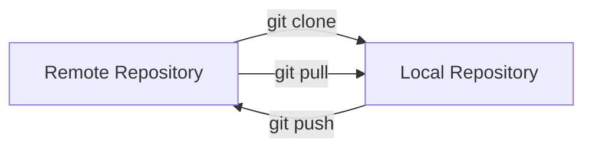

# Git Clone Repository

## Introduction

When working with Git for collaboration, one of the first skills you'll need is the ability to clone a repository. Cloning is the process of creating a local copy of a remote repository on your machine. This fundamental Git operation allows you to:

- Contribute to open-source projects
- Work on team-based development
- Access your own repositories from different computers
- Create backup copies of projects

In this guide, we'll explore the `git clone` command in depth, understand its options, and see how it's used in real-world scenarios.

## What is Git Clone?

Git clone creates a full copy of a repository, including:

- All files in the project
- Complete commit history
- All branches
- Remote-tracking information

When you clone a repository, Git automatically sets up a connection to the original repository (called the "origin"), allowing you to push changes back or pull updates from it.



## Basic Syntax

The basic syntax for the `git clone` command is:

```bash
git clone <repository-url>
```

Git supports multiple protocols for repository URLs:

- HTTPS: `https://github.com/username/repository.git`
- SSH: `git@github.com:username/repository.git`
- Git: `git://github.com/username/repository.git`

## Basic Usage Example

Let's clone a simple public repository from GitHub:

```bash
git clone https://github.com/octocat/Hello-World.git
```

Output:
```
Cloning into 'Hello-World'...
remote: Enumerating objects: 749, done.
remote: Total 749 (delta 0), reused 0 (delta 0), pack-reused 749
Receiving objects: 100% (749/749), 156.82 KiB | 979.00 KiB/s, done.
Resolving deltas: 100% (324/324), done.
```

After running this command, you'll have a new directory named `Hello-World` containing all the files from the repository.

## Common Git Clone Options

### Specifying a Different Directory Name

By default, Git creates a directory with the same name as the repository. You can specify a different directory name:

```bash
git clone https://github.com/octocat/Hello-World.git my-hello-world
```

This will create a directory named `my-hello-world` instead of `Hello-World`.

### Cloning a Specific Branch

You can clone a specific branch using the `--branch` or `-b` option:

```bash
git clone --branch develop https://github.com/username/repository.git
```

### Creating a Shallow Clone

For large repositories, you might want to limit the history using a shallow clone:

```bash
git clone --depth 1 https://github.com/username/repository.git
```

This command creates a clone with only the most recent commit.

### Cloning Without the Working Copy

If you only need the Git repository data without the working files:

```bash
git clone --bare https://github.com/username/repository.git
```

## Step-by-Step: Cloning a Repository

1. **Find the repository URL**
   - On GitHub, click the green "Code" button and copy the URL
   - Choose between HTTPS (easier, requires username/password) or SSH (requires key setup but more secure)

2. **Open your terminal or command prompt**
   - Navigate to the directory where you want to store the repository

3. **Run the git clone command**
   ```bash
   git clone <repository-url>
   ```

4. **Wait for the download to complete**
   - Git will show progress information as it downloads

5. **Navigate to the cloned repository**
   ```bash
   cd <repository-name>
   ```

6. **Verify the clone was successful**
   ```bash
   git status
   ```

## Practical Examples

### Example 1: Contributing to an Open Source Project

Let's say you want to contribute to a popular open-source library:

```bash
# Clone the repository
git clone https://github.com/expressjs/express.git

# Navigate to the repository directory
cd express

# Create a new branch for your feature
git checkout -b feature/my-improvement

# Make your changes and commit them
git add .
git commit -m "Add new feature"

# Push changes to your fork (after setting up a fork)
git push origin feature/my-improvement
```

### Example 2: Cloning Your Own Repository to Another Computer

When working across multiple devices:

```bash
# On your work computer
git clone git@github.com:yourusername/your-project.git

# Make changes, commit, and push
git add .
git commit -m "Updates from work computer"
git push

# Later, on your home computer
git clone git@github.com:yourusername/your-project.git
# or, if already cloned
git pull
```

### Example 3: Cloning a Specific Tag (Release Version)

When you need a specific version of a project:

```bash
# Clone a specific tagged release
git clone --branch v2.0.1 https://github.com/username/repository.git
```

## Troubleshooting Common Issues

### Authentication Problems

If you see an error like:

```
fatal: Authentication failed for 'https://github.com/username/repository.git/'
```

Solutions:
- Ensure you have access to the repository
- Check your credentials
- For private repositories, you might need to set up SSH keys or use a personal access token

### Slow Clone Performance

For large repositories:

```bash
# Clone with limited depth
git clone --depth 1 https://github.com/username/repository.git

# Later, if needed, fetch more history
git fetch --unshallow
```

### SSL Certificate Problems

If you encounter SSL certificate verification errors:

```bash
# Only use this if you understand the security implications
git -c http.sslVerify=false clone https://github.com/username/repository.git
```

## Best Practices

1. **Use SSH keys** for secure authentication with repositories you access frequently

2. **Consider shallow clones** for large repositories when you don't need full history

3. **Clone directly from the source** when possible, rather than from forks (unless you're contributing)

4. **Be mindful of the location** where you're cloning repositories to maintain organization

5. **Check repository size** before cloning in bandwidth-limited environments

## Advanced Git Clone Techniques

### Mirror Cloning

When you need an exact mirror of a repository:

```bash
git clone --mirror https://github.com/username/repository.git
```

### Cloning with Submodules

For repositories that contain submodules:

```bash
git clone --recursive https://github.com/username/repository.git
```

## Summary

The `git clone` command is your gateway to collaboration in the Git ecosystem. It allows you to:

- Create local copies of remote repositories
- Start contributing to open-source projects
- Access your projects from different machines
- Work with team members on shared codebases

By understanding the various options and techniques for cloning repositories, you can efficiently work with Git in a variety of scenarios.

## Exercises

1. Clone a public repository from GitHub, such as `https://github.com/github/gitignore`.

2. Try cloning the same repository with a different target directory name.

3. Experiment with a shallow clone and then later fetch more history.

4. Clone a specific branch of a repository and verify you're on that branch.

5. Set up SSH keys for your GitHub account and clone a repository using SSH instead of HTTPS.

## Additional Resources

- [Git Official Documentation on `git clone`](https://git-scm.com/docs/git-clone)
- [GitHub Guides: Cloning a Repository](https://docs.github.com/en/repositories/creating-and-managing-repositories/cloning-a-repository)
- [Pro Git Book - Chapter 2: Git Basics](https://git-scm.com/book/en/v2/Git-Basics-Getting-a-Git-Repository)