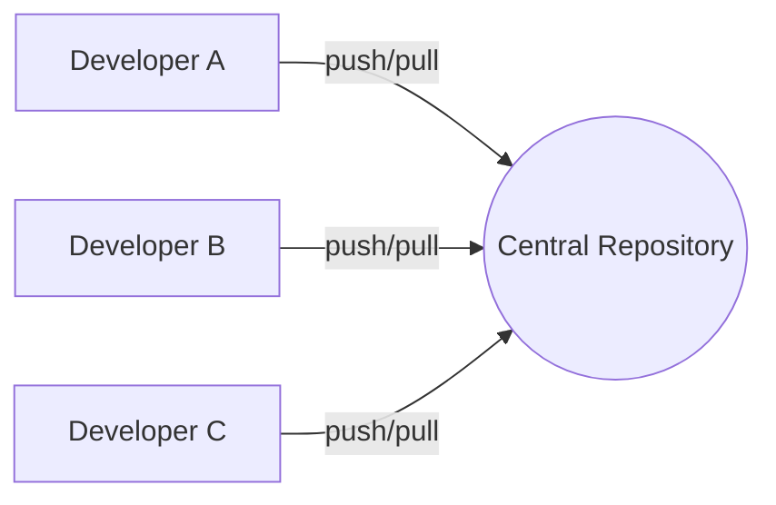
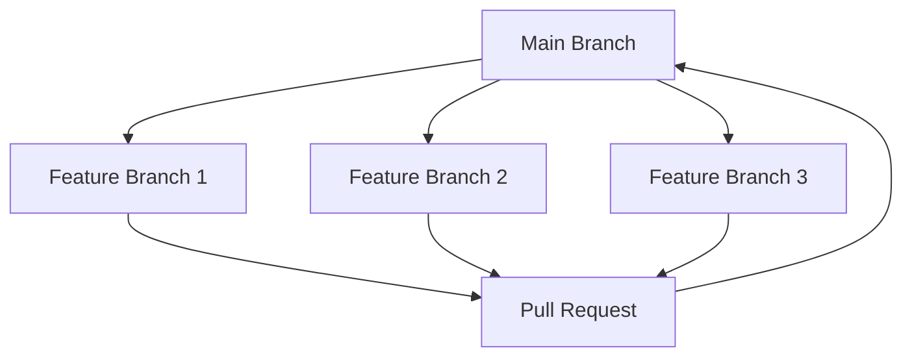
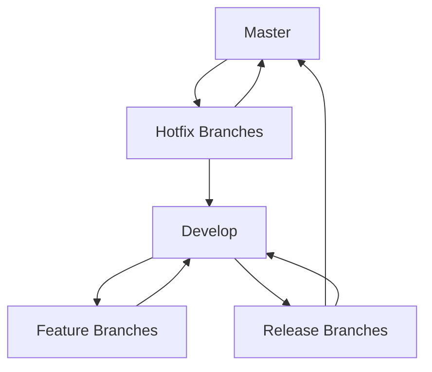
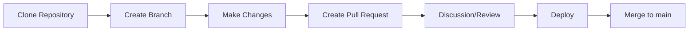
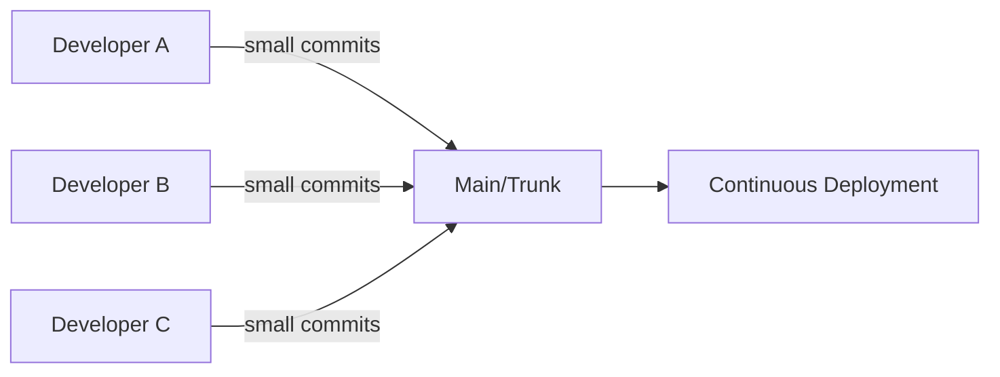

# Git Team Workflow

## Introduction

When you move from solo coding to working in a team, version control becomes essential for coordinating changes. A Git team workflow provides a structured approach for multiple developers to work on the same codebase without stepping on each other's toes.

In this guide, we'll explore how teams use Git to collaborate effectively, covering branching strategies, pull requests, code reviews, and conflict resolution. By the end, you'll understand how to contribute to team projects while maintaining code quality and stability.

## Why Use a Team Workflow?

Before diving into specific workflows, let's understand why they're crucial:

- **Prevent conflicts**: Minimize the chance of developers overwriting each other's work
- **Maintain code quality**: Implement review processes before code reaches production
- **Track changes**: Keep a clear history of who made what changes and why
- **Coordinate releases**: Manage different stages of development from features to production

## Common Git Team Workflows

### Centralized Workflow

The simplest approach is a centralized workflow, similar to older version control systems but with Git's advantages.



**How it works:**

1. All team members clone the central repository
2. They make changes locally
3. When ready, they push directly to the main branch

**Example:**

```bash
# Clone the repository
git clone https://github.com/team/project.git

# Make changes locally
echo "New feature code" > feature.js

# Add and commit changes
git add feature.js
git commit -m "Add new feature"

# Push to the central repository
git push origin main
```

**Pros:**
- Simple to understand and implement
- Works well for very small teams or simple projects

**Cons:**
- No formal review process
- Higher risk of conflicts
- Main branch can become unstable

### Feature Branch Workflow

A more sophisticated approach where each feature gets its own branch.



**How it works:**

1. The main branch always represents stable code
2. For each new feature or bugfix, create a dedicated branch
3. Work on your feature in isolation
4. When complete, merge back to main (often via pull request)

**Example:**

```bash
# Create a new feature branch from main
git checkout main
git pull
git checkout -b feature/login-page

# Make changes and commit
echo "Login page code" > login.js
git add login.js
git commit -m "Add login page implementation"

# Push feature branch to remote
git push -u origin feature/login-page

# Later, merge back to main (after review)
git checkout main
git merge feature/login-page
git push origin main
```

**Pros:**
- Isolates incomplete work from stable code
- Simplifies parallel development
- Can incorporate code reviews via pull requests

**Cons:**
- More complex than centralized workflow
- Requires more Git knowledge from team members

### GitFlow Workflow

A structured branching model for projects with scheduled releases.



**How it works:**

1. Maintain two permanent branches:
   - `master`: Always reflects production-ready code
   - `develop`: Integration branch for features
2. Use supporting branches:
   - Feature branches: For new features
   - Release branches: For preparing releases
   - Hotfix branches: For emergency production fixes

**Example GitFlow setup:**

```bash
# Initialize GitFlow
git flow init

# Start a new feature
git flow feature start user-authentication

# Work on the feature with regular commits
echo "Authentication code" > auth.js
git add auth.js
git commit -m "Implement user authentication"

# Finish the feature (merges to develop)
git flow feature finish user-authentication

# Start a release
git flow release start v1.0.0

# Make release preparations
echo "Version bump" > version.txt
git add version.txt
git commit -m "Bump version to 1.0.0"

# Finish release (merges to master and develop)
git flow release finish v1.0.0
```

**Pros:**
- Provides a robust framework for managing complex projects
- Clear separation between in-progress work and production code
- Excellent for projects with scheduled release cycles

**Cons:**
- More overhead and complexity
- Can be overkill for smaller projects
- Requires team discipline to maintain

### GitHub Flow (or Pull Request Workflow)

A simpler alternative to GitFlow, focused on frequent deployments.



**How it works:**

1. Create a branch from main for each new feature
2. Add commits to your branch
3. Open a pull request for discussion
4. Deploy and test your changes
5. Merge to main

**Example:**

```bash
# Create a branch for a new feature
git checkout -b feature-user-profiles

# Make changes and commit
echo "User profile code" > profiles.js
git add profiles.js
git commit -m "Add user profiles"

# Push branch to GitHub
git push -u origin feature-user-profiles

# Create pull request (via GitHub UI)
# After review and approval, merge in GitHub
```

## Pull Requests and Code Reviews

A critical component of modern Git workflows is the pull request (PR) process.

### Anatomy of a Good Pull Request

A quality PR includes:

1. **Clear title and description**: What changes are included and why
2. **Linked issues**: Reference to related tickets or issues
3. **Focused changes**: Limited in scope to make review easier
4. **Tests**: New or updated tests for the changes
5. **Documentation**: Updated as needed

### Conducting Effective Code Reviews

When reviewing others' code:

1. **Be thorough but respectful**: Focus on the code, not the person
2. **Look for both bugs and improvements**: Catch issues but also suggest enhancements
3. **Use commenting features**: Add inline comments in specific locations
4. **Consider broader implications**: How will these changes affect the rest of the system?
5. **Don't rush**: Take time to understand the changes before approving

**Example PR review comments:**

```
- The login function doesn't handle failed authentication attempts
- Consider using a more descriptive variable name than `data`
- This loop could be simplified using Array.map()
+ Great error handling in the API response code!
```

## Handling Merge Conflicts

Merge conflicts are inevitable in team environments. Here's how to resolve them:

1. **Update your branch first**:

```bash
git checkout main
git pull
git checkout your-feature-branch
git merge main
```

2. **Resolve conflicts**:
When Git reports conflicts, files will be marked up showing both versions:

```
<<<<<<< HEAD
const greeting = "Hello World";
=======
const greeting = "Hi there";
>>>>>>> feature-branch
```

3. **Edit the files** to resolve the conflicts manually, removing the markers

4. **Complete the merge**:

```bash
git add .
git commit -m "Resolve merge conflicts"
```

## Best Practices for Team Collaboration

### Communication

- **Descriptive commit messages**: Write clear messages explaining why changes were made
- **Document decisions**: Record why certain approaches were chosen
- **Keep the team informed**: Communicate when starting work on features to avoid duplication

### Branch Management

- **Delete branches after merging**: Keep the repository clean
- **Use consistent naming conventions**: e.g., `feature/`, `bugfix/`, `hotfix/`
- **Keep branches short-lived**: Long-running branches lead to difficult merges

### Git Hygiene

- **Commit often**: Make small, logical commits rather than large ones
- **Rebase before merging**: Keep history clean with `git rebase`
- **Use `.gitignore` properly**: Avoid committing temporary files, build artifacts, or sensitive information

### Example `.gitignore` for a Node.js project:

```
# Dependencies
node_modules/
npm-debug.log

# Build outputs
dist/
build/

# Environment variables
.env
.env.local

# Editor files
.vscode/
.idea/
*.swp

# OS files
.DS_Store
Thumbs.db
```

## Setting Up Team Standards

Consider documenting the following for your team:

1. **Chosen workflow**: Which branching strategy the team will follow
2. **Commit message format**: Standardized format for clarity
3. **PR requirements**: What must be included for approval
4. **Release process**: Steps for promoting code to production

**Example commit message standard:**

```
feat: Add user authentication

- Implement login and registration forms
- Set up JWT token handling
- Add protected routes

Resolves: #123
```

## Practical Team Exercise

Let's practice a team Git workflow:

1. **Exercise setup**:
   - Team of 3-4
   - Simple web application
   - Feature branch workflow

2. **Tasks**:
   - Each team member creates a feature branch
   - Implement assigned components
   - Create pull requests
   - Review each other's code
   - Merge completed features
   - Resolve any conflicts

3. **Reflection**:
   - What worked well?
   - What challenges did you encounter?
   - How would you improve the process?

## Advanced Git Team Features

As you become more comfortable with basic team workflows, explore these advanced features:

### Git Hooks

Automate tasks with pre-commit or post-receive hooks:

```bash
#!/bin/sh
# .git/hooks/pre-commit
# Run tests before allowing commit
npm test
```

### Continuous Integration

Integrate with CI services to automatically test pull requests:

```yaml
# Example GitHub Actions workflow
name: CI
on: [push, pull_request]
jobs:
  test:
    runs-on: ubuntu-latest
    steps:
    - uses: actions/checkout@v2
    - name: Install dependencies
      run: npm install
    - name: Run tests
      run: npm test
```

### Trunk-Based Development

A streamlined approach focusing on small, frequent commits to the main branch:



## Summary

A well-defined Git team workflow is essential for productive collaboration. Key takeaways:

- Choose a workflow that matches your team's size and project complexity
- Use branches to separate work-in-progress from stable code
- Implement pull requests for code review and quality control
- Establish clear standards for commits, branches, and merges
- Practice resolving conflicts early and often
- Communicate clearly with your team about what you're working on

By following these practices, you'll minimize conflicts, maintain code quality, and create a more enjoyable collaborative development experience.

## Additional Resources

- [Git Documentation](https://git-scm.com/doc)
- [GitHub Flow Guide](https://guides.github.com/introduction/flow/)
- [Atlassian Git Tutorials](https://www.atlassian.com/git/tutorials)
- [Learn Git Branching](https://learngitbranching.js.org/) - Interactive tutorial
- [Pro Git Book](https://git-scm.com/book/en/v2) - Free comprehensive guide

## Exercises

1. **Workflow simulation**: With a partner, simulate a feature branch workflow by:
   - Creating a shared repository
   - Each creating feature branches
   - Opening pull requests
   - Reviewing each other's code
   - Merging the changes

2. **Conflict resolution practice**: Deliberately create a conflict by having two people modify the same line, then practice resolving it.

3. **Workflow comparison**: For a project idea of your choice, write out how you would implement it using:
   - Centralized workflow
   - Feature branch workflow
   - GitFlow workflow
   - GitHub flow

   Compare the advantages and disadvantages of each approach for your specific project.