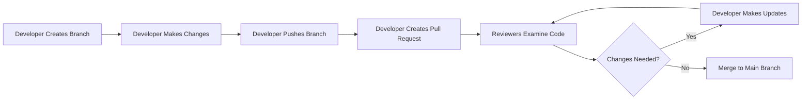

# Git Code Review

## Introduction

Code review is a critical practice in modern software development that involves systematically examining code changes to improve code quality, catch bugs, and share knowledge among team members. When combined with Git's powerful version control capabilities, code reviews become an essential part of the collaborative development workflow.

In this guide, we'll explore how to conduct effective code reviews using Git tools, focusing on practical techniques that will help you contribute meaningfully to projects while learning from others.

## What is a Code Review?

A code review is the process where developers examine each other's code changes before they're merged into the main codebase. In Git workflows, this typically happens through:

- Pull requests (GitHub, GitLab, Bitbucket)
- Merge requests (GitLab)
- Patch reviews (via email or tools like Gerrit)

Code reviews provide several key benefits:

1. **Catching bugs early** - Extra pairs of eyes help find logic errors, edge cases, and potential issues
2. **Knowledge sharing** - Team members learn from each other's approaches and techniques
3. **Code quality** - Enforces coding standards and best practices
4. **Documentation** - Review comments help document why certain decisions were made

## Git-Based Code Review Workflow

Let's explore a typical code review workflow using Git and pull requests:



### Step 1: Prepare Your Changes for Review

Before submitting code for review, ensure your changes are well-prepared:

```bash
# Create a feature branch from main
git checkout main
git pull
git checkout -b feature/user-authentication

# Make your changes and commit them with clear messages
git add auth_controller.js
git commit -m "Add user authentication controller with login functionality"

# Push your branch to the remote repository
git push -u origin feature/user-authentication
```

### Step 2: Create a Pull Request

Most Git hosting platforms (GitHub, GitLab, Bitbucket) allow you to create pull requests through their web interface:

1. Navigate to the repository on the platform
2. You'll often see a prompt to create a pull request for recently pushed branches
3. Fill in the pull request template with:
   - A clear title describing the change
   - A detailed description of what changed and why
   - Any testing performed
   - References to related issues or tickets

Example Pull Request Description:

```
## User Authentication Implementation

This PR adds basic user authentication with:
- Login controller with email/password validation
- Session management with JWT tokens
- Password hashing with bcrypt

Fixes #42

### Testing Done
- Manual testing of login flows
- Added unit tests for the authentication controller
- Verified token expiration works as expected

### Notes for Reviewers
The token expiration is set to 24 hours - please confirm if this matches requirements
```

## Conducting Effective Code Reviews

### What to Look For When Reviewing Code

As a reviewer, focus on these key areas:

1. **Functionality**: Does the code work as intended?
2. **Correctness**: Is the logic sound and are edge cases handled?
3. **Design**: Is the code well-structured and maintainable?
4. **Security**: Are there potential security vulnerabilities?
5. **Performance**: Will the code perform well at scale?
6. **Readability**: Is the code easy to understand?
7. **Tests**: Are there adequate tests covering the changes?
8. **Documentation**: Is the code well-documented where needed?

### Practical Example: Reviewing a Simple Function

Let's examine a function that calculates the total price including tax, and how we might review it:

Original Code Submitted for Review:

```javascript
function calculateTotal(price, quantity) {
  return price * quantity * 1.1;
}
```

Potential Review Comments:

```
1. The tax rate (1.1) is hardcoded - consider making this a parameter or a configurable constant
2. There's no input validation - what happens with negative quantities?
3. The function name doesn't indicate that tax is being applied - "calculateTotalWithTax" would be clearer
4. No comments explaining the 1.1 multiplier is for 10% tax
```

Improved Version After Review:

```javascript
/**
 * Calculates the total price including tax
 * @param {number} price - The unit price of the item
 * @param {number} quantity - The quantity being purchased
 * @param {number} [taxRate=0.1] - The tax rate as a decimal (default 10%)
 * @returns {number} The total price including tax
 */
function calculateTotalWithTax(price, quantity, taxRate = 0.1) {
  if (price < 0 || quantity < 0) {
    throw new Error("Price and quantity must be non-negative");
  }
  
  return price * quantity * (1 + taxRate);
}
```

### Using Git Tools for Code Review

Git provides several commands that are helpful during the review process:

```bash
# View the changes in a specific commit
git show <commit-hash>

# See the differences between branches
git diff main feature/user-authentication

# Check all commits in a feature branch that aren't in main
git log main..feature/user-authentication

# See the changes in a specific file
git diff main feature/user-authentication -- src/auth_controller.js
```

### Responding to Code Reviews

When receiving review comments:

1. **Be open to feedback** - Code reviews are about improving the code, not criticizing you
2. **Ask for clarification** - If you don't understand a comment, ask questions
3. **Explain your reasoning** - Sometimes reviewers miss context for why a decision was made
4. **Make updates and push** - Address feedback and push your changes to the same branch
5. **Mark comments as resolved** - Most platforms allow marking comments as addressed

Example response to a review comment:

```
Good catch! I've updated the function to include input validation and made the tax rate configurable.
I also added JSDoc comments for better documentation.
```

## Best Practices for Git Code Reviews

### For Authors (People Submitting Code)

1. **Keep changes small and focused** - Smaller pull requests are easier to review
2. **Write clear commit messages** - Help reviewers understand the changes
3. **Self-review before submitting** - Check your own code first
4. **Add comments** - Explain complex sections or decisions in your code
5. **Respond promptly** - Address feedback in a timely manner
6. **Update tests** - Ensure your changes are covered by tests
7. **Document your changes** - Make sure documentation is updated

### For Reviewers

1. **Be timely** - Don't delay reviews unnecessarily
2. **Be respectful** - Focus on the code, not the person
3. **Prioritize issues** - Focus on important problems first
4. **Provide context** - Explain why something should be changed
5. **Offer solutions** - When possible, suggest alternatives
6. **Praise good code** - Acknowledge well-written code
7. **Ask, don't tell** - Use questions to understand the author's reasoning

### Example Review Comment Styles

Less Helpful:
```
This code is wrong. Fix it.
```

More Helpful:
```
I notice this function doesn't handle negative inputs. What would happen if a user entered -1 for quantity? Could we add validation to prevent potential issues?
```

## Code Review Tools in Git Platforms

Different Git platforms offer specialized tools for code reviews:

### GitHub

- **Pull Requests**: The main review mechanism
- **Review Requests**: Explicitly ask specific team members to review
- **Suggested Changes**: Propose specific code modifications
- **Review Status**: Approve, Request Changes, or Comment
- **Required Reviews**: Configure branch protection to require reviews

### GitLab

- **Merge Requests**: Similar to pull requests
- **Approval Rules**: Configure required approvals
- **Code Quality Reports**: Automated quality checks
- **Review Apps**: Automatically deploy merge requests for testing

### Bitbucket

- **Pull Requests**: Standard review workflow
- **Task Lists**: Create tasks from comments
- **Inline Comments**: Comment on specific lines
- **Approvals**: Configure required number of approvals

## Practical Exercise: Your First Code Review

Try this exercise to practice conducting a code review:

1. Find an open-source project on GitHub that interests you
2. Look for open pull requests with the "good first issue" label
3. Fork the repository and clone it to your local machine
4. Check out the branch with the changes
5. Review the code following the guidelines we've discussed
6. Leave constructive comments on the pull request

## Common Code Review Scenarios

### Scenario 1: Reviewing Large Changes

When faced with a large pull request:

1. Ask the author to break it down if possible
2. Review it in multiple sessions
3. Focus on architecture and design first, then details
4. Use tools to filter changes by file or component

### Scenario 2: Disagreements During Review

When you disagree with a reviewer:

1. Explain your reasoning clearly
2. Provide evidence or examples
3. Be open to compromise
4. If needed, involve a third team member for another perspective
5. Remember the goal is better code, not winning arguments

## Summary

Effective code reviews using Git are essential for maintaining high-quality codebases and fostering collaboration in development teams. By following the practices outlined in this guide, you'll be able to:

- Prepare your changes for effective review
- Conduct thorough and constructive reviews
- Respond professionally to feedback
- Use Git tools to streamline the review process

Code reviews aren't just about finding bugs—they're opportunities for learning, mentoring, and building stronger development teams.

## Additional Resources

- [GitHub's Code Review Documentation](https://docs.github.com/en/pull-requests/collaborating-with-pull-requests/reviewing-changes-in-pull-requests)
- [GitLab's Code Review Guidelines](https://docs.gitlab.com/ee/development/code_review.html)
- [Google's Engineering Practices Documentation](https://google.github.io/eng-practices/review/)

## Exercises

1. Create a small project with a teammate and practice the full pull request and code review workflow
2. Review an open pull request in an open-source project
3. Set up branch protection rules in a repository to require code reviews
4. Practice writing constructive code review comments for different scenarios
5. Create a code review checklist tailored to your team's needs or the programming language you use most