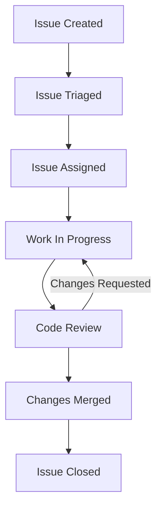

# Git Issue Tracking

## Introduction

Issue tracking is a fundamental aspect of collaborative software development that helps teams manage bugs, feature requests, and tasks in an organized manner. While Git itself doesn't provide a built-in issue tracking system, most Git hosting platforms like GitHub, GitLab, and Bitbucket offer robust issue tracking capabilities that integrate seamlessly with your Git repositories.

In this tutorial, we'll explore how issue tracking works in Git-based workflows, focusing primarily on GitHub's implementation while noting differences in other platforms where relevant.

## What is Issue Tracking?

Issue tracking is a systematic approach to recording, monitoring, and resolving problems or tasks within a project. In the context of Git collaboration, issues typically represent:

- **Bugs** that need to be fixed
- **Feature requests** for new functionality
- **Tasks** that need to be completed
- **Enhancements** to existing features
- **Questions** about the codebase or functionality

Each issue serves as a unit of work with its own discussion thread, assignees, labels, and relationship to the code.

## Why Use Issue Tracking?

Before diving into the mechanics, let's understand why issue tracking is essential for effective collaboration:

1. **Centralized Communication**: Issues provide a central place to discuss specific problems or features.
2. **Work Organization**: Teams can prioritize, assign, and track the status of different work items.
3. **Historical Record**: Issues create a searchable history of problems encountered and how they were resolved.
4. **Project Planning**: Issues can be organized into milestones or sprints for better project management.
5. **Integration with Code**: Issues can be linked directly to the code changes that implement them.

## Basic Issue Workflow

Here's the typical lifecycle of an issue in a Git-based workflow:



## Creating Issues

Let's start by learning how to create an issue in GitHub:

1. Navigate to your repository on GitHub.
2. Click on the "Issues" tab.
3. Click the "New issue" button.
4. Fill in the required information:
   - Title: A concise description of the issue
   - Description: Detailed information about the issue

### Writing Effective Issue Descriptions

A good issue description should include:

- **What happened** (for bugs) or **what needs to be done** (for features)
- **Expected behavior** (for bugs)
- **Steps to reproduce** (for bugs)
- **Screenshots** or mockups (when relevant)
- **Environment information** (operating system, browser, etc. for bugs)

Here's an example of a well-written bug report:

```
Title: Login button unresponsive on mobile devices

Description:
When using the application on an iPhone or Android device, the login button
on the homepage doesn't respond to taps, making it impossible to log in.

Expected behavior:
The login button should respond to taps and take users to the login page.

Steps to reproduce:
1. Visit homepage on a mobile device
2. Tap the "Login" button in the top-right corner
3. Observe that nothing happens

Environment:
- Tested on iPhone 12 (iOS 15.2) with Safari
- Also reproduced on Samsung Galaxy S21 (Android 12) with Chrome

Additional notes:
This issue only occurs on mobile devices. The login button works fine
on desktop browsers.
```

## Managing Issues

Once issues are created, they need to be organized, prioritized, and tracked. GitHub and other Git platforms provide several features to help with this:

### Labels

Labels are color-coded tags that help categorize issues. Common labels include:

- `bug`: Indicates something isn't working
- `enhancement`: New features or improvements
- `documentation`: Related to documentation
- `help wanted`: Extra attention is needed
- `good first issue`: Good for newcomers to the project

To add a label to an issue:
1. Open the issue
2. Click on the "Labels" gear icon on the right sidebar
3. Select the appropriate labels

### Assignees

Assignees are team members responsible for working on an issue. To assign an issue:

1. Open the issue
2. Click on the "Assignees" gear icon on the right sidebar
3. Select the team member(s) to assign

### Milestones

Milestones group issues that are part of a larger goal or release. To create and use milestones:

1. Go to the "Issues" tab
2. Click on "Milestones"
3. Click "New milestone" to create one
4. Add issues to the milestone by editing each issue

## Linking Issues and Pull Requests

One of the most powerful features of Git-based issue tracking is the ability to link issues directly to the code changes that address them. This is typically done through pull requests.

### Referencing Issues in Commits

You can reference an issue in your commit messages using the issue number with a hash symbol:

```bash
git commit -m "Fix login button on mobile devices, fixes #42"
```

Special keywords like `fixes`, `closes`, or `resolves` followed by the issue number will automatically close the issue when the commit is merged into the default branch.

### Creating a Branch for an Issue

It's good practice to create a dedicated branch for each issue you're working on:

```bash
# Create a new branch for issue #42
git checkout -b fix-login-issue-42
```

### Creating a Pull Request from an Issue

When you're ready to submit your changes:

1. Push your branch to GitHub:
   ```bash
   git push origin fix-login-issue-42
   ```

2. Go to your repository on GitHub
3. GitHub will often suggest creating a pull request from your newly pushed branch
4. In the pull request description, use phrases like "Closes #42" to link it to the issue

## Advanced Issue Tracking Features

As you become more comfortable with basic issue tracking, you can explore these advanced features:

### Issue Templates

Issue templates provide standardized formats for different types of issues. To set up issue templates:

1. Create a `.github/ISSUE_TEMPLATE/` directory in your repository
2. Add markdown files for each template type (e.g., `bug_report.md`, `feature_request.md`)

Here's an example bug report template:

```markdown
---
name: Bug report
about: Create a report to help us improve
title: ''
labels: bug
assignees: ''
---

**Describe the bug**
A clear and concise description of what the bug is.

**To Reproduce**
Steps to reproduce the behavior:
1. Go to '...'
2. Click on '....'
3. Scroll down to '....'
4. See error

**Expected behavior**
A clear and concise description of what you expected to happen.

**Screenshots**
If applicable, add screenshots to help explain your problem.

**Environment:**
 - OS: [e.g. iOS]
 - Browser [e.g. chrome, safari]
 - Version [e.g. 22]

**Additional context**
Add any other context about the problem here.
```

### Project Boards

Project boards provide a visual way to organize issues using a Kanban-style interface. To create a project board:

1. Go to the "Projects" tab in your repository
2. Click "New project"
3. Choose a template or start from scratch
4. Add columns like "To Do," "In Progress," and "Done"
5. Add issues to the appropriate columns

### Issue Automation

GitHub Actions and similar tools can be used to automate issue management. For example, you can:

- Automatically assign issues based on labels
- Close stale issues after a period of inactivity
- Move issues between project board columns based on activity

Here's a simple GitHub Actions workflow to close stale issues:

```yaml
name: Close Stale Issues

on:
  schedule:
    - cron: '0 0 * * *'  # Run daily at midnight

jobs:
  stale:
    runs-on: ubuntu-latest
    steps:
      - uses: actions/stale@v4
        with:
          stale-issue-message: 'This issue has been inactive for 30 days. It will be closed in 5 days if there is no activity.'
          days-before-issue-stale: 30
          days-before-issue-close: 5
          stale-issue-label: 'stale'
          exempt-issue-labels: 'pinned,security'
```

## Platform-Specific Features

While we've focused primarily on GitHub, other Git platforms have similar but slightly different approaches:

### GitLab Issues

GitLab offers:
- **Weight**: Assign complexity/effort values to issues
- **Health Status**: Mark issues as "On track," "Needs attention," or "At risk"
- **Time Tracking**: Record estimated and spent time on issues

### Bitbucket Issues

Bitbucket provides:
- **Priority Levels**: Set issue priorities from "Trivial" to "Blocker"
- **Jira Integration**: Tight integration with Atlassian's Jira issue tracker

## Real-World Example: Bug Fix Workflow

Let's walk through a complete example of using issue tracking to fix a bug:

1. **Issue Creation**: A user reports that the application crashes when uploading files larger than 10MB.

2. **Issue Triage**: A maintainer adds the `bug` and `high-priority` labels and assigns it to a developer.

3. **Branch Creation**: The developer creates a branch to fix the issue:
   ```bash
   git checkout -b fix-large-file-upload-crash-123
   ```

4. **Code Changes**: The developer makes the necessary changes to fix the bug.

5. **Commit with Reference**: The developer commits the changes with a reference to the issue:
   ```bash
   git commit -m "Fix application crash on large file uploads, fixes #123"
   ```

6. **Push and Pull Request**: The developer pushes the branch and creates a pull request that references the issue:
   ```bash
   git push origin fix-large-file-upload-crash-123
   ```

7. **Code Review**: Other team members review the code and approve the changes.

8. **Merge and Close**: When the pull request is merged, the issue is automatically closed due to the "fixes #123" reference.

9. **Documentation**: The issue now serves as documentation of the problem and its solution for future reference.

## Best Practices for Issue Tracking

To get the most out of Git issue tracking:

1. **Be Descriptive**: Write clear, detailed issue descriptions with all necessary information.

2. **Use Consistent Labeling**: Develop a consistent system of labels and use them across all issues.

3. **Link to Code**: Always reference issues in your commits and pull requests.

4. **Keep Issues Focused**: Each issue should address a single, specific problem or feature.

5. **Update Status Regularly**: Keep issues updated with progress reports and status changes.

6. **Close Resolved Issues Promptly**: Don't leave issues open once they're resolved.

7. **Use Templates**: Create and use issue templates to ensure consistency.

## Summary

Git issue tracking is a powerful tool for managing collaborative development efforts. While Git itself doesn't include an issue tracker, platforms like GitHub, GitLab, and Bitbucket offer robust issue tracking systems that integrate seamlessly with Git workflows.

By effectively using issues to document bugs, plan features, and track tasks, you can improve communication, organization, and productivity in your development projects. The tight integration between issues and code changes creates a cohesive system for managing the entire development lifecycle.

## Additional Resources

- [GitHub Issues Documentation](https://docs.github.com/en/issues)
- [GitLab Issues Documentation](https://docs.gitlab.com/ee/user/project/issues/)
- [Bitbucket Issues Documentation](https://support.atlassian.com/bitbucket-cloud/docs/use-the-issue-tracker/)

## Exercises

1. Create a new repository and set up at least two issue templates: one for bug reports and one for feature requests.

2. Practice the full issue workflow by:
   - Creating an issue for a hypothetical bug
   - Creating a branch to fix the issue
   - Making a small code change
   - Referencing the issue in your commit
   - Creating a pull request that references and closes the issue

3. Set up a simple project board with "To Do," "In Progress," and "Done" columns, and practice moving issues between these stages.

4. Experiment with issue automation using GitHub Actions or similar tools on your platform of choice.