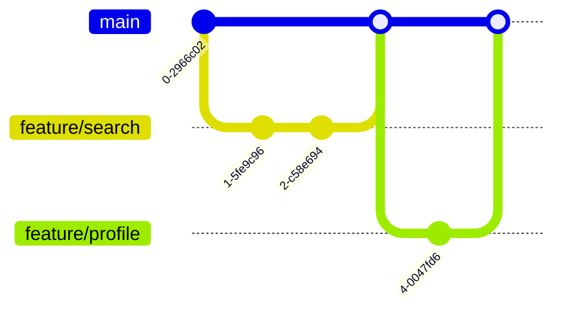
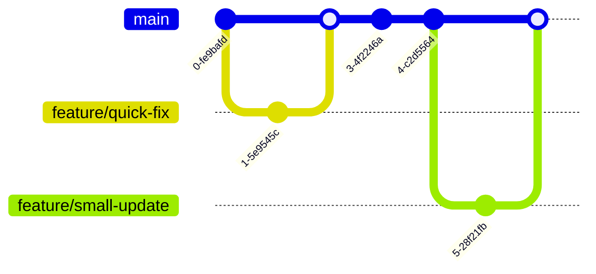

# Git Project Management

## Introduction

Git project management involves organizing and coordinating collaborative development efforts using Git's powerful version control capabilities. It goes beyond basic Git commands to focus on how teams can work together efficiently on shared codebases. Effective Git project management establishes structures, workflows, and conventions that make collaboration smoother, reduce conflicts, and maintain code quality.

In this guide, we'll explore the essential techniques and best practices for managing projects with Git, particularly for teams working on the same codebase.

## The Importance of Git Project Management

Without a clear project management approach, collaborative work with Git can quickly become chaotic:

- Team members might work on the same files simultaneously, creating complex merge conflicts
- Critical changes could be lost or overwritten
- Code quality can suffer when changes aren't properly reviewed
- Development progress may slow due to coordination issues

By implementing good Git project management practices, teams can avoid these problems and achieve:

- Parallel development without hindering each other's work
- Clear visibility of project progress
- Reliable code quality through review processes
- Streamlined releases and deployments

## Core Git Project Management Concepts

### Branching Strategies

Branches are Git's most powerful feature for project management. A well-structured branching strategy keeps development organized and prevents chaos.

#### Main Branches

Most Git projects maintain at least two permanent branches:

- `main` (or `master`): Contains production-ready code
- `develop`: Integration branch for features being prepared for release

```bash
# Creating and switching to a develop branch
git checkout -b develop
git push -u origin develop
```

#### Feature Branches

Feature branches isolate work on specific features or fixes:

```bash
# Create a feature branch from develop
git checkout develop
git checkout -b feature/user-authentication

# After work is complete
git push -u origin feature/user-authentication
```

#### Common Branching Models

**1. Git Flow**

Git Flow provides a robust framework for managing larger projects with scheduled releases.


**2. GitHub Flow**

A simpler approach focusing on continuous delivery:



**3. Trunk-Based Development**

Emphasizes working in small increments directly on the main branch or short-lived feature branches:



### Pull/Merge Requests

Pull requests (GitHub) or merge requests (GitLab) are crucial for code review and maintaining quality:

1. Developer completes work on a feature branch
2. Developer creates a pull request to merge into the target branch
3. Team reviews code, provides feedback, and requests changes if needed
4. Once approved, the branch is merged

Example workflow from the command line with GitHub:

```bash
# Push your feature branch
git push -u origin feature/login-page

# Then create a pull request on GitHub
# After review and approval, merge and clean up
git checkout develop
git pull
git branch -d feature/login-page
```

### Project Boards

Many Git platforms offer project boards to track work:

- GitHub Projects
- GitLab Boards
- Jira (with Git integration)

These tools help visualize work status, often with columns like:
- Backlog
- To Do
- In Progress
- In Review
- Done

### Tagging and Releases

Tags mark specific points in Git history, typically used for releases:

```bash
# Creating a lightweight tag
git tag v1.0.0

# Creating an annotated tag
git tag -a v1.0.0 -m "Release version 1.0.0"

# Pushing tags to remote
git push origin v1.0.0
```

## Best Practices for Git Project Management

### 1. Establish Clear Branch Naming Conventions

Consistent branch naming makes project management easier:

```
feature/short-description
bugfix/issue-reference
hotfix/critical-problem
release/version-number
```

### 2. Write Meaningful Commit Messages

Good commit messages document project history:

```bash
# Bad example
git commit -m "Fixed stuff"

# Good example
git commit -m "Fix user authentication timeout issue"

# Even better example - first line is a summary, followed by details
git commit -m "Fix user authentication timeout issue
 
This fixes the issue where users were being logged out after 5 minutes
instead of the configured 30 minutes. The problem was in the token
expiration calculation."
```

### 3. Use Pull Request Templates

Create `.github/PULL_REQUEST_TEMPLATE.md` in your repository:

```markdown
## Description
[Describe changes here]

## Related Issues
Fixes #[issue number]

## Testing
[Describe how you tested these changes]

## Checklist
- [ ] Code follows project style guidelines
- [ ] Tests added/updated
- [ ] Documentation updated
```

### 4. Implement Code Reviews

Code reviews improve quality and share knowledge:

- Review for functionality, not just style
- Use automated tools for style checking
- Be constructive and specific in feedback
- Approve only when issues are resolved

### 5. Protect Important Branches

Configure branch protection rules:

- Require pull request reviews before merging
- Require status checks to pass
- Prevent force pushes to main/develop branches

### 6. Use Continuous Integration

Integrate CI tools to automate testing:

```yaml
# Example GitHub Actions workflow (.github/workflows/ci.yml)
name: CI

on:
  push:
    branches: [ main, develop ]
  pull_request:
    branches: [ main, develop ]

jobs:
  test:
    runs-on: ubuntu-latest
    steps:
    - uses: actions/checkout@v3
    - name: Set up Node.js
      uses: actions/setup-node@v3
      with:
        node-version: '16'
    - name: Install dependencies
      run: npm ci
    - name: Run tests
      run: npm test
```

## Practical Example: Managing a Web Application Project

Let's walk through a practical example of setting up Git project management for a simple web application.

### Project Setup

```bash
# Initialize repository
git init web-app
cd web-app

# Create initial structure
touch index.html styles.css app.js README.md

# Initial commit
git add .
git commit -m "Initial project setup"

# Create develop branch
git checkout -b develop

# Push to remote (assuming remote is already set up)
git push -u origin main
git push -u origin develop
```

### Team Collaboration Scenario

**Scenario:** Your team needs to add a login feature and update the homepage.

**Developer 1 (Login Feature):**

```bash
# Create feature branch from develop
git checkout develop
git checkout -b feature/login-form

# Make changes
# Create login.html and modify app.js

git add login.html app.js
git commit -m "Add login form and authentication logic"

# Push and create pull request
git push -u origin feature/login-form
```

**Developer 2 (Homepage Update):**

```bash
# Create another feature branch from develop
git checkout develop
git checkout -b feature/homepage-redesign

# Update homepage files
git add index.html styles.css
git commit -m "Redesign homepage with new layout"

# Push and create pull request
git push -u origin feature/homepage-redesign
```

**Merging Process:**

1. Team reviews both pull requests
2. After approval, merge `feature/homepage-redesign` to `develop`
3. Merge `feature/login-form` to `develop`
4. Test the integrated features on `develop`
5. When ready for release:

```bash
# Create release branch
git checkout develop
git checkout -b release/1.0.0

# Final fixes and version updates
git commit -m "Update version to 1.0.0"

# Merge to main and develop when ready
git checkout main
git merge release/1.0.0
git tag -a v1.0.0 -m "Version 1.0.0"

git checkout develop
git merge release/1.0.0

# Push changes
git push origin main
git push origin develop
git push origin --tags
```

## Managing Conflicts

Conflicts are inevitable in collaborative projects. Here's how to handle them:

```bash
# When a merge creates conflicts
git merge feature/some-feature
# [CONFLICT] Automatic merge failed; fix conflicts and commit the result.

# After resolving conflicts in your editor
git add file-with-resolved-conflicts.js
git commit
```

Strategies to minimize conflicts:
- Communicate with team members about which files you're changing
- Keep feature branches short-lived
- Pull from the target branch regularly
- Break large features into smaller, more manageable changes

## Summary

Effective Git project management is essential for successful team collaboration. By implementing:

- A clear branching strategy
- Consistent workflows
- Good commit practices
- Quality code reviews
- Automated testing

Your team can work together efficiently, maintain high code quality, and deliver reliable software.

## Additional Resources

- [Pro Git Book](https://git-scm.com/book/en/v2)
- [GitHub Flow Guide](https://guides.github.com/introduction/flow/)
- [Atlassian Git Tutorials](https://www.atlassian.com/git/tutorials)

## Exercises

1. **Branching Practice**: Create a sample project with main and develop branches. Practice creating feature branches and merging them.

2. **Conflict Resolution**: Have two team members modify the same file in different ways and resolve the resulting merge conflict.

3. **Code Review**: Set up a pull request with deliberately introduced issues, and have team members practice code review by identifying problems.

4. **Workflow Design**: Create a Git workflow document for a hypothetical project, detailing branch naming conventions, commit message templates, and merge processes.