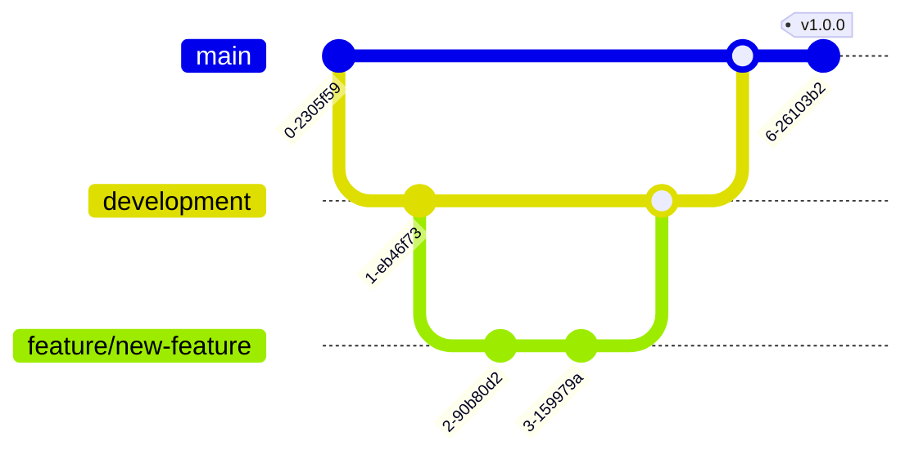

# Git Contribution Guidelines

## Introduction

Contributing to projects using Git is a great way to collaborate with other developers and improve software together. However, without clear guidelines, collaboration can quickly become chaotic. Contribution guidelines provide a structured approach for team members and outside contributors to follow when making changes to a project.

In this guide, we'll explore how to create and follow effective Git contribution guidelines for your projects. Whether you're working on a small team project or an open-source initiative, these practices will help maintain code quality and streamline the collaboration process.

## Why Contribution Guidelines Matter

Contribution guidelines serve several important purposes:

- **Quality Control**: They ensure all code meets the project's standards
- **Consistency**: They maintain uniform coding practices across contributions
- **Efficiency**: They reduce time spent reviewing inappropriate or poorly formatted submissions
- **Onboarding**: They help new contributors understand how to participate effectively

## Essential Components of Contribution Guidelines

Let's explore the key elements that should be included in your Git contribution guidelines.

### 1. Repository Structure

Start by explaining how your repository is organized. This helps contributors understand where different components are located.

```
project-name/
├── src/          # Source code
├── docs/         # Documentation
├── tests/        # Test files
├── .github/      # GitHub specific files like issue templates
├── README.md     # Project overview
└── CONTRIBUTING.md  # Contribution guidelines
```

### 2. Branching Strategy

Clearly define your branching model to avoid confusion and conflicts.



A common branching strategy includes:

- **main**: The production branch with stable code
- **development**: Integration branch for features before release
- **feature/[name]**: For developing new features
- **bugfix/[name]**: For fixing bugs
- **hotfix/[name]**: For critical production fixes

Example guideline text:

```
## Branching Strategy

Our project uses the following branching model:

- `main` - Contains production-ready code
- `development` - Integration branch for testing features
- `feature/*` - For developing new features (e.g., `feature/login-page`)
- `bugfix/*` - For fixing bugs (e.g., `bugfix/header-alignment`)
- `hotfix/*` - For urgent production fixes (e.g., `hotfix/security-patch`)

Always branch from `development` for new features and bug fixes.
```

### 3. Commit Message Guidelines

Good commit messages make project history meaningful and useful. Define clear standards for commit messages.

Example:


## Commit Message Format

We follow a structured commit message format:

```
<type>(<scope>): <subject>

<body>

<footer>
```

Types:
- feat: A new feature
- fix: A bug fix
- docs: Documentation changes
- style: Formatting changes that don't affect code behavior
- refactor: Code changes that neither fix bugs nor add features
- test: Adding or modifying tests
- chore: Changes to build process or auxiliary tools

Example:
```
feat(auth): implement JWT authentication

Added JWT token-based authentication system with refresh tokens.
Includes user login, logout, and token refresh endpoints.

Closes #123
```


### 4. Pull Request Process

Explain how contributors should submit changes through pull requests.


## Pull Request Process

1. **Create a branch** from `development` with an appropriate naming convention.
2. **Make your changes** following our code style guidelines.
3. **Test your changes** thoroughly.
4. **Update documentation** if necessary.
5. **Submit a pull request** to the `development` branch.
6. **Add a clear description** of the changes and the purpose of the PR.
7. **Link any related issues** using keywords like "Closes #123" or "Relates to #456".
8. **Wait for CI checks** to complete and pass.
9. **Address reviewer feedback** if requested.


### 5. Code Style and Quality Guidelines

Define the coding standards for your project.


## Code Style Guidelines

We follow these coding standards to maintain consistency:

- Use 2-space indentation
- Follow camelCase for variables and functions
- Use PascalCase for class names
- Add comments for complex logic
- Write unit tests for all new functions
- Max line length: 80 characters
- Run linting before committing

We use ESLint with our custom configuration. Run the linter with:

```bash
npm run lint
```


### 6. Issue Reporting Guidelines

Provide instructions for reporting bugs or suggesting features.


## Issue Reporting

When creating an issue, please use the appropriate template and include:

For bug reports:
- Clear and descriptive title
- Steps to reproduce the issue
- Expected behavior
- Actual behavior
- Screenshots if applicable
- Environment information (OS, browser, version)

For feature requests:
- Clear and descriptive title
- Detailed description of the proposed feature
- Explanation of why this feature would be valuable
- Any relevant examples or mockups


## Practical Example: Setting Up Contribution Guidelines

Let's walk through creating a `CONTRIBUTING.md` file for a project:

```bash
# Create a CONTRIBUTING.md file in your project root
touch CONTRIBUTING.md
```

Now, add content to your file following the sections we've discussed:

```markdown
# Contributing to Example Project

Thank you for considering contributing to Example Project! This document outlines the process for contributing to our repository.

## Code of Conduct

Please read and follow our [Code of Conduct](CODE_OF_CONDUCT.md).

## Getting Started

1. Fork the repository
2. Clone your fork: `git clone https://github.com/YOUR-USERNAME/example-project.git`
3. Create a branch for your changes: `git checkout -b feature/amazing-feature`

## Development Workflow

1. Make your changes
2. Run tests: `npm test`
3. Run linting: `npm run lint`
4. Commit your changes using our commit message format
5. Push to your branch: `git push origin feature/amazing-feature`
6. Open a pull request against our `development` branch

## Pull Request Requirements

All pull requests must:
- Pass all automated tests
- Follow our code style guidelines
- Include appropriate documentation
- Have a meaningful description of the changes
```

## Enforcing Guidelines with Git Hooks

You can enforce contribution guidelines using Git hooks. For example, you can create a pre-commit hook to run linting and tests:

```bash
#!/bin/sh
# .git/hooks/pre-commit

# Run linting
npm run lint

# Run tests
npm test

# If any command failed, prevent the commit
if [ $? -ne 0 ]; then
  echo "Tests or linting failed. Please fix issues before committing."
  exit 1
fi
```

Make the hook executable:

```bash
chmod +x .git/hooks/pre-commit
```

To share hooks with all contributors, use a tool like Husky:

```bash
# Install Husky
npm install husky --save-dev

# Add to package.json
```

Example package.json configuration:

```json
{
  "husky": {
    "hooks": {
      "pre-commit": "npm run lint && npm test",
      "commit-msg": "commitlint -E HUSKY_GIT_PARAMS"
    }
  }
}
```

## Real-World Example: Contributing to an Open Source Project

Let's see how you would contribute to a project following typical guidelines:

1. **Fork the repository** on GitHub by clicking the "Fork" button.

2. **Clone your fork** to your local machine:
   ```bash
   git clone https://github.com/YOUR-USERNAME/project-name.git
   cd project-name
   ```

3. **Add the original repository as a remote** to keep your fork updated:
   ```bash
   git remote add upstream https://github.com/original-owner/project-name.git
   ```

4. **Create a new branch** for your feature:
   ```bash
   git checkout -b feature/add-login-page
   ```

5. **Make your changes**, following the project's code style guidelines.

6. **Commit your changes** with a descriptive message:
   ```bash
   git commit -m "feat(auth): add login page with email validation"
   ```

7. **Push your branch** to your fork:
   ```bash
   git push origin feature/add-login-page
   ```

8. **Create a pull request** on GitHub from your fork to the original repository.

9. **Respond to feedback** from maintainers if requested.

## Common Mistakes to Avoid

When following contribution guidelines, watch out for these common pitfalls:

- **Forgetting to branch**: Always create a new branch for changes, don't work directly on `main` or `development`.
- **Large pull requests**: Keep PRs focused on a single feature or fix to make review easier.
- **Ignoring existing conventions**: Review existing code to understand the project's style.
- **Missing documentation**: Update relevant documentation when changing functionality.
- **Skipping tests**: Ensure all new code has appropriate test coverage.

## Summary

Effective Git contribution guidelines help maintain project quality and make collaboration smoother for everyone involved. Key points to remember:

- Clear guidelines benefit both project maintainers and contributors
- Essential components include branching strategy, commit message format, PR process, and code style rules
- Use automation tools like Git hooks to enforce guidelines
- Following a structured workflow helps prevent common collaboration issues

By establishing and following good contribution guidelines, you'll create a more productive development environment and higher quality codebase.

## Additional Resources

- [GitHub's Guide to Contributing to Open Source](https://opensource.guide/how-to-contribute/)
- [Conventional Commits Specification](https://www.conventionalcommits.org/)
- [GitHub Flow Guide](https://guides.github.com/introduction/flow/)

## Exercises

1. Create a `CONTRIBUTING.md` file for one of your existing projects.
2. Set up Git hooks to enforce linting and testing in your repository.
3. Practice writing commit messages following the conventional commits format.
4. Contribute to an open-source project by following their contribution guidelines.