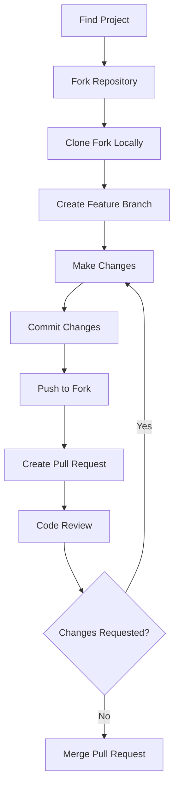

# Git Open Source

## Introduction

Open source software has revolutionized the way we build and share code. At the heart of this revolution is Git, the distributed version control system that enables thousands of developers worldwide to collaborate on projects. In this guide, we'll explore how Git facilitates open source contributions and how you can become an active participant in the open source community.

Open source refers to software whose source code is freely available for anyone to view, use, modify, and distribute. Contributing to open source projects is not only a great way to improve your coding skills, but also allows you to give back to the community and build your professional profile.

## Understanding Open Source Collaboration

Before diving into the technical aspects, let's understand the basic workflow of open source contribution:



Let's explore each of these steps in detail.

## Step 1: Finding Open Source Projects

Finding the right project to contribute to is an important first step. Here are some ways to find open source projects:

- **GitHub Explore**: Browse trending repositories and topics
- **Good First Issue**: Look for issues labeled "good first issue" or "beginner-friendly"
- **Open Source Friday**: A initiative that encourages contribution on Fridays
- **Projects you already use**: Consider contributing to tools and libraries you already work with

## Step 2: Forking a Repository

Forking creates a copy of the original repository under your GitHub account, allowing you to freely experiment without affecting the original project.

```bash
# No command needed - done through GitHub interface
# Navigate to the repository page and click the "Fork" button in the top-right corner
```

After forking, you'll have a copy of the repository under your username: `github.com/your-username/project-name`

## Step 3: Cloning Your Fork

Clone your fork to create a local copy on your computer:

```bash
# Clone your forked repository
git clone https://github.com/your-username/project-name.git

# Navigate into the project directory
cd project-name

# Add the original repository as an "upstream" remote
git remote add upstream https://github.com/original-owner/project-name.git
```

The last command sets up a connection to the original repository (called "upstream"), which will be important for keeping your fork updated.

## Step 4: Creating a Branch

Always create a new branch for your changes. This keeps your work organized and makes it easier for project maintainers to review your contribution.

```bash
# Make sure you're working with the latest code
git fetch upstream
git checkout main
git merge upstream/main

# Create and switch to a new branch
git checkout -b feature/awesome-new-feature
```

Choose a descriptive branch name that reflects the changes you're making.

## Step 5: Making Changes

Now you can make your changes to the codebase. This could involve:

- Fixing a bug
- Adding a new feature
- Improving documentation
- Adding tests
- Optimizing code

Remember to follow the project's coding style and contribution guidelines, which are usually found in the repository's `CONTRIBUTING.md` file or in the project documentation.

## Step 6: Committing Your Changes

Once you've made your changes, commit them with a clear and descriptive message:

```bash
# Add the files you've modified
git add .

# Commit with a descriptive message
git commit -m "Add feature: implement responsive navbar for mobile devices"
```

A good commit message should:
- Start with a verb in the present tense
- Be concise but descriptive
- Explain what the change does, not how it does it
- Reference issue numbers if applicable (e.g., "Fixes #123")

## Step 7: Pushing to Your Fork

Push your changes to your fork on GitHub:

```bash
git push origin feature/awesome-new-feature
```

This uploads your changes to your fork on GitHub under your new branch.

## Step 8: Creating a Pull Request

Now it's time to create a pull request (PR) to propose your changes to the original project:

1. Navigate to your fork on GitHub
2. Click the "Compare & pull request" button that appears for your recently pushed branch
3. Fill out the PR form with a clear title and description
4. Reference any relevant issues
5. Click "Create pull request"

Example of a good PR description:

```
## Description
This PR adds a responsive navigation bar that adapts to mobile screen sizes.

## Changes
- Created a responsive navbar component
- Added CSS media queries for different screen sizes
- Implemented a hamburger menu for mobile view
- Ensured accessibility compliance with ARIA attributes

## Related Issues
Fixes #42

## Screenshots
(If applicable, add screenshots to help explain your changes)

## Testing
Tested on Chrome, Firefox, and Safari on both desktop and mobile.
```

## Step 9: Code Review Process

After submitting your PR, project maintainers or other contributors will review your code. Be prepared to:

- Respond to feedback promptly
- Make requested changes
- Defend your approach or suggest alternatives
- Learn from the feedback

The review process may involve several rounds of feedback and changes before your contribution is accepted.

## Step 10: Keeping Your Fork Updated

While waiting for your PR to be reviewed, the original repository might receive other updates. To keep your fork up to date:

```bash
# Switch to your main branch
git checkout main

# Fetch changes from the original repository
git fetch upstream

# Merge changes from upstream/main
git merge upstream/main

# Push changes to your fork
git push origin main
```

If you need to update your PR branch with the latest changes:

```bash
git checkout feature/awesome-new-feature
git rebase main
git push -f origin feature/awesome-new-feature
```

Note: Be careful with force pushing (`git push -f`) as it rewrites history.

## Open Source Etiquette

Contributing to open source isn't just about code—it's about joining a community. Here are some tips for being a good open source citizen:

1. **Read the documentation** before asking questions
2. **Be patient** with maintainers, who are often volunteers
3. **Start small** with your first contributions
4. **Be respectful** in communications
5. **Follow through** on your commitments
6. **Give back** by helping others once you gain experience

## Real-World Example: Contributing to a Documentation Fix

Let's walk through a simple but common first contribution: fixing a typo in documentation.

1. Fork the repository
2. Clone your fork locally

```bash
git clone https://github.com/your-username/project-name.git
cd project-name
git remote add upstream https://github.com/original-owner/project-name.git
```

3. Create a branch for your fix

```bash
git checkout -b fix/documentation-typo
```

4. Find the typo in `README.md` and fix it with your text editor
5. Commit your changes

```bash
git add README.md
git commit -m "Fix typo in installation instructions"
```

6. Push to your fork

```bash
git push origin fix/documentation-typo
```

7. Create a pull request via GitHub's interface
8. Wait for feedback and respond accordingly

This process may seem lengthy for a small change, but following these steps ensures your contribution is handled properly and helps you practice the workflow for larger contributions later.

## Working with Issues

Most open source projects use GitHub Issues to track bugs, feature requests, and other tasks. Before starting work on a contribution:

1. **Search existing issues** to see if your bug or feature has already been reported
2. If not, **create a new issue** describing the bug or feature
3. **Comment on the issue** expressing your interest in working on it
4. **Wait for maintainer feedback** before starting work

This prevents duplication of effort and ensures your contribution aligns with the project's goals.

## Summary

Contributing to open source using Git is a rewarding way to improve your skills, build your portfolio, and give back to the developer community. By following the workflow we've outlined—forking, cloning, branching, making changes, committing, pushing, and creating pull requests—you can make meaningful contributions to projects you care about.

Remember that open source is about more than just code; it's about collaboration, communication, and community. Approach each contribution with patience and respect, and you'll find the open source community welcoming and supportive.

## Additional Resources

- [GitHub's Open Source Guide](https://opensource.guide/)
- [How to Contribute to Open Source](https://opensource.guide/how-to-contribute/)
- [First Timers Only](https://www.firsttimersonly.com/)
- [Up For Grabs](https://up-for-grabs.net/)
- [CodeTriage](https://www.codetriage.com/)

## Exercises

1. Find an open source project that interests you and star it on GitHub.
2. Read through the project's `CONTRIBUTING.md` file (if available).
3. Look for issues labeled "good first issue" or "beginner-friendly".
4. Fork the repository and clone it locally.
5. Set up the development environment according to the project's documentation.
6. Make a simple change (fix a typo, add a comment, update documentation).
7. Create a pull request with your change.
8. Reflect on the process and what you learned.

By practicing these steps, you'll build confidence in the Git workflow and be ready to make more substantial contributions to open source projects.