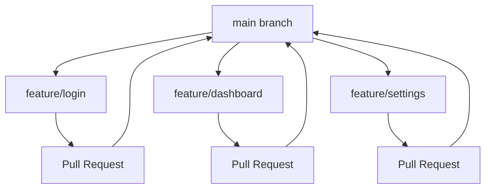
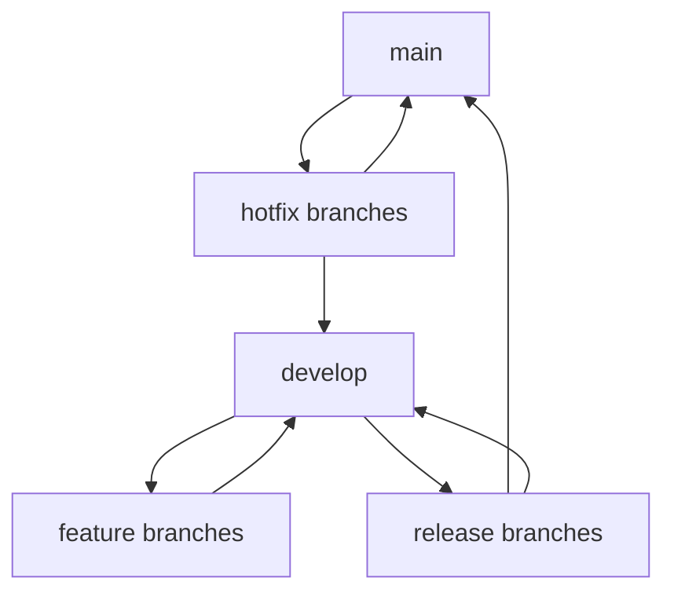
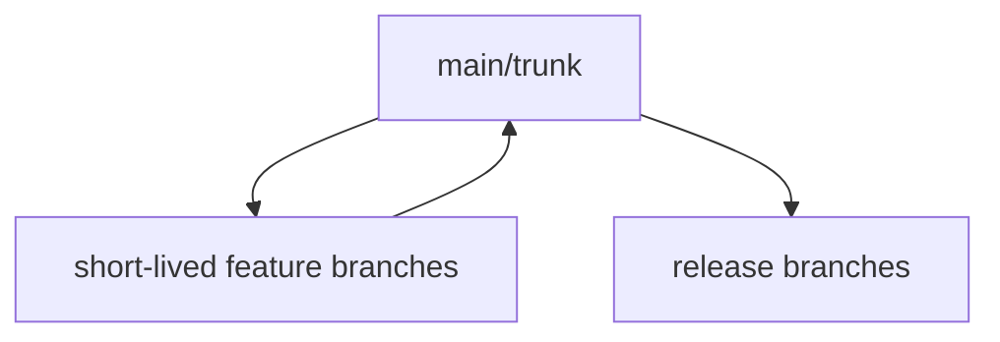

# Git Collaboration Tools

## Introduction

When working in a team, Git offers much more than just version control for your code. It provides powerful collaboration features that help teams work together efficiently. Git collaboration tools enable developers to work simultaneously on the same codebase, track changes made by different team members, manage concurrent work, resolve conflicts, and maintain code quality.

In this guide, we'll explore the essential collaboration tools and workflows that make Git an indispensable part of modern software development teams.

## Core Git Collaboration Tools

### Branches

Branches are one of Git's most powerful collaboration features. They allow team members to work on separate features or fixes without interfering with each other's work.

```bash
# Create a new feature branch
git checkout -b feature/login-page

# Make changes and commit them
git add .
git commit -m "Implement login page UI"

# Push the branch to the remote repository
git push -u origin feature/login-page
```

Branches enable parallel development, where multiple features can be developed simultaneously without affecting the main codebase until they're ready to be integrated.

### Merging and Pull Requests

When a feature is complete, it needs to be integrated back into the main codebase. This is done through merging, often facilitated by pull requests in platforms like GitHub, GitLab, or Bitbucket.

```bash
# Switch to the main branch
git checkout main

# Merge the feature branch
git merge feature/login-page

# Push the changes to the remote repository
git push origin main
```

Pull requests (PRs) extend this process by adding a layer of review. Instead of directly merging your branch, you create a PR that:
1. Shows the changes you've made
2. Allows team members to review the code
3. Provides a space for discussion
4. Can integrate with CI/CD tools for automated testing
5. Documents the change for future reference

### Fetch and Pull

To collaborate effectively, you need to stay updated with changes made by other team members.

```bash
# Fetch updates from the remote repository without merging
git fetch origin

# Pull updates (fetch + merge) from the remote repository
git pull origin main
```

The difference between fetch and pull:
- `git fetch` retrieves changes from the remote repository but doesn't integrate them into your working files
- `git pull` fetches and automatically merges changes into your current branch

### Remote Repositories

Remote repositories are versions of your project hosted on a server. They serve as the central point for collaboration, allowing team members to push their changes and pull others' changes.

```bash
# Add a remote repository
git remote add origin https://github.com/username/repository.git

# View remote repositories
git remote -v

# Push to a remote repository
git push origin main
```

Popular Git hosting services include:
- GitHub
- GitLab
- Bitbucket
- Azure DevOps

## Advanced Collaboration Tools

### Rebasing

Rebasing is an alternative to merging that rewrites the commit history to create a cleaner, more linear history.

```bash
# Switch to your feature branch
git checkout feature/login-page

# Rebase on the main branch
git rebase main
```

Benefits of rebasing:
- Creates a cleaner commit history
- Avoids unnecessary merge commits
- Makes it easier to track when and where changes were introduced

However, it should be used with caution on shared branches as it rewrites commit history.

### Interactive Rebasing

Interactive rebasing allows you to modify commits during the rebase process.

```bash
# Start an interactive rebase of the last 3 commits
git rebase -i HEAD~3
```

This opens a text editor where you can:
- Reorder commits
- Edit commit messages
- Combine multiple commits
- Split commits
- Delete commits

### Cherry-Picking

Cherry-picking allows you to apply specific commits from one branch to another.

```bash
# Find the commit hash
git log

# Apply a specific commit to your current branch
git cherry-pick a1b2c3d4
```

This is useful when you want to apply a specific bug fix or feature from one branch to another without merging the entire branch.

### Stashing

Stashing temporarily shelves changes you've made so you can work on something else and come back to them later.

```bash
# Stash your changes
git stash save "Work in progress on login feature"

# List stashes
git stash list

# Apply a stash and keep it in the stash list
git stash apply stash@{0}

# Apply a stash and remove it from the stash list
git stash pop stash@{0}
```

Stashing is useful when you need to switch contexts quickly or pull changes from a remote repository while you have uncommitted changes.

## Collaboration Workflows

Different teams adopt different Git workflows based on their needs. Here are some popular collaboration workflows:

### Feature Branch Workflow



In this workflow:
1. The main branch contains stable, production-ready code
2. Each new feature is developed in a dedicated branch
3. When complete, the feature branch is merged back into main via a pull request
4. Feature branches are typically short-lived

### Gitflow Workflow



Gitflow is a more structured workflow with specific branch roles:
1. `main` - contains production code
2. `develop` - integration branch for features
3. `feature/*` - new features development
4. `release/*` - preparation for release
5. `hotfix/*` - urgent fixes for production

### Trunk-Based Development



This workflow focuses on:
1. Small, frequent commits to the main branch (trunk)
2. Short-lived feature branches (1-2 days)
3. Heavy use of feature flags to hide incomplete features
4. Continuous integration testing

## Conflict Resolution

Conflicts occur when different developers modify the same part of a file. Resolving conflicts is an essential skill for collaboration.

When you encounter a conflict, Git will mark the conflicting sections in your files:

```
<<<<<<< HEAD
// Your changes
=======
// Other developer's changes
>>>>>>> feature/other-branch
```

To resolve conflicts:

1. Open the conflicting files in your editor
2. Decide which changes to keep or how to merge them
3. Remove the conflict markers
4. Add the resolved files and commit

```bash
# After resolving conflicts in the files
git add .
git commit -m "Resolve merge conflicts"
```

## Code Review Tools

Many Git platforms provide tools to facilitate code reviews during the pull request process:

1. **Inline comments** - Comment on specific lines of code
2. **Review requests** - Explicitly request reviews from team members
3. **Approval workflows** - Require approvals before merging
4. **Status checks** - Integrate with CI/CD tools to ensure tests pass
5. **Suggested changes** - Propose specific code changes directly in the review

## Continuous Integration Tools

Git collaboration often integrates with CI/CD tools that automatically:
- Run tests when new code is pushed
- Check code style and quality
- Build the application
- Deploy to test or production environments

Popular CI/CD tools that integrate with Git include:
- GitHub Actions
- GitLab CI/CD
- Jenkins
- CircleCI
- Travis CI

## Best Practices for Git Collaboration

### 1. Commit Often and Keep Commits Focused

```bash
# Good: Focused commit
git commit -m "Fix validation on login form"

# Avoid: Overly broad commit
git commit -m "Fixed lots of stuff"
```

### 2. Write Clear Commit Messages

Follow a convention like:
```
feat: add password strength indicator
fix: resolve login button not working on Safari
docs: update API documentation
refactor: simplify authentication logic
```

### 3. Update Frequently

```bash
# Start each day by pulling the latest changes
git pull origin main
```

### 4. Use Branches for Isolation

```bash
# Create a new branch for each feature or fix
git checkout -b fix/login-validation
```

### 5. Review Code Before Merging

Always have team members review your code through pull requests before merging into main branches.

### 6. Use Tags for Releases

```bash
# Create a tag for a release
git tag -a v1.0.0 -m "Version 1.0.0"

# Push tags to the remote repository
git push origin --tags
```

## Summary

Git collaboration tools transform version control from a solo activity into a powerful framework for team development. By leveraging branches, pull requests, and established workflows, teams can work efficiently, maintain code quality, and avoid stepping on each other's toes.

The tools and practices covered in this guide provide a foundation for effective collaboration:
- Branches for parallel development
- Pull requests for code review and integration
- Remote repositories for sharing code
- Advanced tools like rebasing and cherry-picking for specific scenarios
- Established workflows to organize team efforts
- Conflict resolution techniques
- Integration with CI/CD tools

As you continue working with Git in team environments, you'll develop your own preferences and workflows tailored to your team's needs.

## Additional Resources

- [Pro Git Book](https://git-scm.com/book/en/v2) - Comprehensive free guide to Git
- [GitHub Learning Lab](https://lab.github.com/) - Interactive tutorials
- [Git Branching Model](https://nvie.com/posts/a-successful-git-branching-model/) - Detailed description of Gitflow
- [Learn Git Branching](https://learngitbranching.js.org/) - Interactive visualization tool

## Exercises

1. Create a sample repository and practice creating branches, making changes, and merging them.
2. Simulate a merge conflict by having two branches modify the same line of code, then resolve the conflict.
3. Set up a remote repository on GitHub or GitLab and practice pushing and pulling changes.
4. Try different workflows with a small team project and evaluate which works best for your team.
5. Practice using interactive rebasing to clean up a series of commits before creating a pull request.