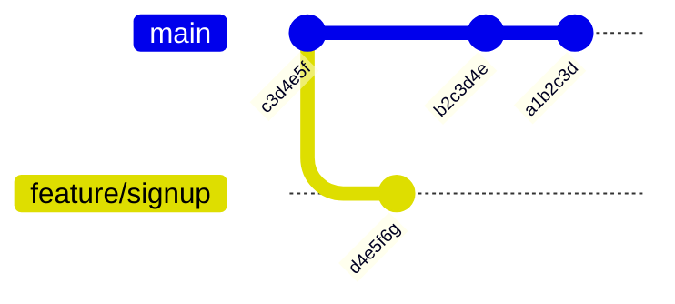

# Git History Viewing

## Introduction

One of Git's most powerful features is its ability to track and maintain a complete history of all changes made to your project. Viewing this history is essential for understanding how your project has evolved, tracking down bugs, and collaborating effectively with others. In this guide, we'll explore various ways to view and navigate Git history, from basic commands to advanced techniques.

## Why Git History Matters

Before diving into commands, let's understand why viewing history is important:

- **Troubleshooting**: Find when and where bugs were introduced
- **Understanding**: See how your project evolved over time
- **Collaboration**: Track who made specific changes and why
- **Recovery**: Find deleted code or revert to previous states

## Basic History Viewing with `git log`

The fundamental command for viewing Git history is `git log`. In its simplest form, it shows a list of commits in reverse chronological order.

```bash
$ git log
commit a1b2c3d4e5f6g7h8i9j0k1l2m3n4o5p6q7r8s9t0
Author: Jane Developer <jane@example.com>
Date:   Mon Feb 12 14:30:45 2024 -0700

    Add user authentication feature

commit b2c3d4e5f6g7h8i9j0k1l2m3n4o5p6q7r8s9t0u1
Author: John Coder <john@example.com>
Date:   Sun Feb 11 09:15:20 2024 -0700

    Fix navigation bug in mobile view

commit c3d4e5f6g7h8i9j0k1l2m3n4o5p6q7r8s9t0u1v2
Author: Jane Developer <jane@example.com>
Date:   Sat Feb 10 16:45:10 2024 -0700

    Initial commit
```

### Customizing the Output

The default output can be verbose. Here are some useful options to customize it:

#### Condensed Output with `--oneline`

```bash
$ git log --oneline
a1b2c3d Add user authentication feature
b2c3d4e Fix navigation bug in mobile view
c3d4e5f Initial commit
```

#### Limiting the Number of Commits with `-n`

```bash
$ git log -n 2
commit a1b2c3d4e5f6g7h8i9j0k1l2m3n4o5p6q7r8s9t0
Author: Jane Developer <jane@example.com>
Date:   Mon Feb 12 14:30:45 2024 -0700

    Add user authentication feature

commit b2c3d4e5f6g7h8i9j0k1l2m3n4o5p6q7r8s9t0u1
Author: John Coder <john@example.com>
Date:   Sun Feb 11 09:15:20 2024 -0700

    Fix navigation bug in mobile view
```

#### Adding Commit Graphs with `--graph`

```bash
$ git log --oneline --graph
* a1b2c3d Add user authentication feature
* b2c3d4e Fix navigation bug in mobile view
* c3d4e5f Initial commit
```

## Viewing Changes in Commits

To see what changes were made in each commit, use the `-p` or `--patch` option:

```bash
$ git log -p -n 1
commit a1b2c3d4e5f6g7h8i9j0k1l2m3n4o5p6q7r8s9t0
Author: Jane Developer <jane@example.com>
Date:   Mon Feb 12 14:30:45 2024 -0700

    Add user authentication feature

diff --git a/src/auth.js b/src/auth.js
new file mode 100644
index 0000000..b5b7a69
--- /dev/null
+++ b/src/auth.js
@@ -0,0 +1,25 @@
+function authenticate(username, password) {
+  // Authentication logic here
+  return token;
+}
+
+module.exports = { authenticate };
```

### Viewing Changes with Statistics

The `--stat` option gives you a summary of changes for each commit:

```bash
$ git log --stat -n 1
commit a1b2c3d4e5f6g7h8i9j0k1l2m3n4o5p6q7r8s9t0
Author: Jane Developer <jane@example.com>
Date:   Mon Feb 12 14:30:45 2024 -0700

    Add user authentication feature

 src/auth.js       | 25 +++++++++++++++++++++++++
 src/index.js      |  3 +++
 2 files changed, 28 insertions(+)
```

## Filtering History

Git offers several ways to filter history to find exactly what you're looking for.

### Filtering by Author

```bash
$ git log --author="Jane"
commit a1b2c3d4e5f6g7h8i9j0k1l2m3n4o5p6q7r8s9t0
Author: Jane Developer <jane@example.com>
Date:   Mon Feb 12 14:30:45 2024 -0700

    Add user authentication feature

commit c3d4e5f6g7h8i9j0k1l2m3n4o5p6q7r8s9t0u1v2
Author: Jane Developer <jane@example.com>
Date:   Sat Feb 10 16:45:10 2024 -0700

    Initial commit
```

### Filtering by Date

```bash
$ git log --after="2024-02-11" --before="2024-02-13"
commit a1b2c3d4e5f6g7h8i9j0k1l2m3n4o5p6q7r8s9t0
Author: Jane Developer <jane@example.com>
Date:   Mon Feb 12 14:30:45 2024 -0700

    Add user authentication feature

commit b2c3d4e5f6g7h8i9j0k1l2m3n4o5p6q7r8s9t0u1
Author: John Coder <john@example.com>
Date:   Sun Feb 11 09:15:20 2024 -0700

    Fix navigation bug in mobile view
```

### Filtering by File

```bash
$ git log -- src/index.js
commit a1b2c3d4e5f6g7h8i9j0k1l2m3n4o5p6q7r8s9t0
Author: Jane Developer <jane@example.com>
Date:   Mon Feb 12 14:30:45 2024 -0700

    Add user authentication feature

commit c3d4e5f6g7h8i9j0k1l2m3n4o5p6q7r8s9t0u1v2
Author: Jane Developer <jane@example.com>
Date:   Sat Feb 10 16:45:10 2024 -0700

    Initial commit
```

### Searching Commit Messages

Use `--grep` to search for keywords in commit messages:

```bash
$ git log --grep="fix"
commit b2c3d4e5f6g7h8i9j0k1l2m3n4o5p6q7r8s9t0u1
Author: John Coder <john@example.com>
Date:   Sun Feb 11 09:15:20 2024 -0700

    Fix navigation bug in mobile view
```

### Searching for Code Changes

Use `-S` to search for changes that add or remove specific strings:

```bash
$ git log -S"authenticate"
commit a1b2c3d4e5f6g7h8i9j0k1l2m3n4o5p6q7r8s9t0
Author: Jane Developer <jane@example.com>
Date:   Mon Feb 12 14:30:45 2024 -0700

    Add user authentication feature
```

## Visualizing History

Git history is often branched and merged. The `--graph` option helps visualize this:

```bash
$ git log --oneline --graph --all
* a1b2c3d (HEAD -> main) Add user authentication feature
* b2c3d4e Fix navigation bug in mobile view
| * d4e5f6g (feature/signup) Add signup form
|/
* c3d4e5f Initial commit
```

For a more visual representation, you can use `git log` with a custom format or a GUI tool.



## Advanced History Viewing Techniques

### Using `git show` to View Specific Commits

To view details of a specific commit, use `git show` with the commit hash:

```bash
$ git show a1b2c3d
commit a1b2c3d4e5f6g7h8i9j0k1l2m3n4o5p6q7r8s9t0
Author: Jane Developer <jane@example.com>
Date:   Mon Feb 12 14:30:45 2024 -0700

    Add user authentication feature

diff --git a/src/auth.js b/src/auth.js
new file mode 100644
index 0000000..b5b7a69
--- /dev/null
+++ b/src/auth.js
@@ -0,0 +1,25 @@
+function authenticate(username, password) {
+  // Authentication logic here
+  return token;
+}
+
+module.exports = { authenticate };
```

### Using `git blame` to See Line-by-Line History

The `git blame` command shows who last modified each line of a file:

```bash
$ git blame src/index.js
a1b2c3d4 (Jane Developer 2024-02-12 14:30:45 -0700  1) const express = require('express');
a1b2c3d4 (Jane Developer 2024-02-12 14:30:45 -0700  2) const { authenticate } = require('./auth');
c3d4e5f6 (Jane Developer 2024-02-10 16:45:10 -0700  3) 
c3d4e5f6 (Jane Developer 2024-02-10 16:45:10 -0700  4) const app = express();
b2c3d4e5 (John Coder     2024-02-11 09:15:20 -0700  5) app.use(express.json());
```

### History of Branches and Merges with `git reflog`

The `git reflog` command shows a log of all reference updates, including branch switching and resets:

```bash
$ git reflog
a1b2c3d (HEAD -> main) HEAD@{0}: merge feature/signup: Fast-forward
b2c3d4e HEAD@{1}: checkout: moving from feature/signup to main
d4e5f6g (feature/signup) HEAD@{2}: commit: Add signup form
c3d4e5f HEAD@{3}: checkout: moving from main to feature/signup
b2c3d4e HEAD@{4}: commit: Fix navigation bug in mobile view
c3d4e5f HEAD@{5}: commit (initial): Initial commit
```

## Real-World Examples

Let's look at some common scenarios where viewing Git history is useful:

### Example 1: Finding When a Bug Was Introduced

Imagine users are reporting that a feature that used to work is now broken. You can use `git bisect` to find when the bug was introduced:

```bash
$ git bisect start
$ git bisect bad  # Current state is bad
$ git bisect good c3d4e5f  # The initial commit is known to be good

# Git will automatically checkout commits between good and bad
# After testing each checkout, you tell Git if it's good or bad
$ git bisect good  # or git bisect bad

# Eventually Git will identify the first bad commit
b2c3d4e is the first bad commit
commit b2c3d4e5f6g7h8i9j0k1l2m3n4o5p6q7r8s9t0u1
Author: John Coder <john@example.com>
Date:   Sun Feb 11 09:15:20 2024 -0700

    Fix navigation bug in mobile view

$ git bisect reset  # Return to original HEAD
```

### Example 2: Tracking Changes to a Specific Function

If you want to see how a specific function evolved over time:

```bash
$ git log -p --follow src/auth.js

# This will show all commits that modified the auth.js file
# with the actual changes in each commit
```

### Example 3: Creating a Changelog

To generate a changelog for a release:

```bash
$ git log --pretty=format:"%h - %s (%an, %ar)" --since="1 month ago"
a1b2c3d - Add user authentication feature (Jane Developer, 1 month ago)
b2c3d4e - Fix navigation bug in mobile view (John Coder, 1 month ago)
d4e5f6g - Add signup form (Jane Developer, 1 month ago)
```

## Customizing Git Log Format

You can create custom formats for `git log` using the `--pretty=format` option:

```bash
$ git log --pretty=format:"%C(bold blue)%h%C(reset) - %C(bold green)(%ar)%C(reset) %C(white)%s%C(reset) %C(dim white)- %an%C(reset)"
a1b2c3d - (1 month ago) Add user authentication feature - Jane Developer
b2c3d4e - (1 month ago) Fix navigation bug in mobile view - John Coder
c3d4e5f - (1 month ago) Initial commit - Jane Developer
```

Many developers create aliases for their favorite formats in their Git configuration.

## Summary

Git's history viewing capabilities are powerful tools for understanding, debugging, and collaborating on software projects. We've covered:

- Basic history viewing with `git log`
- Viewing and understanding changes in commits
- Filtering history by author, date, file, and content
- Visualizing branched history
- Advanced techniques with `git show`, `git blame`, and `git reflog`
- Real-world applications for debugging and tracking changes

By mastering these commands, you'll be able to navigate through your project's history with confidence, find the information you need quickly, and gain deeper insights into your codebase.

## Additional Resources

- Try practicing these commands on a sample repository
- Set up aliases for commonly used git log formats in your `.gitconfig` file
- Explore GUI tools that visualize Git history, such as GitKraken, SourceTree, or the built-in Git tools in IDEs like VSCode

## Exercises

1. Create a repository and make several commits. Then use `git log` with different options to view the history.
2. Practice using `git blame` to identify who made changes to specific lines in a file.
3. Try using `git bisect` to find when a specific change was introduced.
4. Create a custom `git log` format that includes the information most important to you.
5. Use `git show` to view the changes in different commits and compare them.