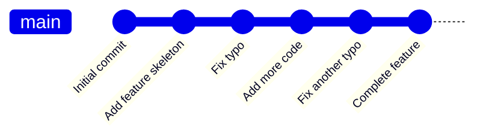
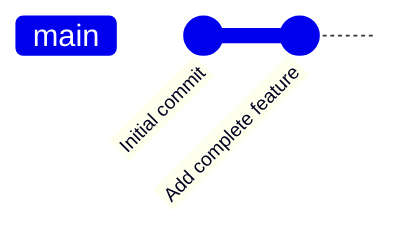

# Git History Cleanup

A clean Git history makes collaboration easier and helps maintain the readability of your project's development timeline. This guide will teach you how to clean up your Git history effectively.

## Introduction

Git history cleanup refers to the process of organizing, consolidating, and refining your commit history to make it more readable and useful. A messy Git history can make it difficult to:

- Track when and why changes were introduced
- Find bugs through `git bisect`
- Understand the evolution of your codebase
- Generate meaningful changelogs

In this guide, we'll explore various techniques to clean up your Git history, from simple commit message edits to more advanced operations like interactive rebasing and squashing.

## Why Clean Up Your Git History?

Before diving into the how, let's understand why a clean Git history matters:

1. **Readability**: A clean history tells a coherent story of your project's development
2. **Collaboration**: Makes it easier for team members to understand changes
3. **Debugging**: Simplifies root cause analysis when bugs appear
4. **Code reviews**: Facilitates more effective code reviews
5. **Documentation**: Serves as living documentation of the project's evolution

## Basic History Cleanup Techniques

### Amending the Last Commit

If you've just made a commit and realize you need to make changes (fix a typo, add a forgotten file, or update the commit message), you can amend it:

```bash
# Make your changes to files
git add .
# Amend the previous commit
git commit --amend
```

If you only want to change the commit message:

```bash
git commit --amend -m "New, improved commit message"
```

**Example:**

Input:
```bash
# Current situation
$ git log --oneline -1
a1b2c3d Fixed bug #123
# Oops, I forgot to add a file!
$ git add forgotten-file.js
$ git commit --amend
```

Output (after editing the commit message in your text editor):
```bash
$ git log --oneline -1
e4f5g6h Fixed bug #123 and added missing validation
```

### Discarding Unpublished Commits

If you have local commits that you want to discard entirely:

```bash
# Reset to a specific commit
git reset --hard <commit-hash>

# Or reset to remote state
git reset --hard origin/main
```

⚠️ **Warning**: This operation is destructive and will permanently delete uncommitted changes and commits after the specified point.

## Interactive Rebase for History Cleanup

Interactive rebase is the most powerful tool for history cleanup. It allows you to modify a series of commits by reordering, editing, squashing, or dropping them.

### Starting an Interactive Rebase

To rebase the last n commits interactively:

```bash
git rebase -i HEAD~n
```

Alternatively, to rebase all commits that differ from the main branch:

```bash
git rebase -i main
```

### Common Interactive Rebase Operations

In the interactive rebase editor, you'll see a list of commits with commands:

```
pick f7f3f6d Update project dependencies
pick 310154e Fix formatting in README
pick a5f4a0d Add feature X
pick 1e4a13c Fix bug in feature X
```

You can change the word "pick" to any of these commands:

- `p`, `pick`: use the commit as is
- `r`, `reword`: use the commit, but edit the message
- `e`, `edit`: use the commit, but stop for amending
- `s`, `squash`: combine this commit with the previous one
- `f`, `fixup`: like squash, but discard this commit's message
- `d`, `drop`: remove the commit entirely

### Example: Squashing Related Commits

Let's say you have several commits related to a single feature, and you want to combine them:

Input:
```bash
$ git log --oneline -4
a1b2c3d Add validation to user form
b2c3d4e Fix validation error message
c3d4e5f Update validation tests
d4e5f6g Add documentation for validation
```

Run interactive rebase:
```bash
$ git rebase -i HEAD~4
```

In the editor, modify the commands:
```
pick a1b2c3d Add validation to user form
squash b2c3d4e Fix validation error message
squash c3d4e5f Update validation tests
squash d4e5f6g Add documentation for validation
```

Output (after saving and providing a new commit message):
```bash
$ git log --oneline -1
e5f6g7h Add user form validation with tests and docs
```

## Advanced Techniques

### Rewriting Author Information

If you committed with the wrong user information, you can fix it:

```bash
git commit --amend --author="John Doe <john@example.com>"
```

For multiple commits, you'll need to use a script or `git filter-branch`.

### Splitting a Commit

To split a commit into multiple smaller ones:

1. Start an interactive rebase: `git rebase -i <commit>^`
2. Mark the commit with `edit`
3. Reset to the previous commit: `git reset HEAD^`
4. Add and commit changes in smaller, logical chunks
5. Continue the rebase: `git rebase --continue`

### Reordering Commits

During interactive rebase, you can reorder commits by simply changing their order in the rebase file:

```
# Original
pick a1b2c3d Fix bug in login
pick b2c3d4e Update documentation
pick c3d4e5f Add new feature

# Reordered
pick c3d4e5f Add new feature
pick a1b2c3d Fix bug in login
pick b2c3d4e Update documentation
```

## Visualizing History Changes

A visual representation can help understand history structure before and after cleanup:



After squashing:



## Best Practices for History Cleanup

1. **Only rewrite unpublished history**: Avoid rewriting history that has already been pushed to a shared repository.
2. **Use feature branches**: Work on features in separate branches to make cleanup easier.
3. **Commit logically**: Make each commit represent a single logical change.
4. **Write meaningful commit messages**: Follow conventions like "Fix bug in X" rather than "Fixed stuff".
5. **Squash before merging**: Many teams prefer to squash feature branch commits before merging to main.

### Git Configuration for Cleaner History

You can configure Git to help maintain a cleaner history:

```bash
# Always rebase instead of merge when pulling
git config --global pull.rebase true

# Automatically squash fixup commits during rebase
git config --global rebase.autosquash true
```

## Working with Published History

If you need to clean up history that's already been pushed:

1. **Communicate with your team**: Make sure everyone knows what you're doing.
2. **Consider creating a new branch**: Instead of force-pushing to an existing branch.
3. **Use `--force-with-lease`**: If you must force-push, use this safer alternative:

```bash
git push --force-with-lease
```

## Real-World Example: Preparing a Pull Request

Let's walk through a common scenario: you've been working on a feature branch and are preparing it for a pull request.

**Current history:**
```bash
$ git log --oneline
a1b2c3d WIP: Still working on feature
b2c3d4e Fix tests
c3d4e5f Add feature implementation
d4e5f6g WIP: Initial feature structure
e5f6g7h Update dependencies for feature
```

**Cleanup process:**

1. Rebase onto the latest main:
```bash
git fetch origin
git rebase origin/main
```

2. Clean up your commits:
```bash
git rebase -i HEAD~5
```

3. In the editor, organize commits:
```
pick e5f6g7h Update dependencies for feature
pick c3d4e5f Add feature implementation
fixup d4e5f6g WIP: Initial feature structure
fixup a1b2c3d WIP: Still working on feature
fixup b2c3d4e Fix tests
```

4. Push your cleaned-up branch:
```bash
git push --force-with-lease origin feature-branch
```

**Final history:**
```bash
$ git log --oneline
f6g7h8i Add feature implementation
e5f6g7h Update dependencies for feature
```

## Troubleshooting Common Issues

### Resolving Conflicts During Rebase

When conflicts occur during rebase:

1. Resolve the conflicts in each file
2. `git add` the resolved files
3. Continue with `git rebase --continue`
4. If you need to abort: `git rebase --abort`

### Recovering Lost Commits

If you accidentally lose commits during history cleanup:

```bash
# View reflog to find lost commits
git reflog

# Recover the commit
git cherry-pick <commit-hash>
# or
git reset --hard <commit-hash>
```

## Summary

Cleaning up your Git history is a valuable skill that improves collaboration and maintainability. Remember these key points:

- Commit history should tell a clear, logical story of your project
- Use `--amend` for simple fixes to recent commits
- Interactive rebase (`rebase -i`) is your main tool for history cleanup
- Be cautious when rewriting published history
- Communicate with your team when cleaning up shared history

With these techniques, you'll maintain a clean, readable Git history that serves as useful documentation for your project.

## Exercises

1. Create a new repository and practice amending your most recent commit.
2. Make five small commits and then use interactive rebase to squash them into two logical commits.
3. Practice reordering commits using interactive rebase.
4. Try splitting a large commit into smaller, more focused commits.
5. Set up a feature branch workflow with a colleague and practice preparing a clean pull request.

## Additional Resources

- [Pro Git Book - Rewriting History](https://git-scm.com/book/en/v2/Git-Tools-Rewriting-History)
- [Git Documentation - git-rebase](https://git-scm.com/docs/git-rebase)
- [Atlassian Git Tutorial - Rewriting History](https://www.atlassian.com/git/tutorials/rewriting-history)
- [GitHub Blog - GitHub Flow](https://guides.github.com/introduction/flow/)