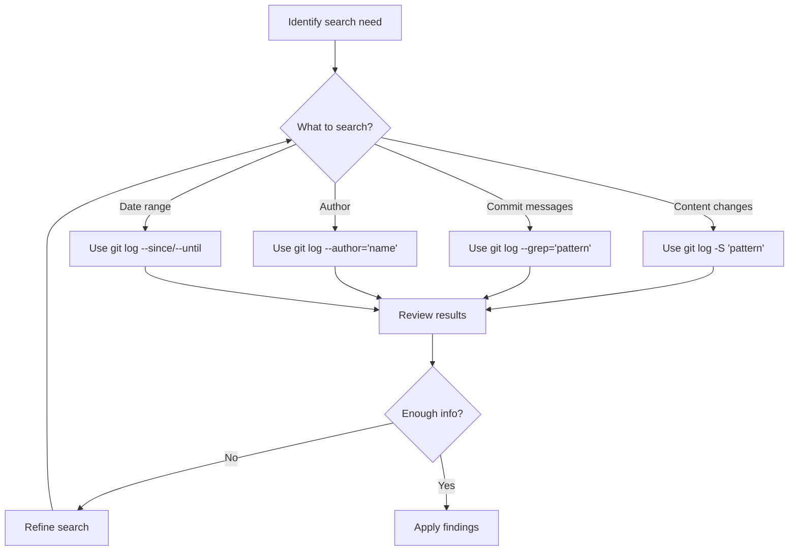

# Git History Searching

## Introduction

When working on a project with Git, the commit history becomes a valuable record of how your codebase has evolved over time. As projects grow, this history can become extensive, making it challenging to locate specific changes or understand when and why certain code modifications were made. Git provides powerful tools for searching through this history, allowing you to find exactly what you need without manually reviewing each commit.

In this guide, we'll explore various techniques for searching Git history, from basic log filtering to advanced pattern matching, helping you become proficient at extracting valuable information from your project's timeline.

## Basic History Viewing with `git log`

The foundation of history searching in Git starts with the `git log` command, which displays the commit history.

```bash
git log
```

**Output:**
```
commit a1b2c3d4e5f6g7h8i9j0k1l2m3n4o5p6q7r8s9t0
Author: Jane Developer <jane@example.com>
Date:   Mon Oct 21 14:32:12 2024 -0700

    Add user authentication feature

commit b2c3d4e5f6g7h8i9j0k1l2m3n4o5p6q7r8s9t0u1
Author: John Coder <john@example.com>
Date:   Sun Oct 20 11:05:38 2024 -0700

    Fix pagination bug in user listing
    
# More commits...
```

By default, `git log` shows all commits from the current branch in reverse chronological order (newest first). While useful, this basic view can be overwhelming for repositories with many commits.

## Limiting the Number of Commits

To see only a specific number of the most recent commits:

```bash
git log -n 5
```

This limits the output to the 5 most recent commits, making it more manageable to review recent changes.

## Formatting Log Output

Git allows you to customize the log output format to focus on relevant information:

```bash
git log --oneline
```

**Output:**
```
a1b2c3d Search feature implementation
b2c3d4e Fix navigation bug
c3d4e5f Update documentation
d4e5f6g Add responsive design
e5f6g7h Initial commit
```

This compact format displays each commit on a single line with its shortened hash and commit message, perfect for getting a quick overview.

## Searching by Author

To find commits by a specific author:

```bash
git log --author="Jane"
```

This will show all commits made by authors whose name contains "Jane".

## Searching by Date

You can filter commits by date using the `--since` and `--until` options:

```bash
git log --since="2024-10-01" --until="2024-10-15"
```

This shows commits made between October 1 and October 15, 2024.

You can also use relative dates:

```bash
git log --since="2 weeks ago"
```

## Searching Commit Messages

One of the most powerful features is searching through commit messages:

```bash
git log --grep="bug fix"
```

This command finds all commits whose messages contain the phrase "bug fix" (case-sensitive by default).

For case-insensitive searching:

```bash
git log --grep="bug fix" -i
```

## Searching for Code Changes

To search for commits that added or removed specific code:

```bash
git log -S"function authenticate()"
```

This uses the `-S` flag (nicknamed the "pickaxe" option) to find commits where the string "function authenticate()" was added or removed.

For more complex pattern matching using regular expressions:

```bash
git log -G"auth.*\(user, password\)"
```

The `-G` option allows you to search using regular expressions.

## Viewing Changes in Commits

To see the actual changes made in each commit:

```bash
git log -p
```

This shows the patch (diff) for each commit, displaying exactly what was changed.

For a statistical summary instead:

```bash
git log --stat
```

**Output:**
```
commit a1b2c3d4e5f6g7h8i9j0k1l2m3n4o5p6q7r8s9t0
Author: Jane Developer <jane@example.com>
Date:   Mon Oct 21 14:32:12 2024 -0700

    Add user authentication feature

 src/auth/login.js      | 45 +++++++++++++++++++
 src/auth/register.js   | 52 +++++++++++++++++++++
 src/components/Login.js | 28 +++++++++++
 3 files changed, 125 insertions(+)
```

## Searching Specific Files or Directories

To see the history of a specific file:

```bash
git log -- path/to/file.js
```

This shows all commits that affected the specified file.

## Visualizing History with Graphs

For visualizing branch and merge history:

```bash
git log --graph --oneline --all
```

**Output:**
```
* a1b2c3d (HEAD -> main) Add search functionality
| * b2c3d4e (feature/user-profiles) Implement profile images
| * c3d4e5f Add user bio section
|/  
* d4e5f6g Update database schema
* e5f6g7h Initial commit
```

This command creates an ASCII graph showing the commit history and branch structure.

## Advanced Filtering with Multiple Conditions

You can combine multiple search criteria:

```bash
git log --author="Jane" --grep="fix" --since="1 month ago"
```

This finds all commits by Jane containing "fix" in the message within the last month.

## Real-World Example: Debugging a Bug

Let's say you've discovered a bug in the authentication system and want to understand when it might have been introduced.

```bash
git log -S"isAuthenticated" --patch
```

This command finds all commits that modified the "isAuthenticated" function or variable and shows the exact changes.

**Output:**
```
commit a1b2c3d4e5f6g7h8i9j0k1l2m3n4o5p6q7r8s9t0
Author: Jane Developer <jane@example.com>
Date:   Mon Oct 21 14:32:12 2024 -0700

    Fix typo in authentication condition

diff --git a/src/auth/utils.js b/src/auth/utils.js
index 8a7e3d5..9f8a12c 100644
--- a/src/auth/utils.js
+++ b/src/auth/utils.js
@@ -42,7 +42,7 @@ function checkPermissions(user, resource) {
 }
 
 function isAuthenticated(session) {
-  return session && session.token != null;
+  return session && session.token !== null;
 }
```

By examining this output, you can see that Jane changed the comparison operator from `!=` to `!==`, which might be related to the bug.

## Real-World Example: Finding Feature Implementation

To understand how a feature was implemented over time:

```bash
git log --grep="user profile" --follow -- src/components/Profile.js
```

This command finds all commits related to "user profile" that affected the Profile.js file, even if the file was renamed at some point.

## Workflow Diagram

Here's a diagram illustrating a typical Git history search workflow:



## Summary

Git history searching is a powerful skill that allows you to:

- Find when specific code changes were introduced
- Track the evolution of features
- Identify potential sources of bugs
- Understand the reasoning behind code changes
- Follow the development history of specific files or components

By mastering these search techniques, you can navigate even the most complex Git repositories with confidence, extracting valuable insights from your project's history.

## Additional Resources and Exercises

### Exercises

1. **Basic Log Navigation**: Clone a public repository and use `git log` to find the 10 most recent commits.

2. **Author Search**: Find all commits made by the repository's most active contributor.

3. **Code Archaeology**: Pick a function in the codebase and use `-S` to discover when it was first introduced and how it evolved.

4. **Bug Investigation**: Pretend there's a bug in a specific file. Use Git history searching to find the last 5 changes to that file.

5. **Feature Timeline**: Use a combination of `--grep` and file filtering to trace the development of a specific feature from its first mention to completion.

### Advanced Git History Commands

```bash
# Find who last modified each line of a file (useful for finding experts)
git blame path/to/file.js

# See a list of commits between two branches
git log main..feature-branch

# Search for changes that added or removed the word "password"
git log -S"password" --patch
```

By practicing these techniques, you'll become more efficient at navigating codebases, understanding code evolution, and solving problems through historical analysis of your projects.