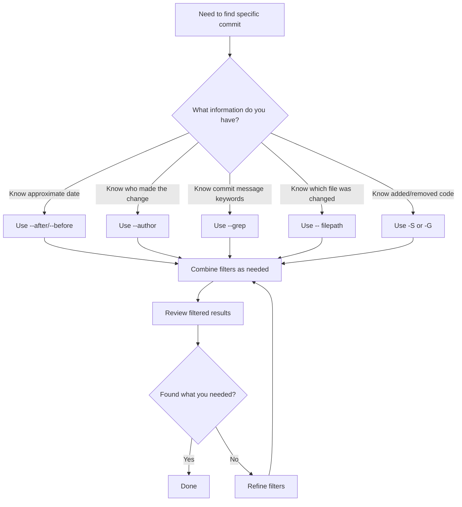

# Git Log Filtering

## Introduction

When working on projects with Git, the commit history can quickly grow to hundreds or thousands of entries. Scrolling through all commits to find specific information becomes impractical. This is where Git log filtering comes in - a powerful way to search through your project's history to find exactly what you need.

Git log filtering allows you to narrow down the commit history based on different criteria such as:
- Time periods
- Authors
- Commit messages
- Changed files
- And much more

In this guide, we'll explore various techniques to filter your Git logs effectively, helping you become more efficient at navigating your project's history.

## Basic Git Log Command

Before diving into filtering, let's review the basic `git log` command:

```bash
git log
```

This command displays all commits in reverse chronological order (newest first), showing:
- Commit hash
- Author name and email
- Date and time
- Commit message

Example output:

```
commit a1b2c3d4e5f6g7h8i9j0k1l2m3n4o5p6q7r8s9t0
Author: John Doe <john.doe@example.com>
Date:   Mon Oct 10 15:30:22 2023 +0200

    Add user authentication feature

commit u1v2w3x4y5z6a7b8c9d0e1f2g3h4i5j6k7l8m9n0
Author: Jane Smith <jane.smith@example.com>
Date:   Sun Oct 9 12:15:45 2023 +0200

    Fix navigation bug in mobile view
```

## Limiting the Number of Commits

The simplest way to filter is to limit the number of commits shown:

```bash
git log -n 5
```

This shows only the 5 most recent commits. You can replace `5` with any number.

## Time-Based Filtering

### Filter by Date Range

You can filter commits within a specific date range:

```bash
git log --after="2023-09-01" --before="2023-09-30"
```

This shows commits made during September 2023.

### Relative Time Filtering

Git also understands relative time references:

```bash
git log --after="2 weeks ago"
git log --before="yesterday"
git log --after="1 month ago" --before="2 days ago"
```

## Filtering by Author

Find commits by a specific author:

```bash
git log --author="John Doe"
```

You can use partial names or email patterns with regular expressions:

```bash
git log --author="John\|Jane"  # Shows commits by either John or Jane
git log --author="@example.com"  # Shows commits from anyone with this email domain
```

## Filtering by Commit Message

Search for specific words or phrases in commit messages:

```bash
git log --grep="bug fix"
```

This finds all commits containing the phrase "bug fix" in their message.

Case-insensitive search:

```bash
git log --grep="feature" --ignore-case
```

## Filtering by File or Directory

See the history of a specific file:

```bash
git log -- path/to/file.js
```

Or for a specific directory:

```bash
git log -- src/components/
```

### Finding Who Changed a Specific Line

The `git blame` command complements log filtering when you need to find who changed a specific line:

```bash
git blame path/to/file.js
```

Example output:

```
a1b2c3d4 (John Doe 2023-09-15 14:30:22 +0200  1) function authenticateUser(credentials) {
e5f6g7h8 (Jane Smith 2023-09-16 09:45:15 +0200  2)   if (!credentials.username || !credentials.password) {
e5f6g7h8 (Jane Smith 2023-09-16 09:45:15 +0200  3)     return { success: false, message: 'Missing credentials' };
a1b2c3d4 (John Doe 2023-09-15 14:30:22 +0200  4)   }
```

## Filtering by Content Changes

Find commits that added or removed specific code:

```bash
git log -S"function authenticate"
```

This searches for commits that added or removed the string "function authenticate".

For regular expression searches:

```bash
git log -G"auth.*User"
```

## Advanced Log Formatting

### Oneline Format

For a compact view of commits:

```bash
git log --oneline
```

Example output:

```
a1b2c3d Add user authentication feature
u1v2w3x Fix navigation bug in mobile view
```

### Custom Format

Create custom log formats to show exactly what you need:

```bash
git log --pretty=format:"%h - %an, %ar : %s"
```

Example output:

```
a1b2c3d - John Doe, 2 days ago : Add user authentication feature
u1v2w3x - Jane Smith, 3 days ago : Fix navigation bug in mobile view
```

Common format placeholders:
- `%h`: abbreviated commit hash
- `%an`: author name
- `%ar`: author date, relative
- `%s`: subject (commit message first line)

## Combining Multiple Filters

The real power comes from combining filters:

```bash
git log --author="John" --after="1 week ago" --grep="fix" --oneline -- src/
```

This finds commits:
- By authors containing "John"
- Made in the last week
- With commit messages containing "fix"
- Only showing changes in the src directory
- In a compact oneline format

## Visualizing History with Graphs

Add a visual graph to see branch and merge relationships:

```bash
git log --graph --oneline --all
```

Example output:

```
* a1b2c3d (HEAD -> main) Add user authentication feature
* u1v2w3x Fix navigation bug in mobile view
| * e5f6g7h (feature-branch) Add password reset functionality
| * i9j0k1l Start work on password reset
|/
* m3n4o5p Update documentation
```

## Practical Examples

### Example 1: Finding Recent Bug Fixes

When preparing a release, you might want to see all recent bug fixes:

```bash
git log --grep="fix\|bug\|issue" --after="2 weeks ago"
```

### Example 2: Tracking Changes to a Critical File

To see who changed a critical configuration file and when:

```bash
git log --pretty=format:"%h - %an, %ar : %s" -- config/settings.js
```

### Example 3: Finding Where a Feature Was Implemented

If you need to locate when a specific feature was added:

```bash
git log -S"featureName" --oneline
```

### Example 4: Reviewing Your Own Recent Work

To see what you've been working on recently:

```bash
git log --author="$(git config user.name)" --after="1 week ago"
```

## Common Workflow Diagram

Here's a visualization of a typical Git log filtering workflow:



## Summary

Git log filtering is an essential skill for any developer working with Git. It allows you to:

- Quickly find specific commits in large repositories
- Track changes to particular files or features
- Identify who made particular changes and when
- Focus on relevant history during code reviews and debugging

By mastering the various filtering options and combining them effectively, you can navigate your project's history with precision and efficiency.

## Practice Exercises

1. Find all commits you made in the last month that contain the word "refactor".
2. List all commits that changed a specific file, showing only the hash and commit message.
3. Identify who last modified a particular function in your codebase.
4. Create a custom log format that shows the commit date in YYYY-MM-DD format, the author, and the commit message.
5. Find all commits that added or removed references to a specific API function.

## Additional Resources

- The official [Git documentation](https://git-scm.com/docs/git-log) for the log command
- Learn more about [Git pretty formats](https://git-scm.com/docs/pretty-formats)
- Explore the [Git blame command](https://git-scm.com/docs/git-blame) for line-by-line history