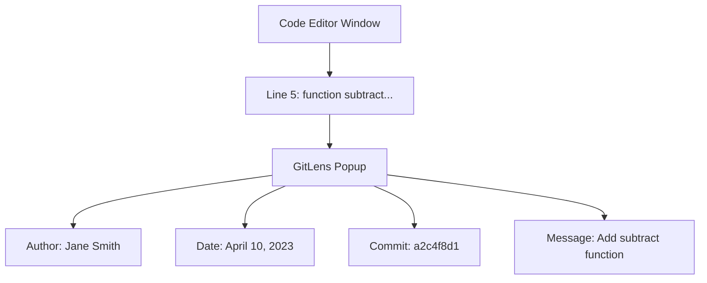

# Git Blame

## Introduction

Have you ever looked at a piece of code and wondered, "Who wrote this, and why?" Git Blame is your answer to these questions. It's a powerful Git feature that helps you discover when each line of code was last modified and by whom. 

Git Blame is an essential tool for understanding code evolution, tracking down bugs, and knowing who to ask when you need more context about a specific part of your codebase. In this tutorial, we'll explore how to use `git blame` effectively and understand its various options and applications.

## What is Git Blame?

Git Blame is a Git command that shows the revision and author who last modified each line of a file. It annotates each line with information about:

- The commit hash (SHA)
- The author's name
- The date and time of the change
- The line number
- The actual content of the line

This information helps you understand the context behind each line of code, making it easier to debug issues, understand the reasoning behind certain implementations, or simply know who to talk to for more information.

## Basic Usage

The basic syntax for Git Blame is:

```bash
git blame [options] [file]
```

Let's see a simple example. Suppose we have a file called `calculator.js`:

```bash
git blame calculator.js
```

The output will look something like this:

```
^5d830e2 (John Doe      2023-03-15 14:23:45 -0500  1) function add(a, b) {
^5d830e2 (John Doe      2023-03-15 14:23:45 -0500  2)   return a + b;
^5d830e2 (John Doe      2023-03-15 14:23:45 -0500  3) }
a2c4f8d1 (Jane Smith    2023-04-10 09:15:30 -0500  4) 
a2c4f8d1 (Jane Smith    2023-04-10 09:15:30 -0500  5) function subtract(a, b) {
a2c4f8d1 (Jane Smith    2023-04-10 09:15:30 -0500  6)   return a - b;
a2c4f8d1 (Jane Smith    2023-04-10 09:15:30 -0500  7) }
f7e92b3c (Mike Johnson  2023-05-22 11:42:18 -0500  8) 
f7e92b3c (Mike Johnson  2023-05-22 11:42:18 -0500  9) function multiply(a, b) {
f7e92b3c (Mike Johnson  2023-05-22 11:42:18 -0500 10)   return a * b;
f7e92b3c (Mike Johnson  2023-05-22 11:42:18 -0500 11) }
```

This output tells us that:
- John Doe wrote the `add` function on March 15, 2023
- Jane Smith added the `subtract` function on April 10, 2023
- Mike Johnson contributed the `multiply` function on May 22, 2023

## Useful Options

Git Blame provides several options to customize its output. Here are some of the most useful ones:

### 1. `-L` (Line Range)

If you're only interested in a specific part of a file, you can use the `-L` option to specify a line range:

```bash
git blame -L 5,7 calculator.js
```

This will show blame information only for lines 5 through 7:

```
a2c4f8d1 (Jane Smith    2023-04-10 09:15:30 -0500  5) function subtract(a, b) {
a2c4f8d1 (Jane Smith    2023-04-10 09:15:30 -0500  6)   return a - b;
a2c4f8d1 (Jane Smith    2023-04-10 09:15:30 -0500  7) }
```

### 2. `-s` (Simplified Output)

The `-s` option suppresses the author name and timestamp, showing only the commit hash:

```bash
git blame -s calculator.js
```

Output:

```
^5d830e2 1) function add(a, b) {
^5d830e2 2)   return a + b;
^5d830e2 3) }
a2c4f8d1 4) 
a2c4f8d1 5) function subtract(a, b) {
a2c4f8d1 6)   return a - b;
a2c4f8d1 7) }
f7e92b3c 8) 
f7e92b3c 9) function multiply(a, b) {
f7e92b3c 10)   return a * b;
f7e92b3c 11) }
```

### 3. `-e` (Show Email)

Use the `-e` option to display the author's email address instead of their name:

```bash
git blame -e calculator.js
```

### 4. `-w` (Ignore Whitespace)

The `-w` option ignores whitespace changes, which is useful when someone has only reformatted the code without changing its functionality:

```bash
git blame -w calculator.js
```

### 5. `-M` (Detect Moved Lines)

The `-M` option detects lines that were moved from other files:

```bash
git blame -M calculator.js
```

### 6. `-C` (Detect Copied Lines)

The `-C` option detects lines that were copied from other files:

```bash
git blame -C calculator.js
```

## Practical Applications

Let's explore some real-world scenarios where Git Blame proves invaluable:

### 1. Investigating Bugs

Imagine you've discovered a bug in your application. The error is occurring in the `calculate` function in `utils.js`. To find out who last modified this function and when:

```bash
git blame -L $(grep -n "function calculate" utils.js | cut -d: -f1),+10 utils.js
```

This command finds the line where the `calculate` function starts and shows blame information for that line and the 10 lines that follow it.

### 2. Understanding Code Evolution

To understand how a specific feature evolved over time, you can combine Git Blame with other Git commands:

```bash
git blame feature.js | grep "John"
```

This shows all lines in `feature.js` that were last modified by John.

### 3. Finding the Commit That Introduced a Line

Once you've identified a line of interest using Git Blame, you might want to see the full commit that introduced it:

```bash
git show a2c4f8d1
```

This shows the complete commit with hash `a2c4f8d1`, including the commit message and all changes.

## Integration with IDEs and Text Editors

Most modern IDEs and text editors integrate Git Blame functionality, making it even more accessible:

- **VS Code**: Use the "Git Lens" extension or hover over a line to see Git Blame information
- **WebStorm/IntelliJ**: Right-click in the editor and select "Annotate with Git Blame"
- **Sublime Text**: Install the "Git Blame" package
- **Atom**: Use the "Git Blame" package

Here's how Git Blame appears in VS Code with the GitLens extension:



## The Limitations of Git Blame

While Git Blame is powerful, it has some limitations:

1. **It shows the last change only**: Git Blame only shows who last modified a line, not its complete history.
2. **Reformatting can obscure history**: If someone reformats a file (even with `-w`), the blame information might point to the reformatter rather than the original author.
3. **Copy-paste loses history**: When code is copied from one file to another, the history doesn't automatically follow.

To overcome some of these limitations, you can:

- Use the `-C` and `-M` options to detect copied and moved code
- Use `git log -p` on specific sections of code for a more detailed history
- Consider specialized tools like `git-hyper-blame` for more advanced history tracking

## Beyond Git Blame: Related Commands

Git Blame is part of a family of Git history exploration commands:

- **git log**: Shows the commit history of a repository
- **git show**: Displays a specific commit's details
- **git diff**: Shows changes between commits, working directory, etc.
- **git bisect**: Helps find the commit that introduced a bug through binary search

Together, these commands form a powerful toolkit for understanding your codebase's history.

## Summary

Git Blame is an invaluable tool for understanding code ownership and history. It helps you:

- Identify who last modified each line of code
- Track down when changes were made
- Understand the context behind code decisions
- Find the right person to ask about specific code sections

By mastering Git Blame and its various options, you'll be better equipped to navigate and understand complex codebases, debug issues efficiently, and collaborate more effectively with your team.

## Exercises

1. Find the oldest line of code in your current project using Git Blame.
2. Use Git Blame to identify who wrote a specific function or feature in your codebase.
3. Combine Git Blame with grep to find all lines written by a particular team member.
4. Use the `-C` option to find if any code in your project was copied from another file.
5. Compare the output of regular Git Blame with `-w` on a file that has been reformatted.

## Additional Resources

- [Git Blame Official Documentation](https://git-scm.com/docs/git-blame)
- [Pro Git Book - Git Tools - History Simplification](https://git-scm.com/book/en/v2/Git-Tools-Revision-Selection)
- [GitHub's Web Interface for Git Blame](https://docs.github.com/en/repositories/working-with-files/using-files/viewing-a-files-history)
- [GitLab's Web Interface for Git Blame](https://docs.gitlab.com/ee/user/project/repository/blame.html)