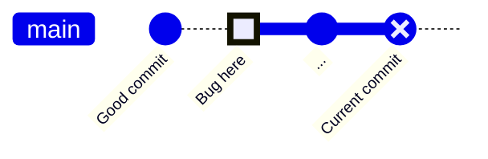

# Git Bisect

## Introduction

Have you ever pushed a new feature only to discover that something broke? Maybe tests are failing, or a button no longer works, but you've made dozens of commits since the last known good state. How do you find which commit introduced the bug without manually checking each one?

Enter `git bisect` - a powerful debugging tool that helps you find the exact commit that introduced a bug by performing a binary search through your commit history. Rather than checking each commit one by one (which could take hours), bisect lets you find the problematic commit in just a few steps.

## How Git Bisect Works

Git bisect works on a simple principle: binary search. This approach allows you to find the problematic commit in logarithmic time (O(log n)) rather than linear time (O(n)). For example, if you have 1000 commits to search through, you'll need to check at most 10 commits with bisect instead of all 1000.

Here's a visualization of how the process works:



The process follows these steps:

1. You mark a "good" commit (where the code works correctly)
2. You mark a "bad" commit (where the bug is present)
3. Git checks out a commit halfway between good and bad
4. You test the code and tell git if this commit is good or bad
5. Git narrows down the range and repeats until the first bad commit is found

## Basic Usage

Let's walk through a basic example of using git bisect:

```bash
# Start the bisect process
git bisect start

# Mark the current commit as bad (the bug exists here)
git bisect bad

# Mark a known good commit (where the bug doesn't exist)
git bisect good a123456

# Git will automatically check out a commit halfway between good and bad
# You test this commit and tell git if it's good or bad
# For example, if the bug exists at this commit:
git bisect bad

# If the bug doesn't exist at this commit:
git bisect good

# Continue this process until git identifies the first bad commit
# Git will output something like:
# 7c3b4d8 is the first bad commit
# commit 7c3b4d8...
# Author: ...
# Date: ...
#
#     Commit message
```

When you're done, clean up the bisect session:

```bash
git bisect reset
```

## Practical Example

Let's walk through a complete real-world example. Imagine you discover that your application crashes when a user clicks a specific button, but it worked fine last week.

### Step 1: Start the bisect session

```bash
$ git bisect start
```

### Step 2: Mark the current commit as bad

```bash
$ git bisect bad
```

### Step 3: Find and mark a known good commit

Find the last known good state. Maybe you remember it worked in the release from last Friday:

```bash
$ git log --before="last Friday" -1 --format=%H
e83c51f232cb55c890638a638d718cb37ea97fe7

$ git bisect good e83c51f232cb55c890638a638d718cb37ea97fe7
Bisecting: 10 revisions left to test after this (roughly 4 steps)
[85743217b079b0cc58b1a98cd1257ec62679b2e7] Add form validation
```

Git automatically checks out a commit in the middle of your history.

### Step 4: Test and continue the process

Now test your application to see if the bug exists at this commit. Let's say the button works fine here:

```bash
$ git bisect good
Bisecting: 5 revisions left to test after this (roughly 3 steps)
[a3c24e92f4c3212bd897af424321120119f1e29c] Refactor API client
```

Git checks out a new commit. Test again, and let's say the button now crashes:

```bash
$ git bisect bad
Bisecting: 2 revisions left to test after this (roughly 2 steps)
[c8e2d50a4af97f1796fed4cbb97e026342eea8f5] Update dependencies
```

Continue this process:

```bash
$ git bisect good
Bisecting: 0 revisions left to test after this (roughly 1 step)
[f21b88c9b4a69781c4290e8b36a3bf29dec4e82a] Fix styling on dashboard

$ git bisect bad
Bisecting: 0 revisions left to test after this (roughly 0 steps)
[d83fcae7c422ff594198f5d0fc2d13cd38a52817] Add error handling to API calls

$ git bisect good
f21b88c9b4a69781c4290e8b36a3bf29dec4e82a is the first bad commit
commit f21b88c9b4a69781c4290e8b36a3bf29dec4e82a
Author: Jane Doe <jane@example.com>
Date:   Mon Jul 3 14:23:01 2023 -0700

    Fix styling on dashboard
```

Now you know exactly which commit introduced the bug! The commit that was supposed to "Fix styling on dashboard" apparently broke your button functionality.

### Step 5: Clean up

When you're done, reset your repository to exit bisect mode:

```bash
$ git bisect reset
```

## Advanced Techniques

### Automated Bisecting

If you have a test script that can automatically determine if a commit is good or bad, you can automate the entire bisect process:

```bash
# Start bisect and provide the good and bad commits
git bisect start HEAD e83c51f

# Run an automated script on each bisected commit
git bisect run ./test-script.sh
```

The script should return:
- Exit code 0 for good commits
- Exit code 1-124, 126, 127 for bad commits 
- Exit code 125 to skip the commit
- Exit code > 128 to stop the bisecting process

Here's a simple example of a test script:

```bash
#!/bin/bash
# test-script.sh

# Build the project
npm run build || exit 125  # Skip if build fails

# Run the test that checks for the bug
npm test -- --filter=button-test
exit $?  # Return the exit code from the test
```

### Using Bisect with Custom Terms

If "good" and "bad" don't make sense for your scenario (maybe you're trying to find when a performance regression occurred), you can use custom terms:

```bash
git bisect start --term-new=slow --term-old=fast
git bisect slow  # Instead of "bad"
git bisect fast v1.0  # Instead of "good"
```

### Visualizing the Bisect Process

You can see a log of your bisect session:

```bash
git bisect log
```

Or view the remaining commits to be tested:

```bash
git bisect visualize
```

## Common Pitfalls and Tips

1. **Non-testable commits**: Sometimes you'll hit a commit where you can't test (maybe it doesn't compile). Use `git bisect skip` to skip that commit.

2. **Starting with the wrong commits**: Make sure your "good" commit truly doesn't have the bug and your "bad" commit does have it.

3. **Complex bugs**: Some bugs only appear with specific data or conditions. Make sure your testing is consistent at each step.

4. **Merge commits**: Bisect can get confused with merge commits. If possible, use `git bisect skip` on merge commits.

5. **Save time with automation**: For repeated bisect operations, create a script to test for the bug automatically.

## Practical Scenarios for Using Git Bisect

### Scenario 1: Finding a Performance Regression

If your application suddenly becomes slow, you can use bisect to find where the performance degraded:

```bash
git bisect start
git bisect bad  # Current commit is slow
git bisect good v1.0  # Old version was fast

# For each commit, run performance tests
# Mark "good" if fast, "bad" if slow
```

### Scenario 2: Finding When a Test Started Failing

For continuous integration environments:

```bash
git bisect start
git bisect bad HEAD
git bisect good last-known-passing-commit

# Automate with
git bisect run npm test
```

### Scenario 3: Finding When a Configuration Changed

If a configuration setting somehow changed:

```bash
git bisect start
git bisect bad  # Current setting is wrong
git bisect good master~100  # Old setting was correct

# For each commit
git grep "setting_name" config/settings.yml
# Mark accordingly
```

## Summary

Git bisect is a powerful debugging tool that uses binary search to efficiently find the exact commit that introduced a bug. By repeatedly dividing the commit range in half, you can identify problematic changes quickly, even in repositories with thousands of commits.

Key points to remember:
- Git bisect uses binary search to find bugs efficiently
- The basic workflow is: start, mark good/bad, test, repeat
- Automation can save time for repetitive testing
- Advanced features like custom terms and visualizations can help with complex scenarios

By mastering git bisect, you'll save countless hours of debugging and gain valuable insights into when and how bugs were introduced into your codebase.

## Additional Resources

- [Official Git Documentation on Bisect](https://git-scm.com/docs/git-bisect)
- [Pro Git Book - Debugging with Git](https://git-scm.com/book/en/v2/Git-Tools-Debugging-with-Git)

## Exercises

1. **Basic Bisect**: Create a sample repository with 16 commits. Introduce a "bug" in one commit. Practice using git bisect to find it.

2. **Automated Bisect**: Write a script that automatically checks for a specific text in a file. Use this script with `git bisect run` to find when the text changed.

3. **Real Project Bisect**: Choose an open-source project on GitHub. Find a closed bug and try to use git bisect to identify which commit introduced it.