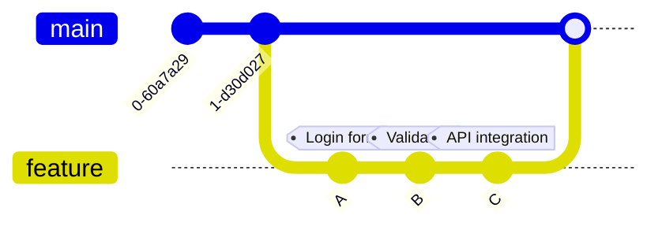

# Git Reflog: Your Safety Net for Git Operations

## Introduction

Have you ever made a mistake in Git that seemed irreversible? Perhaps you accidentally deleted a branch, performed a hard reset that wiped out important changes, or made some other operation that appeared to lose your work forever? 

Enter `git reflog` - one of Git's most powerful safety features that can help you recover from what might seem like catastrophic mistakes.

Unlike the commit history that you see with `git log`, which shows the history of your project, the reflog shows the history of your Git operations. Think of it as Git's own internal record-keeping system, tracking every change to the tip of branches and other references in your local repository.

In this tutorial, we'll explore how to use the reflog to recover from common Git mistakes and gain a deeper understanding of Git's internal tracking mechanisms.

## What is Git Reflog?

Reflog is short for "reference log" - Git's mechanism for recording updates to the tips of branches and other references in your local repository. Every time the HEAD pointer changes in your repository (through commits, checkouts, resets, merges, etc.), Git quietly logs this change to its reflog.

The reflog exists only on your local machine and is not pushed to remote repositories, which makes it a personal safety net for your Git operations.

## Basic Reflog Commands

Let's start with the basic command to view the reflog:

```bash
git reflog
```

The output will look something like this:

```
1a410ef HEAD@{0}: reset: moving to 1a410ef
ab1afef HEAD@{1}: commit: Added feature X
f414f31 HEAD@{2}: commit: Fixed bug #1234
5469e2a HEAD@{3}: pull: Merge made by the 'recursive' strategy
```

Each entry in the reflog includes:
- A commit hash
- A HEAD position with a number in curly braces - this indicates the position in the reflog history
- The operation performed (commit, reset, checkout, etc.)
- A brief description of the operation

## Common Use Cases for Git Reflog

### 1. Recovering a Deleted Branch

One of the most common uses of reflog is recovering a deleted branch. Let's say you accidentally deleted a branch called `feature-login`:

```bash
git branch -D feature-login
```

To recover it, you'd first look in the reflog for the last commit on that branch:

```bash
git reflog
```

Find the entry that represents the tip of your deleted branch. Let's say it's `ab1afef`:

```
ab1afef HEAD@{1}: commit: Added login form validation
```

Now you can create a new branch starting from that commit:

```bash
git branch feature-login-recovered ab1afef
```

And just like that, your "deleted" branch is back!

### 2. Undoing a Bad Reset

If you've performed a hard reset and lost changes:

```bash
git reset --hard HEAD~3  # Oops! We went back 3 commits and lost our changes!
```

Look at the reflog to find where you were before:

```bash
git reflog
```

You might see something like:

```
1a410ef HEAD@{0}: reset: moving to HEAD~3
ab1afef HEAD@{1}: commit: Final changes before presentation
f414f31 HEAD@{2}: commit: Fix navigation bug
5469e2a HEAD@{3}: commit: Update documentation
```

To return to where you were before the reset:

```bash
git reset --hard ab1afef
```

### 3. Recovering from a Bad Rebase or Merge

If a rebase or merge goes wrong:

```bash
git reflog
```

Find the commit before your operation went wrong, and reset to it:

```bash
git reset --hard HEAD@{5}  # Adjust the number as needed
```

## Understanding Reflog Expiration

It's important to know that reflog entries don't stay forever. By default:
- Reflog entries expire after 90 days
- Unreachable reflog entries expire after 30 days

You can change these settings in your Git configuration:

```bash
git config --global gc.reflogExpire "200 days"
git config --global gc.reflogExpireUnreachable "100 days"
```

## Advanced Reflog Usage

### Viewing Specific Reference Logs

You can view the reflog for specific references, not just HEAD:

```bash
git reflog show main
```

### Using Date Specifications

You can use special date formats to navigate the reflog:

```bash
git show HEAD@{yesterday}
git show HEAD@{2.days.ago}
```

### Recovering Specific States

You can check out a specific state from the reflog:

```bash
git checkout HEAD@{2}
```

This will put you in a "detached HEAD" state at that point. If you want to keep working from there, create a branch:

```bash
git checkout -b recovered-work
```

## Visualizing Reflog with Git Log

You can use `git log` to visualize the commits in your reflog:

```bash
git log -g
```

For a prettier version with a graph:

```bash
git log -g --oneline --graph
```

## When Reflog Can't Help

The reflog has limitations:
- It only tracks changes in your local repository
- It doesn't store reflog entries indefinitely (they expire)
- If you haven't committed your changes, reflog can't help recover them
- Reflog doesn't exist for newly cloned repositories (it only contains operations you've performed)

## Real-World Example: Recovering from a Messy Rebase

Let's walk through a realistic scenario where reflog saves the day.

Imagine you're working on a complex feature and you've created several commits:



Your team lead asks you to rebase and clean up your history before merging. You try to rebase interactively:

```bash
git rebase -i HEAD~3
```

But something goes wrong during the rebase. Conflicts emerge, you make mistakes resolving them, and your code ends up in a broken state.

First, abort the current rebase if it's still in progress:

```bash
git rebase --abort
```

Now, check the reflog to find the state before you started the rebase:

```bash
git reflog
```

You'll see something like:

```
1a410ef HEAD@{0}: rebase -i (start): checkout HEAD~3
ab1afef HEAD@{1}: commit: API integration
f414f31 HEAD@{2}: commit: Validation
5469e2a HEAD@{3}: commit: Login form
```

Reset to the state before the rebase began:

```bash
git reset --hard ab1afef
```

Now you can try again with your rebase, being more careful this time.

## Summary

Git's reflog is a powerful tool that provides a safety net for recovering from Git operations that appear to lose work. By recording all changes to reference pointers in your local repository, reflog gives you the ability to:

- Recover deleted branches
- Undo bad resets, rebases, and merges
- Understand the history of your Git operations
- Restore your repository to previous states

Understanding and knowing how to use reflog can save you hours of frustration and potential loss of work. While Git can sometimes seem intimidating with its complex operations, features like reflog demonstrate Git's design philosophy: almost any operation can be undone.

## Additional Resources

- [Git Documentation on Reflog](https://git-scm.com/docs/git-reflog)
- [Pro Git Book - Maintenance and Data Recovery](https://git-scm.com/book/en/v2/Git-Internals-Maintenance-and-Data-Recovery)

## Exercises

1. Create a test repository and practice deliberately "breaking" things and fixing them with reflog:
   - Delete a branch and recover it
   - Perform a hard reset and then return to your previous state
   - Try an interactive rebase, mess it up, and recover

2. Examine the reflog in one of your existing projects:
   - How far back does your reflog go?
   - Can you identify different operations you've performed?
   - Try checking out different points in the reflog to explore your project's history

3. Create Git aliases for common reflog operations to speed up your workflow.