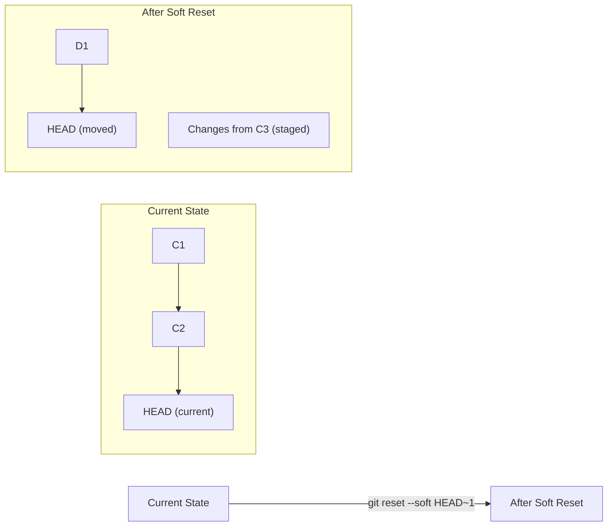
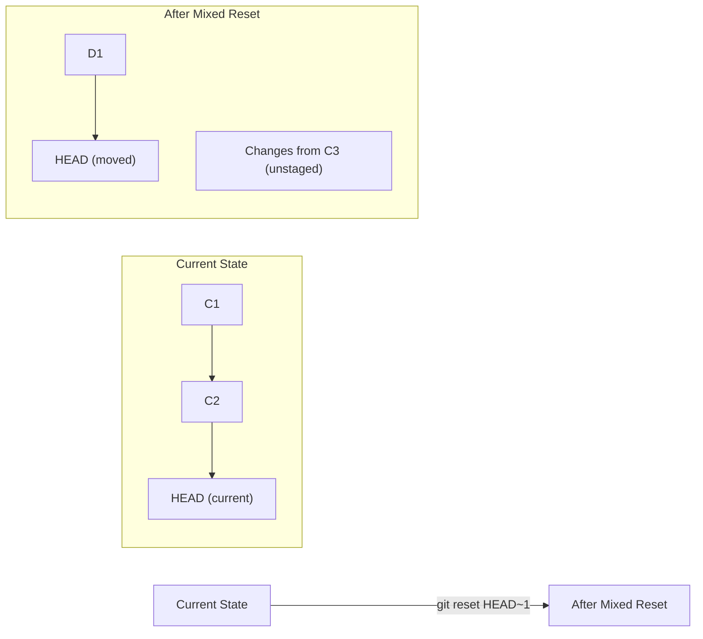
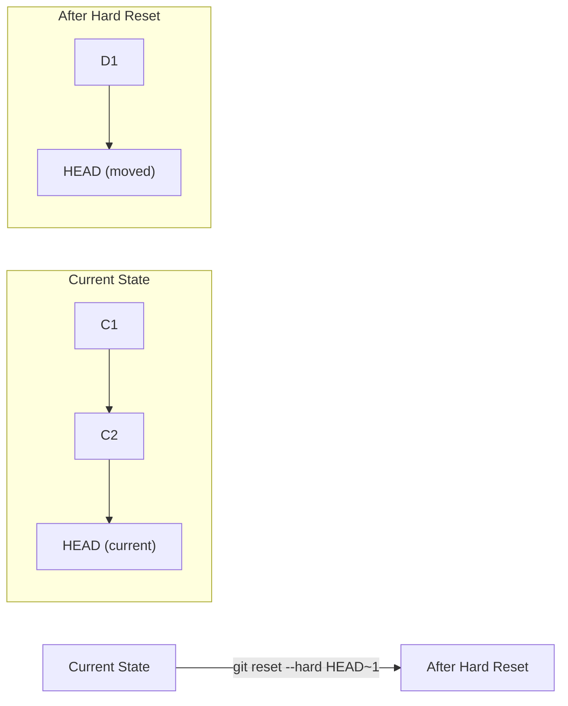

# Git Reset

## Introduction

Git Reset is a powerful command that allows you to undo changes and manipulate your repository's history. Unlike some other Git commands, `git reset` can work at different levels—changing the commit history, the staging area, or the working directory—depending on how you use it. 

Understanding Git Reset is essential for effective Git history management, especially when you need to:
- Remove unwanted commits
- Restore your repository to a previous state
- Unstage files that were staged by mistake
- Clean up your Git history before sharing your work

In this tutorial, we'll explore the different modes of Git Reset and learn how to use them effectively.

## Understanding Git Reset Modes

Git Reset operates in three primary modes, each with a different level of impact:

| Mode | Flag | Impact |
|------|------|--------|
| Soft | `--soft` | Changes commit history only |
| Mixed | `--mixed` (default) | Changes commit history and staging area |
| Hard | `--hard` | Changes commit history, staging area, and working directory |

Let's explore each mode with examples.

## Git Reset Modes Explained

### 1. Soft Reset (`--soft`)

A soft reset moves the HEAD pointer to a specified commit but does not change the staging area or working directory. This is useful when you want to "uncommit" changes but keep them staged for a new commit.



#### Example: Modifying your last commit

Imagine you just committed some changes but forgot to include a file:

```bash
# Make a commit
git commit -m "Add new feature"

# Oops, forgot to include a file! Let's reset the last commit
git reset --soft HEAD~1

# Now the changes from the previous commit are staged
# Add the forgotten file
git add forgotten-file.js

# Create a new commit with all changes
git commit -m "Add new feature with all necessary files"
```

In this example, `HEAD~1` refers to the commit before the current HEAD.

### 2. Mixed Reset (`--mixed`)

A mixed reset is the default behavior of `git reset`. It moves the HEAD pointer and also unstages changes, but preserves modifications in your working directory.



#### Example: Reorganizing recent changes

```bash
# Check status before reset
git status

# Reset to a previous commit
git reset HEAD~2  # Go back 2 commits

# The changes from those commits are now in the working directory
git status  # Will show files as modified but not staged

# You can now reorganize changes and create new commits
git add file1.js
git commit -m "First logical change"

git add file2.js file3.js
git commit -m "Second logical change"
```

### 3. Hard Reset (`--hard`)

A hard reset is the most drastic option. It moves the HEAD pointer and discards all changes in both the staging area and working directory. This effectively reverts your repository to the exact state of the specified commit.

⚠️ **Warning**: A hard reset discards changes permanently. Use with caution!



#### Example: Discarding recent commits completely

```bash
# Check current state
git log --oneline -5  # Show last 5 commits

# Perform hard reset to remove the last 3 commits
git reset --hard HEAD~3

# The repository is now at the state of 3 commits ago
# and all changes from those 3 commits are gone
git log --oneline -5
```

## Common Use Cases for Git Reset

### 1. Unstaging Files

One of the most common uses of `git reset` is to unstage files that were added to the staging area by mistake.

```bash
# Stage all files in the current directory
git add .

# Oops, we didn't mean to stage all files
# Unstage a specific file
git reset HEAD file-to-unstage.js

# Check status to confirm
git status
```

### 2. Fixing a Broken Commit History

If you've made several commits that should be reorganized before pushing to a shared repository:

```bash
# View recent commits
git log --oneline -5

# Reset to before the messy commits, keeping changes
git reset HEAD~3

# Now you can create better-organized commits
git add feature-part1.js
git commit -m "Add feature part 1"

git add feature-part2.js
git commit -m "Add feature part 2"
```

### 3. Discarding Local Commits Not Yet Pushed

If you've made commits locally that you want to completely discard:

```bash
# View commits
git log --oneline

# Find the commit hash you want to return to
git reset --hard a1b2c3d  # Using the commit hash

# Or go back a specific number of commits
git reset --hard HEAD~2  # Go back 2 commits
```

### 4. Reverting to a Specific Commit

To revert your working directory to the exact state of a previous commit:

```bash
# Find the commit you want to revert to
git log --oneline

# Reset to that specific commit
git reset --hard a1b2c3d  # Replace with the actual commit hash
```

## Git Reset vs. Other Commands

### Git Reset vs. Git Revert

- `git reset` modifies history by removing commits.
- `git revert` creates new commits that undo previous changes, preserving history.

#### When to use Reset vs. Revert:
- Use Reset for local changes that haven't been shared
- Use Revert for changes that have already been pushed to a shared repository

### Git Reset vs. Git Checkout

- `git reset` moves the HEAD and the branch pointer.
- `git checkout` moves only the HEAD pointer (when checking out commits).

## Best Practices

1. **Back Up Before Resetting**: Consider creating a backup branch before performing a reset, especially a hard reset.
   ```bash
   git branch backup-branch
   ```

2. **Avoid Hard Reset on Shared History**: Never use `git reset --hard` on commits that have been pushed to a shared repository.

3. **Use Reflog as a Safety Net**: If you accidentally reset too far, the reflog can help recover:
   ```bash
   # View reflog
   git reflog
   
   # Recover to a previous state
   git reset --hard HEAD@{2}  # Go back to where HEAD was 2 moves ago
   ```

## Common Mistakes to Avoid

1. **Forgetting the Mode**: Running `git reset` without specifying a mode uses `--mixed` by default, which might not be what you want.

2. **Resetting Shared History**: Resetting commits that have already been pushed creates divergent histories, causing problems for collaborators.

3. **Hard Reset Without Backup**: Performing a hard reset without backing up can lead to permanent data loss.

## Summary

Git Reset is a versatile command that allows you to manipulate your Git history at different levels:

- **Soft Reset**: Moves HEAD while keeping changes staged
- **Mixed Reset**: Moves HEAD and unstages changes
- **Hard Reset**: Moves HEAD and discards changes completely

Understanding when and how to use each mode gives you powerful control over your Git repository's state and history.

## Practice Exercises

1. Create a temporary Git repository and practice each reset mode to see their effects:
   ```bash
   mkdir reset-practice && cd reset-practice
   git init
   # Create files and make commits
   # Then try different reset modes
   ```

2. Simulate a scenario where you need to fix a series of commits before pushing:
   - Make several small commits
   - Use reset to reorganize them into logical groups
   - Create new, well-organized commits

3. Practice recovering from a mistaken reset using the reflog.

## Additional Resources

- [Git Documentation: git-reset](https://git-scm.com/docs/git-reset)
- [Pro Git Book: Undoing Things](https://git-scm.com/book/en/v2/Git-Basics-Undoing-Things)
- [Git Reference: Reset Demystified](https://git-scm.com/book/en/v2/Git-Tools-Reset-Demystified)