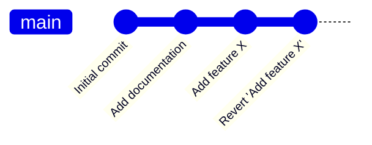

# Git Revert

## Introduction

When working with Git, mistakes happen. You might commit changes that introduce bugs, implement features incorrectly, or simply want to undo certain changes. Git provides multiple ways to undo changes, and `git revert` is one of the safest and most collaborative-friendly approaches.

Unlike other undo mechanisms like `git reset`, which removes commits from history, `git revert` creates a new commit that undoes the changes made by a previous commit. This approach maintains a complete history of all actions, making it ideal for collaborative projects where history preservation matters.

## What is Git Revert?

Git revert is a command that creates a new commit that undoes all the changes made in a specific previous commit. It's like saying "I want to create a new commit that does the exact opposite of this other commit."

### Key Characteristics

- **Safe for shared branches**: Since it adds a new commit rather than removing existing ones
- **Preserves history**: All actions remain in the commit log
- **Clear documentation**: The revert commit message explains what was undone
- **Selective undo**: Can target specific commits even if they're not the most recent

## Basic Usage

The basic syntax of the git revert command is:

```bash
git revert <commit-hash>
```

Where `<commit-hash>` is the identifier of the commit you want to undo.

### Example: Reverting a Single Commit

Let's walk through a simple example:

1. First, let's check our commit history:

```bash
git log --oneline
```

Output:
```
a1b2c3d Added feature X
e4f5g6h Updated documentation
i7j8k9l Initial commit
```

2. Now, let's say we want to undo the "Added feature X" commit. We can use:

```bash
git revert a1b2c3d
```

3. Git will open your default text editor to create a commit message. The default message is usually sufficient:

```
Revert "Added feature X"

This reverts commit a1b2c3d.
```

4. After saving and closing the editor, Git creates a new commit that undoes the changes:

```bash
git log --oneline
```

Output:
```
z9y8x7w Revert "Added feature X"
a1b2c3d Added feature X
e4f5g6h Updated documentation
i7j8k9l Initial commit
```

## Understanding What Happens

Let's visualize what happens during a revert:



As you can see, the revert doesn't remove the original commit. Instead, it adds a new commit that undoes the changes introduced by the original commit.

## Advanced Usage

### Reverting Multiple Commits

You can revert multiple commits by specifying each commit hash:

```bash
git revert a1b2c3d e4f5g6h
```

This will create one revert commit for each specified commit.

### Reverting a Range of Commits

To revert a range of commits:

```bash
git revert older_commit^..newer_commit
```

For example:

```bash
git revert HEAD~3..HEAD
```

This reverts the last three commits, creating three separate revert commits.

### Reverting Without Automatic Commit

Sometimes you might want to revert changes without immediately committing them:

```bash
git revert --no-commit a1b2c3d
```

This applies the reverse changes to your working directory and stages them, but doesn't create a commit automatically. You can then:

- Make additional changes
- Stage them with `git add`
- Commit everything together with `git commit`

This is useful when you need to revert multiple commits and want to combine them into a single revert commit:

```bash
git revert --no-commit HEAD~3..HEAD
git commit -m "Reverted last three commits"
```

## Handling Revert Conflicts

When Git can't automatically revert changes (usually due to conflicting changes made after the original commit), you'll encounter merge conflicts:

```bash
git revert a1b2c3d
```

Output:
```
error: could not revert a1b2c3d... Added feature X
hint: after resolving the conflicts, mark the corrected paths
hint: with 'git add <paths>' or 'git rm <paths>'
hint: and commit the result with 'git commit'
```

To resolve revert conflicts:

1. Check which files have conflicts:

```bash
git status
```

2. Open the conflicting files and look for conflict markers (`<<<<<<<`, `=======`, `>>>>>>>`).

3. Edit the files to resolve conflicts.

4. Stage the resolved files:

```bash
git add <resolved-file>
```

5. Complete the revert:

```bash
git revert --continue
```

If you want to cancel the revert operation:

```bash
git revert --abort
```

## Real-World Applications

### Scenario 1: Reverting a Bug Introduction

Imagine you deploy code to production and discover that a recent commit (with hash `a1b2c3d`) introduced a critical bug:

```bash
# First, ensure you're on the main branch
git checkout main

# Revert the buggy commit
git revert a1b2c3d

# Push the revert to the remote repository
git push origin main
```

This quickly removes the buggy code from production while maintaining a clear record of both the bug's introduction and its removal.

### Scenario 2: Undoing a Feature for a Release

Your team has been working on multiple features, but at the last moment, you decide one feature isn't ready for the upcoming release:

```bash
# Find the commit that introduced the feature
git log --grep="Add feature Y"

# Revert that commit
git revert feature_commit_hash

# Continue with your release
```

Later, when the feature is ready, you can re-implement it properly or even "revert the revert" to restore the original implementation.

## Git Revert vs. Other Undo Methods

Let's compare git revert with other methods of undoing changes:

| Method | What it does | When to use | Impact on history |
|--------|--------------|-------------|-------------------|
| `git revert` | Creates a new commit that undoes changes | When working on shared branches | Preserves history |
| `git reset` | Moves branch pointer to an earlier commit | For local changes only | Rewrites history |
| `git checkout -- <file>` | Discards changes in working directory | Before committing changes | No impact on history |
| `git restore` | Restores files from a specific commit | To restore specific files | No impact on history |

## Best Practices

1. **Use revert for shared branches**: If others have already pulled your changes, use revert instead of reset.

2. **Write clear commit messages**: Explain why you're reverting, not just what you're reverting.

3. **Consider using `--no-commit` for multiple reverts**: This allows you to combine several reverts into a single commit.

4. **Test after reverting**: Make sure the revert actually fixed the issue without introducing new problems.

5. **Push revert commits promptly**: This ensures others get the fix as soon as possible.

## Summary

Git revert is a powerful and safe way to undo changes in your Git repository:

- It creates a new commit that undoes changes from a previous commit
- It preserves history, making it ideal for collaborative projects
- It can target specific commits, even if they're not the most recent
- It handles conflicts through Git's standard merge conflict resolution

By understanding and using git revert effectively, you can confidently make changes knowing that you can always safely undo them if necessary.

## Exercises

1. Create a simple Git repository, make several commits, then practice reverting different commits.

2. Try reverting multiple commits at once using both individual reverts and the range syntax.

3. Deliberately create a scenario that will cause a revert conflict and practice resolving it.

4. Compare the output of `git log` before and after performing a revert to understand how history is preserved.

## Additional Resources

- [Git Official Documentation on Revert](https://git-scm.com/docs/git-revert)
- [Pro Git Book - Undoing Things](https://git-scm.com/book/en/v2/Git-Basics-Undoing-Things)
- [Atlassian Git Tutorial - Undoing Changes](https://www.atlassian.com/git/tutorials/undoing-changes)