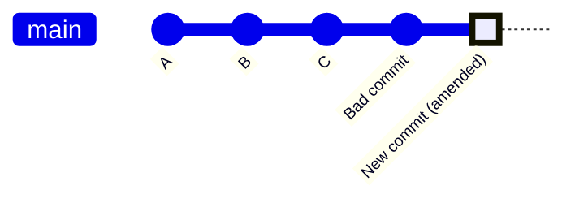

# Git Amend

## Introduction

Have you ever made a commit and immediately realized you forgot to add a file, made a typo in your commit message, or needed to make a small change? Git's `amend` feature is your friend! The `git commit --amend` command allows you to modify your most recent commit, saving you from creating unnecessary correction commits that clutter your history.

In this guide, we'll explore how to use `git commit --amend` to maintain a clean, professional commit history by modifying your last commit instead of creating a new one. This command is an essential tool for every developer who values a clean Git history.

## What is Git Amend?

The `git commit --amend` command is a convenient way to modify the most recent commit. It lets you combine staged changes with the previous commit instead of creating an entirely new commit. You can also use it to simply edit the previous commit message without changing its contents.

**Key point**: Amending a commit creates a new commit with a new SHA-1 hash that replaces the previous commit. If you've already pushed your changes to a shared repository, you'll need to force push the amended commit, which can cause issues for collaborators.

## Basic Usage

### Changing Your Commit Message

One of the most common uses of `git commit --amend` is to fix a typo or improve a commit message:

```bash
# Make your original commit
git commit -m "Add new featre"

# Oops, there's a typo! Amend to fix it
git commit --amend -m "Add new feature"
```

The output will show that your commit message has been updated:

```
[main 5a78d6e] Add new feature
 Date: Mon Mar 11 14:22:45 2025 -0700
 1 file changed, 10 insertions(+)
```

### Adding Forgotten Files

If you forgot to add a file to your commit:

```bash
# Make your original commit
git commit -m "Add user authentication"

# Oops, forgot to add a file!
git add forgotten_file.js

# Amend the previous commit to include the forgotten file
git commit --amend --no-edit
```

The `--no-edit` flag tells Git to use the same commit message without opening the editor. The output will show:

```
[main 8c1d6a2] Add user authentication
 Date: Mon Mar 11 14:25:17 2025 -0700
 2 files changed, 25 insertions(+)
```

### Making Additional Changes

If you want to make more changes to your code before amending:

```bash
# Make your original commit
git commit -m "Implement login functionality"

# Make some changes to your code
# ... edit files ...

# Stage the changes
git add .

# Amend the previous commit
git commit --amend
```

An editor will open, allowing you to modify the commit message if needed. After saving and closing the editor, your commit will be updated with the additional changes.

## Understanding What Happens Behind the Scenes

When you use `git commit --amend`, Git:

1. Takes your staged changes (if any)
2. Combines them with the content of the most recent commit
3. Creates a completely new commit to replace the previous one
4. Updates the branch pointer to point to this new commit

Let's visualize this:



If we were to run `git commit --amend`, the "Bad commit" would be replaced by the "New commit (amended)". The original "Bad commit" would no longer be part of your Git history (unless it was referenced elsewhere).

## Best Practices and Warnings

### Do Amend When:

- You've just made a commit and notice a small mistake
- You want to add small changes to your last commit
- You need to fix a typo in your commit message
- You're working on a local branch that hasn't been pushed yet

### Don't Amend When:

- The commit has already been pushed and others might have based work on it
- You want to modify a commit that isn't the most recent one
- You're working on a shared branch with other developers

### Warning About Force Push

If you've already pushed your original commit to a remote repository, you'll need to force push after amending:

```bash
git push --force-with-lease origin branch-name
```

The `--force-with-lease` option is safer than `--force` as it ensures you don't overwrite others' work.

**Important**: Force pushing rewrites history on the remote repository, which can cause issues for collaborators who have based their work on the original commit. Always communicate with your team before force pushing amended commits.

## Real-World Scenarios

### Scenario 1: Adding Missing Tests

Imagine you've just committed a new feature but forgot to include the tests:

```bash
# Original commit
git commit -m "Add user profile page"

# Oops, forgot the tests! Let's add them
git add tests/UserProfileTest.js

# Amend the commit to include the tests
git commit --amend --no-edit
```

Now your commit includes both the feature and its tests, maintaining a logical unit of work.

### Scenario 2: Fixing Implementation Issues

You've committed a feature, but during code review, a colleague points out a small bug:

```bash
# Original commit
git commit -m "Implement sorting for product list"

# Fix the bug
# ... edit code ...

# Stage and amend
git add src/ProductList.js
git commit --amend
```

This keeps the feature and the fix together in one clean commit.

### Scenario 3: Improving Commit Message

Your team has standards for commit messages, but you rushed and didn't follow them:

```bash
# Original commit
git commit -m "fix bug"

# Amend with a better message following team conventions
git commit --amend -m "fix: Resolve issue with product sorting in Safari browsers (#123)"
```

## Advanced Techniques

### Amending Without Changing Timestamp

By default, amending updates the commit's timestamp. To preserve the original timestamp:

```bash
git commit --amend --no-edit --date="$(git log -1 --format=%cd)"
```

### Amending Author Information

To change the author of the last commit:

```bash
git commit --amend --author="John Doe <john@example.com>" --no-edit
```

## Common Issues and Solutions

### Issue: "Cannot amend non-existing commit"

If you see this error, you're trying to amend when there's no commit yet. Make sure you've already created at least one commit.

### Issue: "Your branch and 'origin/branch' have diverged"

This happens after you amend a commit that was already pushed. You'll need to force push:

```bash
git push --force-with-lease origin branch-name
```

## Summary

The `git commit --amend` command is a powerful tool for maintaining a clean Git history by modifying your most recent commit instead of creating correction commits. Remember these key points:

- Use `--amend` to change your last commit message or add forgotten files
- Amending creates a new commit with a new hash
- Be cautious when amending commits that have been pushed to shared repositories
- Use `--force-with-lease` instead of `--force` when force pushing
- Only amend commits that are still local or on branches where you're the only developer

By mastering `git commit --amend`, you'll maintain a cleaner, more professional Git history that better reflects the logical progression of your project.

## Exercises

1. Create a new Git repository, make an initial commit, then amend it to change the commit message.
2. Make a commit with one file, then amend it to add a second file.
3. Practice amending a commit without changing its message using the `--no-edit` flag.
4. Try amending a commit and then viewing the history with `git log` to see the changes.
5. Set up a scenario where you need to force push after amending, and practice using `--force-with-lease`.

## Additional Resources

- [Git Documentation: git-commit](https://git-scm.com/docs/git-commit#Documentation/git-commit.txt---amend)
- [Pro Git Book: Changing the Last Commit](https://git-scm.com/book/en/v2/Git-Tools-Rewriting-History#_changing_the_last_commit)
- [Git's Best Practices for Rewriting History](https://www.atlassian.com/git/tutorials/rewriting-history)