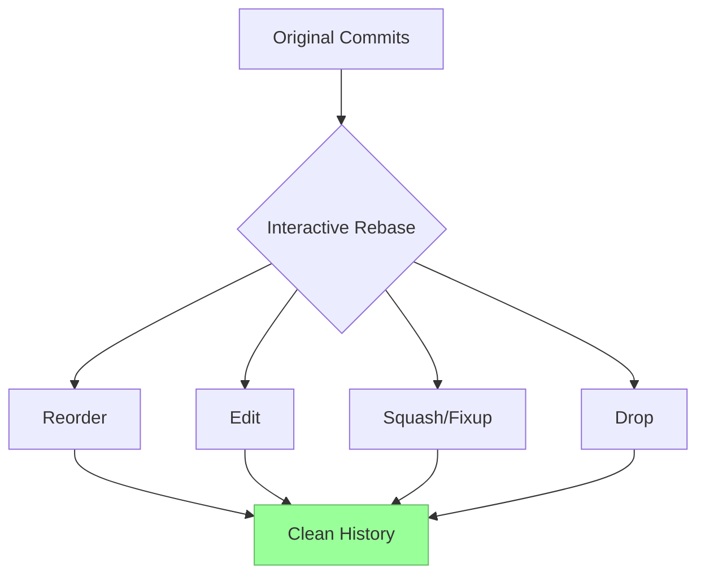

# Git Interactive Rebase

## Introduction

When working on projects with Git, your commit history can quickly become cluttered with numerous small commits, work-in-progress updates, or confusing commit messages. This is where Git's interactive rebase comes in—a powerful feature that allows you to modify your commit history by reordering, combining, editing, or even removing commits before sharing your work.

Interactive rebase gives you the ability to present a clean, logical commit history that tells a coherent story about how your project developed. Think of it as editing a rough draft before publishing the final version.

## What is Interactive Rebase?

Interactive rebase is an extension of Git's regular rebase command that gives you fine-grained control over your commit history. While normal rebase moves commits from one branch to another, interactive rebase lets you stop and modify each commit during the process.

With interactive rebase, you can:

- Reorder commits
- Edit commit messages
- Combine (squash) multiple commits
- Split commits into smaller ones
- Remove commits entirely
- Pause at each commit to update its content

## When to Use Interactive Rebase

Interactive rebase is most useful in these scenarios:

- Before pushing commits to a shared repository
- When preparing a pull request for review
- When cleaning up your local development history
- Before merging a feature branch into the main branch

**Important note:** You should only rebase commits that exist in your local repository and haven't been pushed to a shared repository. Rebasing public history can cause serious problems for your collaborators.

## The Basic Command

The basic syntax for interactive rebase is:

```bash
git rebase -i <base>
```

Where `<base>` is the commit or branch that you want to rebase onto. This could be:

- A specific commit hash
- A branch name
- A relative reference like `HEAD~3` (three commits before the current HEAD)

## Step-by-Step Interactive Rebase

Let's walk through a practical example of using interactive rebase to clean up a feature branch with several commits.

### Example Scenario

Imagine you've been working on a feature branch with the following commits:

```bash
$ git log --oneline
abc1234 Fix typo in login button
def5678 Add password validation
ghi9101 WIP: Implement login form
jkl1121 Start work on user authentication
```

The history is a bit messy—it has a work-in-progress commit and a typo fix that could be combined with the related work. Let's clean it up!

### Step 1: Start the Interactive Rebase

To start an interactive rebase that includes the last 4 commits:

```bash
git rebase -i HEAD~4
```

### Step 2: The Rebase Todo List

Running this command opens a text editor with the rebase "todo" list:

```
pick jkl1121 Start work on user authentication
pick ghi9101 WIP: Implement login form
pick def5678 Add password validation
pick abc1234 Fix typo in login button

# Rebase commands:
# p, pick <commit> = use commit
# r, reword <commit> = use commit, but edit the commit message
# e, edit <commit> = use commit, but stop for amending
# s, squash <commit> = use commit, but meld into previous commit
# f, fixup <commit> = like "squash", but discard this commit's message
# x, exec <command> = run command using shell
# b, break = stop here (continue rebase later with 'git rebase --continue')
# d, drop <commit> = remove commit
# l, label <label> = label current HEAD with a name
# t, reset <label> = reset HEAD to a label
# m, merge = create a merge commit using original merge commit message
#
# These lines can be re-ordered; they are executed from top to bottom.
#
# If you remove a line here THAT COMMIT WILL BE LOST.
#
# However, if you remove everything, the rebase will be aborted.
```

### Step 3: Edit the Todo List

Now you can modify this file to achieve your desired history. Let's make these changes:

1. Keep the first commit as is
2. Change the WIP commit to "edit" so we can modify it
3. Keep the password validation commit
4. Use "fixup" for the typo fix to combine it with the previous commit

Updated todo list:

```
pick jkl1121 Start work on user authentication
edit ghi9101 WIP: Implement login form
pick def5678 Add password validation
fixup abc1234 Fix typo in login button
```

Save and close the editor to start the rebase process.

### Step 4: Editing the WIP Commit

Git will pause at the "edit" commit. Now you can:

1. Change the files as needed
2. Stage the changes with `git add`
3. Update the commit with `git commit --amend`
4. Rename the commit message from "WIP: Implement login form" to "Implement login form"
5. Continue the rebase with `git rebase --continue`

```bash
# Make your changes to the files
$ git add login-form.js
$ git commit --amend -m "Implement login form"
$ git rebase --continue
```

### Step 5: Complete the Rebase

Git will apply the remaining operations automatically. The "fixup" will combine the typo fix with the password validation commit.

### Final Result

After the rebase completes, your history will look like:

```bash
$ git log --oneline
def5678 Add password validation
ghi9101 Implement login form
jkl1121 Start work on user authentication
```

Notice how the history is now cleaner, more logical, and tells a better story of how the feature was developed.

## Common Interactive Rebase Commands

Here's a more detailed explanation of the most common rebase commands:

### pick

```
pick <commit>
```

Use the commit as is, without modifications.

### reword

```
reword <commit>
```

Use the commit but edit the commit message. Git will open your text editor to modify the message.

### edit

```
edit <commit>
```

Pause the rebase at this commit, allowing you to make changes to the files, amend the commit, or even add new commits before continuing.

### squash

```
squash <commit>
```

Combine this commit with the previous commit. Git will prompt you to edit the combined commit message.

### fixup

```
fixup <commit>
```

Like squash, but discard this commit's message and use only the previous commit's message.

### drop

```
drop <commit>
```

Remove this commit from history entirely.

## Visualizing the Rebase Process

Here's a Mermaid diagram illustrating the interactive rebase process:



## Resolving Conflicts During Rebase

Conflicts can occur during a rebase if the changes you're rebasing conflict with changes in the base branch. When a conflict occurs:

1. Git will pause the rebase
2. Show you which files have conflicts
3. Let you resolve the conflicts manually
4. After resolving, you can continue with `git add` followed by `git rebase --continue`

```bash
# If conflicts occur
$ # Edit the files to resolve conflicts
$ git add <resolved-files>
$ git rebase --continue
```

If you decide you want to abandon the rebase, you can use:

```bash
$ git rebase --abort
```

## Real-World Examples

### Example 1: Preparing a Pull Request

Before submitting a pull request, you can clean up your feature branch:

```bash
# See the current history
$ git log --oneline
abc1234 Fix test cases
def5678 Add documentation
ghi9101 Implement feature X
jkl1121 Initial commit for feature X

# Start interactive rebase
$ git rebase -i jkl1121^
```

In the editor, you might decide to:

```
pick jkl1121 Initial commit for feature X
squash ghi9101 Implement feature X
pick def5678 Add documentation
fixup abc1234 Fix test cases
```

This would result in a cleaner two-commit history:

```bash
# After rebase
$ git log --oneline
def5678 Add documentation
jkl1121 Initial commit and implementation of feature X
```

### Example 2: Breaking Down a Large Commit

If you have a large commit that should be split into smaller, logical commits:

```bash
# Start interactive rebase
$ git rebase -i HEAD~3
```

In the editor, mark the large commit for editing:

```
pick abc1234 Small fix
edit def5678 Large feature implementation 
pick ghi9101 Another small fix
```

When Git pauses at the large commit:

```bash
# Reset the commit but keep the changes staged
$ git reset HEAD^

# Create multiple smaller commits
$ git add file1.js
$ git commit -m "Implement feature part 1: data model"

$ git add file2.js file3.js
$ git commit -m "Implement feature part 2: UI components"

# Continue the rebase
$ git rebase --continue
```

## Best Practices

1. **Only rebase local commits**: Never rebase commits that have been pushed to a shared repository.

2. **Create a backup branch**: Before an extensive rebase, create a backup branch.
   ```bash
   git branch backup-before-rebase
   ```

3. **Keep rebases small**: Try to rebase small groups of commits rather than long chains.

4. **Verify after rebasing**: Always check your history after rebasing to ensure it looks as expected.
   ```bash
   git log --oneline --graph
   ```

5. **Push with force-with-lease**: If you must push rebased history to a remote branch that you've previously pushed to, use:
   ```bash
   git push --force-with-lease
   ```
   This is safer than `--force` as it prevents overwriting others' work.

## Potential Issues and Solutions

### 1. Lost Commits

If you accidentally lose commits during a rebase, you can recover them using:

```bash
# Find the lost commit hash
$ git reflog

# Create a new branch pointing to that commit
$ git branch recover-branch <commit-hash>
```

### 2. Rebase on Wrong Branch

If you started a rebase on the wrong branch, you can abort it:

```bash
$ git rebase --abort
```

### 3. Complex Conflicts

For complex conflicts, you might want to use a graphical merge tool:

```bash
$ git mergetool
```

## Summary

Git interactive rebase is a powerful tool for cleaning up your commit history before sharing it. By understanding how to reorder, combine, edit, or remove commits, you can maintain a clean and logical project history that clearly communicates the evolution of your code.

Remember to use interactive rebase only on local commits that haven't been shared with others. With practice, interactive rebase will become an essential part of your Git workflow, helping you present your work in a clear, professional manner.

## Further Learning

To deepen your understanding of Git interactive rebase, consider exploring:

- Git's official documentation on rebasing
- Related commands like `git cherry-pick` and `git commit --amend`
- Advanced branching strategies that work well with rebasing
- Team workflows that incorporate rebasing

## Practice Exercises

1. Create a feature branch with 5-6 small commits, then use interactive rebase to condense them into 2-3 logical commits.

2. Practice splitting a large commit into smaller ones using the `edit` command.

3. Use interactive rebase to reorder commits so related changes are grouped together.

4. Try resolving a merge conflict during an interactive rebase.