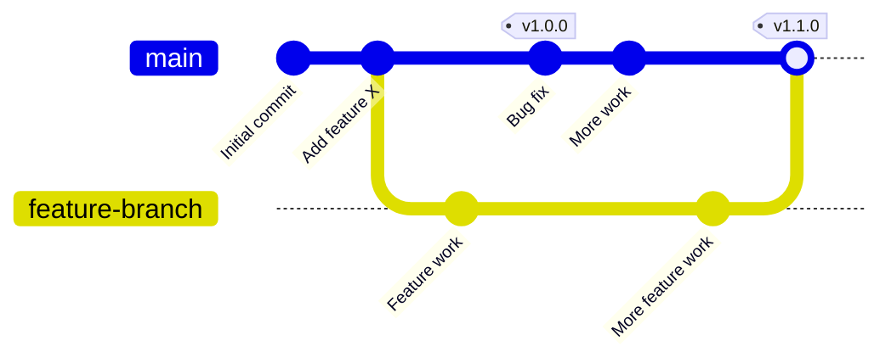

# Git Tag Basics

## Introduction

Git tags are references that point to specific points in Git history, marking significant milestones in your project's development. Unlike branches, tags don't change once they're created - they serve as permanent snapshots of a specific commit. Tags are commonly used to mark release versions (like v1.0.0, v2.1.3) or other important points in a project's timeline.

Think of tags as sticky notes that you attach to specific commits in your repository's history. They make it easier to reference and return to important points without having to remember or search for commit hashes.

## Understanding Git Tags

There are two types of Git tags:

1. **Lightweight tags**: Simple pointers to specific commits
2. **Annotated tags**: Full objects in the Git database that contain additional metadata

Let's visualize the difference between branches and tags:



Notice how tags remain fixed at specific commits while branches continue to move forward.

## Creating Tags

### Lightweight Tags

Lightweight tags are simple references to commits. To create a lightweight tag:

```bash
git tag v1.0.0-light
```

This creates a tag named `v1.0.0-light` pointing to the current commit.

### Annotated Tags (Recommended)

Annotated tags store extra information like the tagger's name, email, date, and a message. They're recommended for public releases:

```bash
git tag -a v1.0.0 -m "Release version 1.0.0"
```

The `-a` flag creates an annotated tag, and `-m` adds a message.

### Tagging Past Commits

You can also tag commits that you've already made by specifying the commit hash:

```bash
git tag -a v0.9.0 -m "Beta release" 9fceb02
```

Here, `9fceb02` is the beginning of the commit hash you want to tag.

## Listing Tags

To list all tags in your repository:

```bash
git tag
```

Example output:
```
v0.9.0
v1.0.0
v1.0.0-light
v1.1.0
```

To search for tags that match a pattern:

```bash
git tag -l "v1.0*"
```

Example output:
```
v1.0.0
v1.0.0-light
```

To view detailed information about a specific tag:

```bash
git show v1.0.0
```

Example output:
```
tag v1.0.0
Tagger: John Doe <john@example.com>
Date:   Sat May 20 15:32:10 2023 -0700

Release version 1.0.0

commit a742b8f85f8a82aec98e35e65df3111bd88dd76f
Author: John Doe <john@example.com>
Date:   Sat May 20 15:30:42 2023 -0700

    Bug fix

diff --git a/file.txt b/file.txt
...
```

## Pushing Tags to Remote Repositories

By default, `git push` doesn't transfer tags to remote repositories. You need to explicitly push tags:

To push a specific tag:

```bash
git push origin v1.0.0
```

To push all tags at once:

```bash
git push origin --tags
```

## Deleting Tags

Sometimes you may need to delete a tag, perhaps because of a mistake or naming convention change.

To delete a local tag:

```bash
git tag -d v1.0.0-light
```

Example output:
```
Deleted tag 'v1.0.0-light' (was a3b9f87)
```

To delete a remote tag:

```bash
git push origin --delete v1.0.0-light
```

## Checking Out Tags

To view the code at a tagged commit, you can check out the tag:

```bash
git checkout v1.0.0
```

This puts your repository in a "detached HEAD" state, meaning you're not on any branch. If you want to make changes based on this tagged version, create a new branch from it:

```bash
git checkout -b fix-for-v1.0.0 v1.0.0
```

## Practical Examples

### Creating a Release Tag

When you're ready to release a new version of your software:

```bash
# Make sure you're on the correct commit
git checkout main
git pull

# Create an annotated tag
git tag -a v1.2.0 -m "Release version 1.2.0 with new user authentication"

# Push the tag to the remote repository
git push origin v1.2.0
```

### Using Tags for Versioning a Node.js Project

In a Node.js project, your `package.json` might have a version like:

```json
{
  "name": "my-project",
  "version": "1.2.0",
  "description": "A sample project"
}
```

You can create a tag matching this version:

```bash
npm version patch  # Automatically updates package.json and creates a git tag
git push && git push --tags  # Push both the code and the new tag
```

### Tagging Hotfixes

When you need to patch an older version:

```bash
# Check out the older version
git checkout v1.1.0

# Create a branch to work on the fix
git checkout -b hotfix-1.1.1

# Make your changes, then commit them
git commit -m "Fix critical bug in login process"

# Create a new tag for the hotfix
git tag -a v1.1.1 -m "Hotfix for login issue in v1.1.0"

# Push the changes and the tag
git push origin hotfix-1.1.1
git push origin v1.1.1
```

## Best Practices for Git Tags

1. **Use semantic versioning**: Follow the MAJOR.MINOR.PATCH format (e.g., v1.2.3)
2. **Always use annotated tags for releases**: They contain valuable metadata
3. **Include descriptive messages**: Explain what's significant about this tagged version
4. **Tag after testing**: Only tag commits that have been properly tested
5. **Don't modify tags**: Once published, a tag should be considered immutable

## Summary

Git tags provide a powerful way to mark important points in your repository's history. They're essential for release management and version tracking. Unlike branches, tags are fixed references that don't move as you continue development.

In this guide, we covered:
- The difference between lightweight and annotated tags
- How to create, list, and delete tags
- Pushing tags to remote repositories
- Checking out code at specific tags
- Practical examples of using tags in real-world scenarios

## Additional Resources

- [Git Documentation on Tagging](https://git-scm.com/book/en/v2/Git-Basics-Tagging)
- [Semantic Versioning Specification](https://semver.org/)

## Exercises

1. Create an annotated tag for your current project's state
2. List all tags in your repository and examine the details of one
3. Create a new branch from an older tag and make some changes
4. Practice deleting a tag locally and remotely (use a test tag!)
5. Set up a workflow where you automatically tag releases using semantic versioning