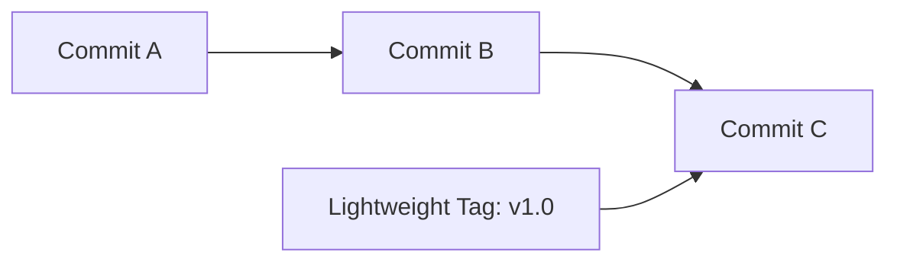

# Git Lightweight Tags

## Introduction

When working with Git, you'll often need to mark specific points in your repository's history. While commits serve as the primary checkpoints, Git offers a feature called **tags** that allows you to give meaningful names to particular commits. Git supports two types of tags: **annotated tags** and **lightweight tags**.

In this guide, we'll focus on lightweight tags - a simple way to mark specific commits without storing additional metadata. If you're a beginner looking for a straightforward way to mark versions or important points in your codebase, lightweight tags offer an excellent solution.

## What Are Lightweight Tags?

A lightweight tag is essentially a pointer to a specific commit - like a branch that doesn't move. Unlike annotated tags, lightweight tags don't store additional information such as the tagger name, email, date, or a message. They are simply a reference to a commit, nothing more.

Think of a lightweight tag as a sticky note with just a name that you attach to a specific commit.



## Creating Lightweight Tags

Creating a lightweight tag is straightforward. You simply use the `git tag` command without the `-a`, `-s`, or `-m` options:

```bash
git tag v1.0-light
```

This command creates a lightweight tag named `v1.0-light` that points to the current HEAD commit.

If you want to tag a specific commit rather than the current HEAD, you can specify the commit hash:

```bash
git tag v0.9-light a87f54e
```

### Example: Creating a Lightweight Tag

Let's see how to create a lightweight tag in a real project:

```bash
# Check our current commit
git log -1 --oneline
# Output: 7d36a42 Update user authentication module

# Create a lightweight tag for this commit
git tag auth-update-v1

# Verify the tag was created
git tag
# Output: auth-update-v1
```

## Viewing Lightweight Tags

To list all tags in your repository:

```bash
git tag
```

To see more details about a specific tag, use the `git show` command:

```bash
git show v1.0-light
```

For lightweight tags, this will simply show the commit information since lightweight tags don't contain any additional metadata.

### Example: Difference Between Lightweight and Annotated Tags

Let's compare what we see when examining both types of tags:

```bash
# Create a lightweight tag
git tag lightweight-example

# Create an annotated tag
git tag -a annotated-example -m "This is an annotated tag"

# Let's examine the lightweight tag
git show lightweight-example
# Output shows only commit information:
# commit 7d36a42b5d9e8d4f35c12a8df2866a43f0ab92a4
# Author: Jane Doe <jane@example.com>
# Date:   Mon Mar 11 14:32:52 2024 -0500
# 
#     Update user authentication module

# Now examine the annotated tag
git show annotated-example
# Output shows tag metadata plus commit information:
# tag annotated-example
# Tagger: Jane Doe <jane@example.com>
# Date:   Tue Mar 12 09:45:21 2024 -0500
#
# This is an annotated tag
#
# commit 7d36a42b5d9e8d4f35c12a8df2866a43f0ab92a4
# Author: Jane Doe <jane@example.com>
# Date:   Mon Mar 11 14:32:52 2024 -0500
# 
#     Update user authentication module
```

## When to Use Lightweight Tags

Lightweight tags are ideal for:

1. **Private or temporary bookmarks** - When you need personal reference points in your code
2. **Short-lived markers** - For tags that won't be around for long
3. **Simple version markers** - When you don't need to store additional metadata
4. **Fast tagging** - When you want to quickly mark a commit without creating elaborate documentation

## Pushing and Sharing Lightweight Tags

By default, `git push` doesn't transfer tags to remote repositories. To push a specific lightweight tag to a remote repository:

```bash
git push origin v1.0-light
```

To push all tags (both lightweight and annotated):

```bash
git push origin --tags
```

### Example: Sharing a Lightweight Tag

```bash
# Create a lightweight tag
git tag quick-fix-v1

# Push the tag to the remote repository
git push origin quick-fix-v1
# Output: * [new tag]         quick-fix-v1 -> quick-fix-v1

# To verify, we can check remote tags
git ls-remote --tags origin
# Output includes: 
# 7d36a42b5d9e8d4f35c12a8df2866a43f0ab92a4	refs/tags/quick-fix-v1
```

## Checking Out Lightweight Tags

You can check out a lightweight tag to review the code at that point in time:

```bash
git checkout v1.0-light
```

This will put you in a "detached HEAD" state, meaning you're not on any branch. Any changes you make will not be attached to a branch unless you create a new branch from this point.

To create a new branch based on a tag:

```bash
git checkout -b new-feature v1.0-light
```

### Example: Creating a Hotfix Branch from a Tag

```bash
# Let's say we have a production tag
git tag production-v1.2

# Check out the code at that tag
git checkout production-v1.2
# Output: Note: switching to 'production-v1.2'.
# You are in 'detached HEAD' state...

# Create a hotfix branch from this tag
git checkout -b hotfix-user-login production-v1.2
# Output: Switched to a new branch 'hotfix-user-login'

# Now we can make fixes and commit them to this branch
```

## Deleting Lightweight Tags

If you need to remove a lightweight tag, use the `-d` option:

```bash
git tag -d v1.0-light
```

If you've already pushed the tag to a remote repository and want to delete it there as well:

```bash
git push origin --delete v1.0-light
```

### Example: Removing an Obsolete Tag

```bash
# Delete a local tag
git tag -d beta-feature
# Output: Deleted tag 'beta-feature' (was 3e4f2c1)

# Also remove it from the remote repository
git push origin --delete beta-feature
# Output: * [deleted]         beta-feature
```

## Lightweight vs. Annotated Tags: When to Use Each

| Feature | Lightweight Tags | Annotated Tags |
|---------|-----------------|---------------|
| Purpose | Simple bookmarks | Release versions |
| Contains metadata | No | Yes (name, email, date, message) |
| Can be GPG signed | No | Yes |
| Creation command | `git tag <name>` | `git tag -a <name> -m "message"` |
| Best used for | Temporary markers, personal reference | Official releases, important milestones |

## Practical Examples

### Example 1: Marking Development Stages

```bash
# After completing the UI redesign
git tag ui-redesign-complete

# After implementing API v2
git tag api-v2-implemented

# These simple markers help you navigate the project history
```

### Example 2: Creating a Simple Release Workflow

```bash
# For internal testing
git tag testing-v1.2

# For staging environment
git tag staging-v1.2

# For production (might use annotated tag instead)
git tag -a v1.2 -m "Version 1.2 production release"
```

### Example 3: Marking Integration Points

```bash
# Mark a commit where you successfully integrated with a third-party service
git tag stripe-integration

# Later, you can easily reference this point to see what changed
git diff stripe-integration..HEAD -- app/services/payment_processor.rb
```

## Best Practices for Lightweight Tags

1. **Use consistent naming conventions**
   - For version tags: `v1.0`, `v2.3.1`
   - For feature tags: `feature-user-auth`, `feature-payment-integration`
   - For environment tags: `staging-2024-03-15`, `prod-2024-03-20`

2. **Don't overuse tags**
   - Tags should mark significant points, not every small change

3. **Consider when to use lightweight vs. annotated tags**
   - Use lightweight tags for temporary or personal reference points
   - Use annotated tags for official releases or important project milestones

4. **Document your tagging strategy**
   - Ensure your team understands when and how tags are used in your project

## Summary

Lightweight tags in Git provide a simple yet powerful way to mark specific points in your project's history without the overhead of annotated tags. They're perfect for creating quick references, temporary bookmarks, or simple version markers.

Key points to remember:
- Lightweight tags are just pointers to specific commits
- They don't store any additional metadata
- They're easy to create with a simple `git tag <name>` command
- They're ideal for personal reference points or temporary markers
- For official releases, consider using annotated tags instead

## Exercises

1. Create a new Git repository and add a few commits. Create a lightweight tag for the initial commit.
2. Create both a lightweight tag and an annotated tag on the same commit. Use `git show` to compare the difference in output.
3. Push your lightweight tags to a remote repository, then delete one locally and remotely.
4. Create a new branch from a lightweight tag and make some changes.
5. Develop a tagging strategy for a hypothetical project, deciding when to use lightweight versus annotated tags.

## Additional Resources

- [Git Documentation: Git Basics - Tagging](https://git-scm.com/book/en/v2/Git-Basics-Tagging)
- [Git Tag Command Reference](https://git-scm.com/docs/git-tag)
- [Pro Git Book](https://git-scm.com/book/en/v2) - Contains in-depth information about Git features