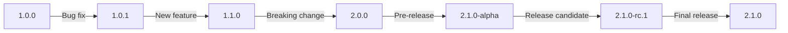
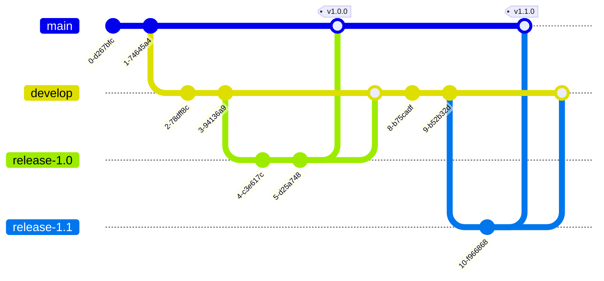

# Git Version Tagging

## Introduction

In Git, tagging is a powerful feature that allows you to mark specific points in your repository's history as being important. While branches are constantly moving as new commits are added, tags remain attached to a specific commit, making them perfect for designating version releases. This guide will explore how to effectively use Git tags for version management in your projects.

## What are Git Tags?

Git tags are references that point to specific points in Git history. Unlike branches, which move when new commits are added, tags are attached to a particular commit and don't change. This makes them ideal for marking version releases, major milestones, or important commits in your project's history.

There are two types of tags in Git:
- **Lightweight tags**: Simply a pointer to a specific commit
- **Annotated tags**: Stored as full objects in the Git database, containing the tagger's name, email, date, and a tagging message

For version tagging, annotated tags are generally recommended as they store important metadata about the release.

## Semantic Versioning

Before diving into the technical aspects of Git tagging, it's helpful to understand semantic versioning (SemVer), which is the most widely adopted versioning scheme for software projects.

Semantic versioning follows the pattern: `MAJOR.MINOR.PATCH` (e.g., 1.2.3)

- **MAJOR**: Incremented for incompatible API changes
- **MINOR**: Incremented for backward-compatible functionality additions
- **PATCH**: Incremented for backward-compatible bug fixes

Additional labels for pre-release and build metadata can be appended as extensions to the MAJOR.MINOR.PATCH format.



## Creating Version Tags

### Creating a Lightweight Tag

Lightweight tags are the simplest form of tags and are created without the `-a`, `-s`, or `-m` options:

```bash
git tag v1.0.0
```

This creates a tag named "v1.0.0" pointing to the current commit.

### Creating an Annotated Tag (Recommended for Versions)

For version tagging, annotated tags are preferred as they store additional metadata:

```bash
git tag -a v1.0.0 -m "Version 1.0.0 - Initial stable release"
```

The `-a` flag creates an annotated tag, and the `-m` flag allows you to specify a message, similar to a commit message.

You should see no output from these commands if they're successful.

### Tagging a Specific Commit

You can also tag an earlier commit by specifying its commit hash:

```bash
git tag -a v0.9.0 -m "Version 0.9.0 - Beta release" a1b2c3d
```

Replace `a1b2c3d` with the actual commit hash you want to tag.

## Listing Tags

To list all tags in your repository:

```bash
git tag
```

Example output:
```
v0.9.0
v1.0.0
v1.1.0
```

To search for tags that match a particular pattern, you can use the `-l` option with a wildcard:

```bash
git tag -l "v1.*"
```

Example output:
```
v1.0.0
v1.1.0
```

## Viewing Tag Information

To view detailed information about a tag, including who created it, when it was created, and the message:

```bash
git show v1.0.0
```

Example output:
```
tag v1.0.0
Tagger: John Doe <john@example.com>
Date:   Sun Feb 9 14:45:11 2023 -0700

Version 1.0.0 - Initial stable release

commit a1b2c3d4e5f6a1b2c3d4e5f6a1b2c3d4e5f6a1b2
Author: John Doe <john@example.com>
Date:   Sun Feb 9 14:42:05 2023 -0700

    Finalize features for 1.0.0 release

diff --git a/README.md b/README.md
...
```

## Pushing Tags to a Remote Repository

By default, the `git push` command doesn't transfer tags to remote repositories. To push tags to a shared repository, you need to explicitly do so.

To push a specific tag:

```bash
git push origin v1.0.0
```

To push all your tags at once:

```bash
git push origin --tags
```

## Deleting Tags

To delete a local tag:

```bash
git tag -d v1.0.0
```

Example output:
```
Deleted tag 'v1.0.0' (was a1b2c3d)
```

To delete a remote tag:

```bash
git push origin --delete v1.0.0
```

## Checking Out Tags

You can check out the code at a specific tag using:

```bash
git checkout v1.0.0
```

This puts your repository in a "detached HEAD" state because tags are static pointers to commits and don't change as new commits are created.

If you want to make changes based on a tag, it's better to create a new branch from the tag:

```bash
git checkout -b new-feature v1.0.0
```

## Practical Example: Managing a Software Release

Let's walk through a typical workflow for using Git tags to manage version releases:

1. First, ensure your main branch is up to date:

```bash
git checkout main
git pull origin main
```

2. Run your tests to make sure everything is working:

```bash
npm test  # or whatever test command your project uses
```

3. Update version numbers in your project files (e.g., package.json for Node.js projects)

4. Commit the version update:

```bash
git add package.json
git commit -m "Bump version to 1.2.0"
```

5. Create an annotated tag for the new version:

```bash
git tag -a v1.2.0 -m "Version 1.2.0 - Added search functionality and fixed login bugs"
```

6. Push the commit and the tag to your remote repository:

```bash
git push origin main
git push origin v1.2.0
```

7. Create a release from your tag (on GitHub, GitLab, etc.)

This process ensures that:
- Your code is properly tested before release
- The version number is consistently updated throughout your project
- The release point is clearly marked in your Git history
- The release is properly documented with a descriptive tag message

## GitHub Releases

If you're using GitHub, you can create releases based on Git tags. A GitHub Release is a more user-friendly interface built on top of Git tags that allows you to:

- Provide release notes in Markdown format
- Attach binaries or other assets to the release
- Mark releases as pre-release or production-ready

To create a GitHub Release:

1. Push your tag to GitHub
2. Go to your repository on GitHub
3. Click on "Releases"
4. Click "Create a new release" or "Draft a new release"
5. Select your tag from the dropdown
6. Fill in the release title and description
7. Optionally attach binaries
8. Publish the release

## Branch Strategy for Version Releases

For larger projects, a common strategy for managing releases involves dedicated release branches:



In this workflow:

1. Development happens on the `develop` branch
2. When ready for release, a `release-x.y.z` branch is created
3. Bug fixes and release preparation happen on the release branch
4. When ready, the release branch is merged to `main` and tagged
5. The release branch is also merged back to `develop`

This approach allows for continued development while a release is being prepared and provides a clear history of releases in the repository.

## Summary

Git version tagging is a powerful feature for marking and managing software releases:

- Tags provide a static reference to a specific point in your Git history
- Annotated tags include metadata and messages, making them ideal for version releases
- Semantic versioning provides a clear and standard way to communicate changes
- Tags need to be explicitly pushed to remote repositories
- Tags can be the basis for GitHub Releases or other release management systems
- A proper release workflow combines tagging with branch management for effective version control

By effectively using Git tags, you can maintain a clear record of your project's releases and make it easier for users and contributors to track and reference specific versions.

## Exercises and Additional Resources

### Exercises

1. Create a simple Git repository, make a few commits, and practice creating both lightweight and annotated tags.

2. Experiment with semantic versioning by creating a series of tags (v1.0.0, v1.0.1, v1.1.0, v2.0.0) based on different types of changes.

3. Try pushing tags to a remote repository and then viewing them on GitHub or GitLab.

4. Practice deleting a tag both locally and remotely.

5. Create a branch from a tag, make some changes, and then create a new tag for the updated version.

### Additional Resources

- [Git Documentation on Tagging](https://git-scm.com/book/en/v2/Git-Basics-Tagging)
- [Semantic Versioning Specification](https://semver.org/)
- [GitHub Releases Documentation](https://docs.github.com/en/repositories/releasing-projects-on-github/about-releases)
- [Git Flow Workflow](https://nvie.com/posts/a-successful-git-branching-model/) - A popular branching strategy that incorporates version tagging