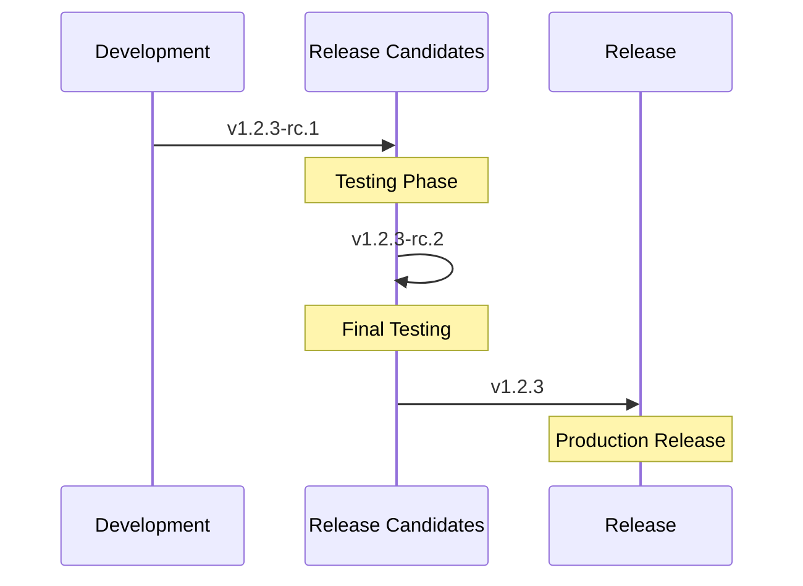
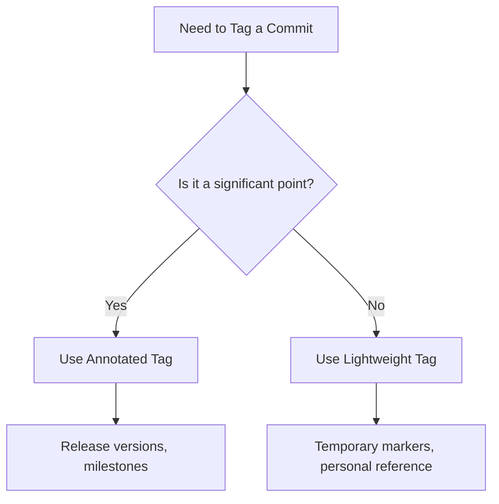

# Git Tag Patterns

Tags in Git are powerful reference points that mark specific points in your repository's history. While creating tags is straightforward, using them effectively requires understanding common patterns and best practices. This guide explores popular Git tagging patterns and how to implement them in your projects.

## Introduction to Tag Patterns

Git tags serve as anchors or bookmarks in your project's timeline, typically used to mark release points, important milestones, or significant changes. Establishing consistent tag patterns helps maintain organization, improves collaboration, and enables efficient project versioning.

## Semantic Versioning Pattern

The most widely adopted tagging pattern is **Semantic Versioning** (SemVer), which follows a structured format of `MAJOR.MINOR.PATCH`.

### Format and Meaning

```
v1.2.3
```

- **MAJOR (1)**: Incremented for incompatible API changes
- **MINOR (2)**: Incremented for backward-compatible functionality additions
- **PATCH (3)**: Incremented for backward-compatible bug fixes

### Implementation Example

```bash
# Creating a semantic version tag
git tag -a v1.2.3 -m "Release version 1.2.3"

# Pushing the tag to remote
git push origin v1.2.3
```

### Practical Application

SemVer tags work particularly well with automated release processes:

```bash
# List all tags that match semantic versioning pattern
git tag -l "v*.*.*"

# Checkout code at version 1.2.3
git checkout v1.2.3
```

## Release Candidate Pattern

For pre-release versions, the **Release Candidate** pattern extends semantic versioning.

### Format and Meaning

```
v1.2.3-rc.1
```

This indicates the first release candidate for version 1.2.3.

### Implementation Example

```bash
# Creating a release candidate tag
git tag -a v1.2.3-rc.1 -m "Release candidate 1 for version 1.2.3"

# When ready for final release
git tag -a v1.2.3 -m "Release version 1.2.3"
```

### Sequence Diagram



## Date-Based Pattern

For projects without versioned releases, date-based tags provide chronological reference points.

### Format and Meaning

```
v20240214
```

This represents a tag from February 14, 2024 (YYYYMMDD format).

More detailed timestamp formats are also common:

```
v20240214.1  (First release on February 14, 2024)
v20240214.2  (Second release on the same day)
```

### Implementation Example

```bash
# Creating a date-based tag
git tag -a v20240214 -m "Release from February 14, 2024"

# For multiple releases on the same day
git tag -a v20240214.2 -m "Second release on February 14, 2024"
```

## Feature and Bugfix Tags

For specific features or bugfixes, descriptive tags help track important changes.

### Format and Meaning

```
feature-user-authentication
bugfix-login-timeout
```

### Implementation Example

```bash
# Creating a feature tag
git tag -a feature-user-authentication -m "Completed user authentication system"

# Creating a bugfix tag
git tag -a bugfix-login-timeout -m "Fixed timeout issue in login form"
```

## Environment-Based Pattern

Tags can mark code that's been deployed to specific environments.

### Format and Meaning

```
prod-2024-02-14
staging-v1.2.3
```

### Implementation Example

```bash
# Tagging a production deployment
git tag -a prod-2024-02-14 -m "Deployed to production on February 14, 2024"

# When combining with semantic versioning
git tag -a staging-v1.2.3 -m "Deployed version 1.2.3 to staging"
```

## Lightweight vs. Annotated Tags

Git supports two types of tags, and choosing the right one is important for your tagging pattern.

### Lightweight Tags

```bash
# Creating a lightweight tag (just a pointer)
git tag v1.2.3-light
```

Lightweight tags are simple pointers to specific commits without additional metadata.

### Annotated Tags

```bash
# Creating an annotated tag (with metadata)
git tag -a v1.2.3 -m "Version 1.2.3 with important fixes"
```

Annotated tags store additional information including:
- Tagger name and email
- Tagging date
- Tag message
- GPG signature (optional)

### When to Use Each



## Tag Organization Patterns

For larger projects, organizing tags helps manage complexity.

### Namespace Pattern

```
frontend/v1.2.3
backend/v2.0.1
```

### Implementation Example

```bash
# Creating namespaced tags
git tag -a frontend/v1.2.3 -m "Frontend release version 1.2.3"
git tag -a backend/v2.0.1 -m "Backend release version 2.0.1"

# Listing tags by namespace
git tag -l "frontend/*"
```

## Automated Tag Generation

For consistent tagging, scripting helps maintain patterns.

### Basic Version Incrementing Script

```bash
#!/bin/bash
# Simple script to increment the patch version

# Get the latest tag
LATEST_TAG=$(git describe --tags --abbrev=0)

# Extract components
MAJOR=$(echo $LATEST_TAG | cut -d. -f1 | sed 's/v//')
MINOR=$(echo $LATEST_TAG | cut -d. -f2)
PATCH=$(echo $LATEST_TAG | cut -d. -f3)

# Increment patch version
NEW_PATCH=$((PATCH + 1))
NEW_TAG="v$MAJOR.$MINOR.$NEW_PATCH"

# Create and push new tag
git tag -a $NEW_TAG -m "Release $NEW_TAG"
git push origin $NEW_TAG

echo "Created new tag: $NEW_TAG"
```

## Best Practices for Tag Patterns

1. **Be Consistent**: Choose a pattern and stick with it throughout your project.

2. **Document Your Pattern**: Include your tagging convention in your project's README or CONTRIBUTING.md.

3. **Use Prefixes**: Prefixing tags with 'v' (e.g., `v1.2.3`) distinguishes them from branch names.

4. **Automate Tagging**: Use scripts or CI/CD pipelines to ensure consistent tag creation.

5. **Annotate Important Tags**: Use annotated tags (`-a` flag) for releases and important milestones.

6. **Never Delete Public Tags**: Once pushed, tags should be considered immutable.

7. **Sign Important Tags**: For critical releases, consider using GPG-signed tags:

   ```bash
   git tag -s v1.2.3 -m "Signed release v1.2.3"
   ```

## Common Problems and Solutions

### Tag Naming Conflicts

```bash
# Error: Tag already exists
fatal: tag 'v1.0.0' already exists

# Solution: Check existing tag
git show v1.0.0

# If incorrect, delete and recreate (only for local, unpublished tags)
git tag -d v1.0.0
git tag -a v1.0.0 -m "Correct version 1.0.0 tag"
```

### Managing Tag History

```bash
# Finding commits that have tags
git log --no-walk --tags

# Getting commit details for a specific tag
git show v1.2.3
```

## Summary

Git tag patterns provide structure and meaning to your repository's history. Adopting a consistent pattern—whether semantic versioning, date-based, or environment-based—improves collaboration and helps manage your project's lifecycle. Remember that the best pattern depends on your project's needs, release cycle, and team preferences.

## Exercises

1. Create a semantic versioning tag for your current project.
2. Write a simple shell script that automatically increments your project's minor version and creates a new tag.
3. Implement a release candidate workflow for your next feature.
4. Compare the difference between annotated and lightweight tags in your repository.
5. Design a tagging strategy for a multi-component project with different release cycles.

## Additional Resources

- [Semantic Versioning Specification](https://semver.org/)
- [Git Documentation: Git Basics - Tagging](https://git-scm.com/book/en/v2/Git-Basics-Tagging)
- [GitHub Flow](https://guides.github.com/introduction/flow/)
- [GitLab Release and Tagging Strategy](https://docs.gitlab.com/ee/topics/git/tags.html)