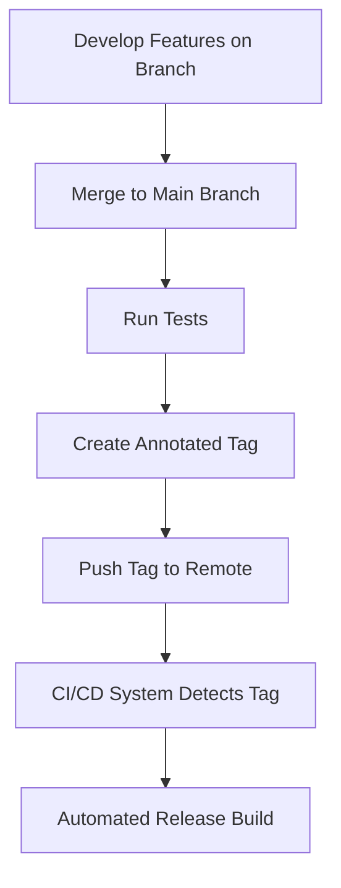

# Git Annotated Tags

## Introduction

Tags in Git are references that point to specific points in Git history, typically used to mark release points (v1.0, v2.0, etc.). While Git offers lightweight tags, which are simple pointers to commits, **annotated tags** provide more information and security features that make them valuable for important releases and milestones.

Annotated tags are stored as full objects in the Git database. They contain the tagger's name, email, date, a tagging message, and can be signed and verified with GNU Privacy Guard (GPG). This additional metadata makes them the preferred choice for public releases and important project milestones.

## Lightweight vs. Annotated Tags

Before diving deep into annotated tags, let's understand how they differ from lightweight tags:

| Feature | Lightweight Tags | Annotated Tags |
|---------|-----------------|----------------|
| Creation complexity | Simple | More detailed |
| Contains metadata | No | Yes |
| Stored as Git objects | No | Yes |
| Can be signed with GPG | No | Yes |
| Recommended for | Temporary or private markers | Public releases, milestones |

## Creating Annotated Tags

To create an annotated tag, you use the `-a` flag with the `git tag` command:

```bash
git tag -a v1.0 -m "Version 1.0 release"
```

Let's break down this command:
- `git tag`: The base command for working with tags
- `-a`: Specifies that this is an annotated tag
- `v1.0`: The tag name (typically using semantic versioning)
- `-m "Version 1.0 release"`: The annotation message

When you create an annotated tag, Git stores the following information:
- The tagger's name and email (from your Git configuration)
- The date the tag was created
- The message you provided with the `-m` flag
- A checksum of the commit being tagged

## Viewing Tag Information

One advantage of annotated tags is that you can view the stored metadata. To see the details of an annotated tag, use:

```bash
git show v1.0
```

Sample output:

```
tag v1.0
Tagger: John Doe <john.doe@example.com>
Date:   Sat May 23 2023 14:48:32 -0700

Version 1.0 release

commit a123456789abcdef123456789abcdef12345678
Author: John Doe <john.doe@example.com>
Date:   Sat May 23 2023 14:30:12 -0700

    Implement final feature for v1.0
```

This output shows the tagger information, the tagging message, and details about the commit that was tagged.

## Creating Annotated Tags for Past Commits

You can also create annotated tags for previous commits by specifying the commit hash:

```bash
git tag -a v0.9 -m "Beta release" 9fceb02
```

In this example, `9fceb02` is the checksum (or a part of it) of the commit you want to tag.

## Signing Annotated Tags with GPG

For additional security, especially for public releases, you can sign your annotated tags with GPG using the `-s` flag:

```bash
git tag -s v1.0 -m "Signed version 1.0 release"
```

To verify a signed tag:

```bash
git tag -v v1.0
```

If you don't have the signer's public key, you'll see an error. If you do have the public key, Git will verify the signature and show you the tag information.

## Sharing Tags

By default, `git push` doesn't transfer tags to remote repositories. To push a specific annotated tag to your remote:

```bash
git push origin v1.0
```

To push all tags at once:

```bash
git push origin --tags
```

## Deleting Annotated Tags

To delete a tag from your local repository:

```bash
git tag -d v1.0
```

To delete a tag from a remote repository:

```bash
git push origin --delete v1.0
```

## Real-World Examples

### Example 1: Creating an Annotated Tag for a Software Release

Imagine you've completed version 2.0 of your application. Here's how you might tag it:

```bash
git tag -a v2.0 -m "Version 2.0 with new UI and performance improvements"
git push origin v2.0
```

This creates a detailed reference to this important milestone with your name, the date, and a descriptive message about what's included in this version.

### Example 2: Creating a Tag for a Specific Feature Completion

Let's say you've completed a major feature that will be part of the next release:

```bash
git tag -a feature-user-authentication -m "Completed secure user authentication system"
```

This allows you and your team to easily reference this important feature completion point.

### Example 3: Using Annotated Tags in a Release Workflow

Here's an example of how annotated tags might be used in a typical release workflow:



In this workflow, the annotated tag serves as a trigger for your CI/CD system to create a new release build.

## Best Practices for Annotated Tags

1. **Use semantic versioning**: Follow the `MAJOR.MINOR.PATCH` format (e.g., v1.2.3).
2. **Write meaningful messages**: Include what's new, what's fixed, or why this point is significant.
3. **Tag significant commits**: Create tags for releases, major features, or important milestones.
4. **Sign important releases**: Use GPG signing for public or production releases.
5. **Keep tags organized**: Delete temporary or unnecessary tags to avoid cluttering your repository.

## Summary

Annotated tags in Git provide a way to mark important points in your project's history with additional metadata. Unlike lightweight tags, annotated tags store the tagger's information, date, a message, and can be signed with GPG. This makes them ideal for marking releases and significant milestones.

Key operations with annotated tags include:
- Creating with `git tag -a`
- Viewing with `git show`
- Signing with `git tag -s`
- Pushing with `git push origin [tagname]`
- Deleting with `git tag -d` and `git push origin --delete`

By using annotated tags effectively, you can provide better documentation, security, and reference points in your Git repositories.

## Additional Resources

- [Git Documentation on Tagging](https://git-scm.com/book/en/v2/Git-Basics-Tagging)
- [Semantic Versioning Specification](https://semver.org/)
- [GPG Documentation](https://gnupg.org/documentation/)

## Exercises

1. Create an annotated tag for your current project marking its current state.
2. View the details of the annotated tag you created using `git show`.
3. Create an annotated tag for a commit from last week.
4. Try signing a tag with GPG (if you have GPG set up).
5. Practice pushing your tags to a remote repository and then deleting them locally and remotely.