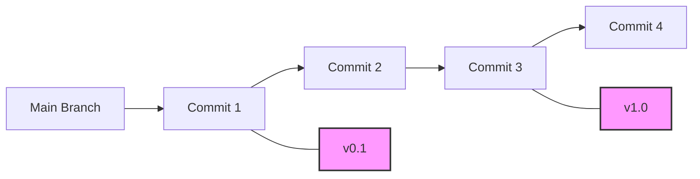

# Git Tag Creation

## Introduction

Git tags are references that point to specific points in Git history, typically used to mark release points (v1.0, v2.0, etc.) or other significant commits in your repository. Unlike branches, tags don't change once they're created - they serve as permanent markers or "snapshots" of your code at a specific point in time.

In this guide, you'll learn how to create different types of Git tags and understand when and why to use them in your projects.

## Types of Git Tags

Git supports two types of tags:

1. **Lightweight tags**: Simple pointers to specific commits
2. **Annotated tags**: Full Git objects with their own metadata (tagger name, email, date, and a tagging message)

Let's learn how to create both types.

## Creating Lightweight Tags

A lightweight tag is simply a pointer to a specific commit - like a branch that doesn't change.

### Basic Syntax

```bash
git tag <tag-name>
```

### Example

```bash
git tag v1.0-beta
```

This creates a lightweight tag named "v1.0-beta" pointing to your current commit (HEAD).

### Output

There's no explicit output when creating a tag successfully, but you can verify it with:

```bash
git tag
```

Which will show:

```
v1.0-beta
```

## Creating Annotated Tags

Annotated tags store extra metadata and are recommended for public releases.

### Basic Syntax

```bash
git tag -a <tag-name> -m "<tag-message>"
```

### Example

```bash
git tag -a v1.0 -m "Release version 1.0"
```

The `-a` flag creates an annotated tag, and the `-m` flag allows you to add a message.

### Output

Again, there's no explicit output on success, but you can verify with:

```bash
git tag
```

To see the details of the annotated tag:

```bash
git show v1.0
```

This will show:

```
tag v1.0
Tagger: Your Name <your.email@example.com>
Date:   Wed Mar 13 2025 14:22:33 GMT+0000

Release version 1.0

commit a1b2c3d4e5f6g7h8i9j0k1l2m3n4o5p6q7r8s9t0
Author: Your Name <your.email@example.com>
Date:   Wed Mar 13 2025 14:20:25 GMT+0000

    Your commit message
```

## Tagging Specific Commits

You can also tag commits other than your current one by specifying the commit hash.

### Syntax

```bash
git tag <tag-name> <commit-hash>
# or for annotated tags
git tag -a <tag-name> -m "<message>" <commit-hash>
```

### Example

```bash
git tag v0.9-beta abc1234
```

This creates a lightweight tag pointing to the commit with hash `abc1234`.

## Tag Naming Conventions

While Git allows almost any string as a tag name, it's good practice to follow these conventions:

- Use semantic versioning (e.g., `v1.0.0`, `v2.3.1`)
- Avoid spaces and special characters
- Use lowercase letters
- Use hyphens or dots to separate words
- Add suffixes like `-beta`, `-rc1` for pre-releases



## Practical Examples

### Scenario 1: Tagging a Release Version

When you've finished a stable version of your project:

```bash
# Make sure you're on the commit you want to tag
git checkout main
git pull

# Create an annotated tag for the release
git tag -a v1.0.0 -m "Release version 1.0.0 - First stable release"

# Push the tag to the remote repository
git push origin v1.0.0
```

### Scenario 2: Creating a Hotfix Tag

When you've fixed a critical bug in production:

```bash
# Create a branch from the production version
git checkout v1.0.0
git checkout -b hotfix/security-vulnerability

# Make your fixes
# ... (edit files)
git add .
git commit -m "Fix critical security vulnerability in login system"

# Tag the hotfix
git tag -a v1.0.1 -m "Hotfix: Security vulnerability patch"

# Merge back to main and push the tag
git checkout main
git merge hotfix/security-vulnerability
git push origin main
git push origin v1.0.1
```

### Scenario 3: Tagging Notable Project Milestones

```bash
# After completing a significant feature
git tag -a milestone-user-authentication -m "Completed user authentication system"
```

## Common Tag Operations

### Listing Tags

List all tags in alphabetical order:

```bash
git tag
```

List tags matching a pattern:

```bash
git tag -l "v1.*"
```

### Viewing Tag Details

For annotated tags:

```bash
git show v1.0.0
```

### Pushing Tags to Remote

By default, `git push` doesn't transfer tags. To push a specific tag:

```bash
git push origin <tag-name>
```

To push all tags:

```bash
git push origin --tags
```

### Deleting Tags

Delete a local tag:

```bash
git tag -d <tag-name>
```

Delete a remote tag:

```bash
git push origin --delete <tag-name>
```

### Checking Out Tags

To view the code at a tagged point:

```bash
git checkout <tag-name>
```

This puts you in a "detached HEAD" state. If you want to make changes, create a new branch:

```bash
git checkout -b <new-branch-name> <tag-name>
```

## Best Practices

1. **Use annotated tags for releases** - They contain valuable metadata
2. **Follow semantic versioning** - Use the `MAJOR.MINOR.PATCH` format
3. **Tag consistently** - Develop a tagging strategy and stick to it
4. **Include descriptive messages** - Explain what the tag represents
5. **Don't modify tags** - Create new ones instead
6. **Push tags immediately** - Ensure they're available to all team members

## Summary

Git tags provide a way to mark specific points in your repository's history, making it easier to reference important commits like releases, milestones, or significant changes. You've learned how to:

- Create lightweight and annotated tags
- Tag specific commits
- Follow naming conventions
- Manage tags (list, view, push, delete)
- Use tags in real-world scenarios

By incorporating tags into your Git workflow, you'll improve project organization and make it easier for teammates to understand your project's history and progression.

## Exercises

1. Create a lightweight tag on your current project
2. Create an annotated tag with a detailed message
3. Push your tags to a remote repository
4. List all tags and filter them using patterns
5. Tag a previous commit using its hash
6. Delete a local tag and its remote counterpart
7. Create a branch from a tag