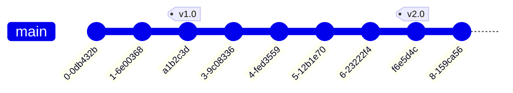

# Git Tag Listing

## Introduction

Tags in Git provide a way to mark specific points in your repository's history as important—typically used for marking release versions (v1.0, v2.0, etc.). Once you've created several tags in your project, you'll need efficient ways to list, search, and organize them. This guide covers various techniques for listing and managing tags in your Git repositories.

## Basics of Listing Tags

To see all the tags in your repository, you can use the simple `git tag` command:

```bash
git tag
```

This will display all tags in alphabetical order:

```
v1.0
v1.1
v2.0
v2.0.1
v2.1
```

## Filtering Tags with Patterns

If you have many tags, you might want to filter them. Git allows you to use patterns to search for specific tags:

```bash
git tag -l "v1.*"
```

This will display all tags that start with "v1.":

```
v1.0
v1.1
```

You can use any glob pattern to filter tags:

```bash
git tag -l "*-rc*"
```

Output (if you have release candidate tags):

```
v1.0-rc1
v1.0-rc2
v2.0-rc1
```

## Showing Tag Details

### Lightweight Tags

To view details about a specific tag, you can use the `git show` command:

```bash
git show v1.0
```

For a lightweight tag, this will show the commit information:

```
commit a1b2c3d4e5f6... (tag: v1.0)
Author: Jane Doe <jane@example.com>
Date:   Sat May 20 20:00:00 2023 -0700

    Release version 1.0
...
```

### Annotated Tags

For annotated tags (created with the `-a` flag), `git show` will display the tag message as well:

```bash
git show v2.0
```

Output:

```
tag v2.0
Tagger: Jane Doe <jane@example.com>
Date:   Wed Jun 14 10:00:00 2023 -0700

Version 2.0 release with new features X, Y, and Z

commit f6e5d4c3b2a1... (tag: v2.0)
Author: Jane Doe <jane@example.com>
Date:   Wed Jun 14 09:55:00 2023 -0700

    Finalize version 2.0
...
```

## Advanced Tag Listing

### Sorting Tags by Version

Git doesn't automatically sort tags by version number semantics. For example, `v10.0` would come before `v2.0` in alphabetical order. To sort tags by version number, you can use:

```bash
git tag --sort=v:refname
```

Output:

```
v1.0
v1.1
v2.0
v2.0.1
v10.0
```

For reverse order (newest versions first):

```bash
git tag --sort=-v:refname
```

Output:

```
v10.0
v2.0.1
v2.0
v1.1
v1.0
```

### Listing Tags with Dates

Sometimes it's helpful to see when tags were created. You can use a custom format:

```bash
git for-each-ref --sort=taggerdate --format '%(refname:short) - %(taggerdate:short) - %(subject)' refs/tags
```

Output:

```
v1.0 - 2023-05-20 - Version 1.0 release
v1.1 - 2023-05-30 - Version 1.1 bugfix release
v2.0 - 2023-06-14 - Version 2.0 release
v2.0.1 - 2023-06-20 - Hotfix for version 2.0
```

### List Remote Tags

To see tags on a remote repository:

```bash
git ls-remote --tags origin
```

Output:

```
a1b2c3d4e5f6... refs/tags/v1.0
b2c3d4e5f6a1... refs/tags/v1.1
c3d4e5f6a1b2... refs/tags/v2.0
d4e5f6a1b2c3... refs/tags/v2.0.1
```

## Practical Examples

### Finding the Latest Release Tag

A common task is finding the most recent release tag. This script finds the most recent tag by version number:

```bash
git describe --tags `git rev-list --tags --max-count=1`
```

Or, if you're looking specifically for release tags with a pattern:

```bash
git tag -l "v*" --sort=-v:refname | head -n 1
```

### Checking What Changed Between Tags

To see what commits were made between two tags:

```bash
git log v1.0..v2.0 --oneline
```

Output:

```
f6e5d4c Finalize version 2.0
e5d4c3b Add feature Z
d4c3b2a Add feature Y
c3b2a1d Improve performance by 20%
b2a1d0c Add feature X
```

### Creating a Changelog Based on Tags

You can create a simple changelog by listing all commits between tags:

```bash
git log --pretty=format:"%h - %s (%an, %ar)" v1.0..v2.0
```

Output:

```
f6e5d4c - Finalize version 2.0 (Jane Doe, 2 months ago)
e5d4c3b - Add feature Z (John Smith, 2 months ago)
d4c3b2a - Add feature Y (Jane Doe, 3 months ago)
c3b2a1d - Improve performance by 20% (Alex Johnson, 3 months ago)
b2a1d0c - Add feature X (Jane Doe, 4 months ago)
```

## Visualizing Tags in Your Repository History

You can visualize where tags occur in your repository history with:

```bash
git log --oneline --decorate
```

Output:

```
f6e5d4c (HEAD -> main, tag: v2.0) Finalize version 2.0
e5d4c3b Add feature Z
d4c3b2a Add feature Y
c3b2a1d Improve performance by 20%
b2a1d0c Add feature X
a1b2c3d (tag: v1.0) Initial release
```

For a more visual representation, you can use `git log` with graph option:

```bash
git log --graph --oneline --decorate
```

You can also visualize this with a diagram:



## Summary

Git provides multiple ways to list and filter tags in your repository, from simple alphabetical listing to advanced filtering and sorting options. Effective tag management helps you navigate your project's history and releases more efficiently.

Key points covered:
- Basic tag listing with `git tag`
- Filtering tags with patterns
- Viewing tag details with `git show`
- Advanced sorting and formatting of tag listings
- Practical examples for working with tags

## Exercises

1. List all tags in your repository that match the pattern "v2.*"
2. Create a script that outputs the three most recent tags by date
3. Generate a changelog of commits between your two most recent release tags
4. Find all tags created in the last 3 months

## Additional Resources

- [Git Documentation: Git Basics - Tagging](https://git-scm.com/book/en/v2/Git-Basics-Tagging)
- [Git Documentation: git-tag](https://git-scm.com/docs/git-tag)
- [Semantic Versioning Specification](https://semver.org/)