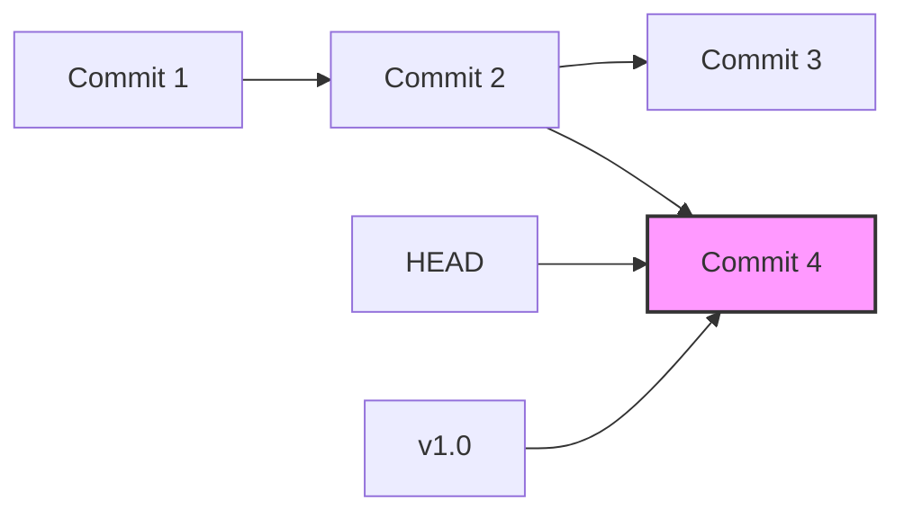

# Git Tag Checkout

## Introduction

Tags in Git serve as important markers or reference points in your repository's history. While branches are movable references that track ongoing development, tags are immutable pointers to specific commits, typically used to mark release versions or significant milestones. 

The ability to checkout tags allows developers to easily navigate to exact versions of their codebase, which is particularly valuable when you need to:
- Reproduce a bug that existed in a specific release
- Review code as it was at a particular milestone
- Build or deploy a specific tagged version

In this guide, we'll learn how to checkout Git tags, understand the underlying concepts, and explore practical applications in real-world development workflows.

## Understanding Tag Checkout

When you checkout a tag in Git, you're essentially telling Git to set your working directory to match the state of the repository at the point where that tag was created. This is similar to checking out a branch, but with an important distinction: tags don't move as new commits are created.

### The "Detached HEAD" State

When checking out a tag, Git will warn you about entering a "detached HEAD" state. This means your HEAD (the pointer to the current working commit) is not attached to any branch but directly points to a commit.



In this state, any new commits you make won't belong to any branch and can be lost if you checkout elsewhere without creating a new branch to retain them.

## Basic Tag Checkout Commands

### Listing Available Tags

Before checking out a tag, you might want to see which tags are available:

```bash
git tag
```

For a more detailed view with tag messages:

```bash
git tag -n
```

### Checking Out a Tag

To checkout a specific tag:

```bash
git checkout v1.2.3
```

Output:
```
Note: checking out 'v1.2.3'.

You are in 'detached HEAD' state. You can look around, make experimental
changes and commit them, and you can discard any commits you make in this
state without impacting any branches by performing another checkout.

If you want to create a new branch to retain commits you create, you may
do so (now or later) by using -b with the checkout command again. Example:

  git checkout -b <new-branch-name>

HEAD is now at a1b2c3d... Tag message for v1.2.3
```

## Working with Tag Checkouts

### Creating a Branch from a Tag

If you need to make changes based on a tagged version, it's best to create a new branch from the tag:

```bash
git checkout -b bugfix-for-v1.2.3 v1.2.3
```

This creates a new branch called `bugfix-for-v1.2.3` starting from the commit pointed to by the tag `v1.2.3`.

### Returning to the Latest Version

Once you're done working with a tagged version, you typically want to return to your main development branch:

```bash
git checkout main
```

Or if you're using the older Git naming convention:

```bash
git checkout master
```

## Practical Examples

### Example 1: Verifying a Bug in a Specific Release

Imagine a user reports a bug in version 1.2.3 of your software. To reproduce and verify the issue:

```bash
# List all version tags
git tag | grep -E '^v[0-9]'

# Checkout the reported version
git checkout v1.2.3

# Run your application to verify the bug
npm start  # or whatever command starts your application
```

### Example 2: Building a Specific Release Version

For deployment purposes, you might need to build a specific tagged version:

```bash
# Checkout the production release tag
git checkout v2.0.0

# Install dependencies for that version
npm install

# Build the application
npm run build

# Package for distribution
npm run package
```

### Example 3: Creating a Hotfix for an Older Version

Sometimes you need to fix a critical issue in an older release while maintaining the current development:

```bash
# Checkout the older version
git checkout v1.8.5

# Create a hotfix branch
git checkout -b hotfix-1.8.6

# Make necessary changes
# ... (edit files)

# Commit your changes
git commit -am "Fix critical security issue in authentication flow"

# Create a new tag for the hotfix
git tag -a v1.8.6 -m "Hotfix: Security patch for authentication"

# Push the fix and the new tag
git push origin hotfix-1.8.6
git push origin v1.8.6
```

## Common Pitfalls and Solutions

### Lost Commits in Detached HEAD State

**Problem**: You made commits while in a detached HEAD state and then checked out another branch, potentially losing your work.

**Solution**: 
If you haven't yet checked out elsewhere, create a branch to save your work:

```bash
git checkout -b recovery-branch
```

If you've already checked out elsewhere, you can use `git reflog` to find and recover the lost commits:

```bash
# Find the lost commit
git reflog

# Create a branch pointing to that commit
git checkout -b recovery-branch <commit-hash>
```

### Confusing Tag and Branch Names

**Problem**: Having tags and branches with the same name can cause confusion.

**Solution**: Use consistent naming conventions:
- Tags: `v1.2.3`, `release-2023-06-15`
- Branches: `feature/user-auth`, `bugfix/login-error`

## Summary

Checking out Git tags allows you to navigate to exact points in your repository's history, making it easy to work with specific versions of your codebase. Remember these key points:

1. Tags are immutable pointers to specific commits
2. Checking out a tag puts you in a "detached HEAD" state
3. Create a new branch if you need to make changes based on a tagged version
4. Use consistent naming conventions to avoid confusion between tags and branches

By mastering tag checkout, you gain greater control over your development workflow and can more effectively manage the versioning of your projects.

## Exercises

1. Create a sample repository, add a few commits, and create a tag for a "v1.0" release.
2. Checkout this tag and observe the detached HEAD warning.
3. Make some changes, create a new commit, and then try to switch to another branch without creating a new branch first. Use `git reflog` to recover your work.
4. Create a new branch from a tag, make some changes, and then merge those changes into your main branch.
5. Practice checking out different tags and navigating between tagged versions of your code.

## Additional Resources

- [Git Documentation on Tags](https://git-scm.com/book/en/v2/Git-Basics-Tagging)
- [Understanding Git's HEAD pointer](https://git-scm.com/docs/git-checkout#_detached_head)
- [Git Reflog for Recovering Lost Commits](https://git-scm.com/docs/git-reflog)