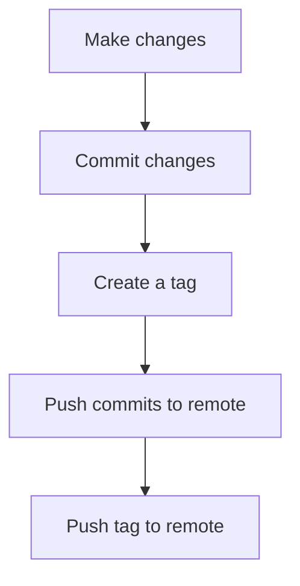

# Git Tag Pushing

## Introduction

After creating tags in your local Git repository to mark important points in your project's history (like releases or significant changes), you'll often need to share these tags with others. This is where "pushing tags" comes into play.

Tag pushing is the process of uploading your local Git tags to a remote repository, making them available to everyone with access to that repository. This is an essential part of collaborative development and version management in Git.

## Why Push Git Tags?

Tags are not automatically included when you push commits to a remote repository. They need to be pushed explicitly. Here's why you should push your tags:

- **Version tracking**: Share release versions with team members and users
- **Collaboration**: Ensure everyone can access the same reference points
- **Deployment**: Many deployment systems use Git tags to determine what to deploy
- **Documentation**: Tags serve as permanent references in your project's history

## Basic Tag Pushing Commands

### Pushing a Single Tag

To push a specific tag to your remote repository:

```bash
git push origin <tag-name>
```

For example, to push a tag named `v1.0.0`:

```bash
git push origin v1.0.0
```

**Example output:**
```
Counting objects: 1, done.
Writing objects: 100% (1/1), 160 bytes | 160.00 KiB/s, done.
Total 1 (delta 0), reused 0 (delta 0)
To github.com:username/repository.git
 * [new tag]         v1.0.0 -> v1.0.0
```

### Pushing All Tags

To push all your local tags to the remote repository:

```bash
git push origin --tags
```

**Example output:**
```
Counting objects: 3, done.
Delta compression using up to 8 threads.
Compressing objects: 100% (3/3), done.
Writing objects: 100% (3/3), 744 bytes | 744.00 KiB/s, done.
Total 3 (delta 0), reused 0 (delta 0)
To github.com:username/repository.git
 * [new tag]         v1.0.0 -> v1.0.0
 * [new tag]         v1.1.0 -> v1.1.0
 * [new tag]         v1.2.0 -> v1.2.0
```

## Tag Pushing Workflow

Here's a typical workflow for creating and pushing tags:



### Step-by-step example:

1. Make and commit your changes:
   ```bash
   git add .
   git commit -m "Add new feature"
   ```

2. Create a tag for your new version:
   ```bash
   git tag -a v1.0.0 -m "Release version 1.0.0"
   ```

3. Push your commits to the remote repository:
   ```bash
   git push origin main
   ```

4. Push your new tag:
   ```bash
   git push origin v1.0.0
   ```

## Common Scenarios and Solutions

### Pushing Tags During Normal Push

You can configure Git to automatically push tags along with your commits:

```bash
git config --global push.followTags true
```

With this configuration, when you run `git push`, any annotated tags that point to commits being pushed will also be pushed.

### Handling Tag Push Errors

If you encounter an error when pushing a tag, it might be because a tag with the same name already exists on the remote repository.

**Example error output:**
```
! [rejected]        v1.0.0 -> v1.0.0 (already exists)
error: failed to push some refs to 'github.com:username/repository.git'
```

To resolve this, you can:

1. Delete the remote tag first and then push your local tag:
   ```bash
   git push origin :refs/tags/v1.0.0
   git push origin v1.0.0
   ```

2. Or use the `--force` option (use with caution):
   ```bash
   git push origin --force v1.0.0
   ```

### Deleting Remote Tags

Sometimes you need to remove a tag from the remote repository:

```bash
git push origin --delete v1.0.0
```

**Example output:**
```
To github.com:username/repository.git
 - [deleted]         v1.0.0
```

## Real-World Applications

### Release Management

In a typical software project, tags are used to mark releases:

```bash
# After finishing all features and fixes for v1.0.0
git tag -a v1.0.0 -m "Release version 1.0.0 - First stable release"
git push origin v1.0.0
```

### Continuous Integration/Deployment

Many CI/CD systems use Git tags to trigger deployment processes:

```bash
# Create a production release tag
git tag -a production-2023-03-14 -m "Production release - March 14, 2023"
git push origin production-2023-03-14
```

This might automatically trigger a deployment to your production environment.

### Semantic Versioning

Following semantic versioning (SemVer) with your tags helps maintain a clear release history:

```bash
# Major version (breaking changes)
git tag -a v2.0.0 -m "Major release with breaking API changes"
git push origin v2.0.0

# Minor version (new features, no breaking changes)
git tag -a v2.1.0 -m "Added new features"
git push origin v2.1.0

# Patch version (bug fixes)
git tag -a v2.1.1 -m "Fixed critical bug"
git push origin v2.1.1
```

## Summary

Pushing Git tags is a crucial part of sharing important project milestones and versions with your team. Remember these key points:

- Tags need to be pushed explicitly with `git push origin <tag-name>` or `git push origin --tags`
- You can configure Git to automatically push annotated tags with `git config --global push.followTags true`
- Tags provide a way to mark specific points in your repository's history for releases and reference
- Following a consistent tagging strategy helps maintain clear project versioning

## Exercises

1. Create a local tag for your current project and push it to a remote repository.
2. Delete a tag from your remote repository, then recreate it locally and push it again.
3. Set up your Git configuration to automatically push annotated tags.
4. Create a tag with a message that explains a significant change in your project, then push it.
5. Practice implementing semantic versioning by creating and pushing tags for major, minor, and patch versions.

## Additional Resources

- [Git Documentation: Git Basics - Tagging](https://git-scm.com/book/en/v2/Git-Basics-Tagging)
- [Semantic Versioning Specification](https://semver.org/)
- [GitHub Documentation: Pushing tags](https://docs.github.com/en/get-started/using-git/pushing-commits-to-a-remote-repository)