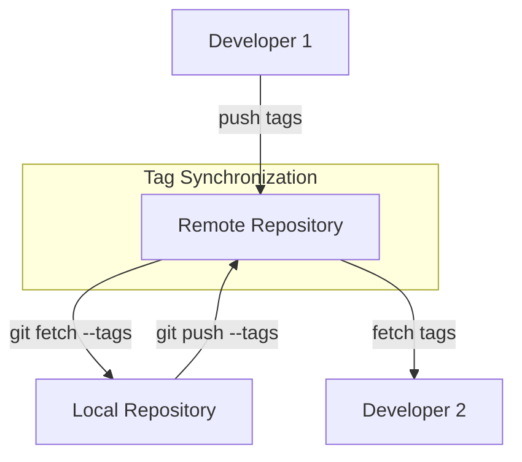

# Git Tag Fetching

## Introduction

Git tags are references that point to specific points in Git history, typically used to mark release points (v1.0, v2.0, etc.). While you can create tags locally, collaborating with others requires the ability to share these tags across repositories. This is where tag fetching comes in.

Tag fetching is the process of retrieving tags from a remote repository and bringing them into your local repository. This allows you to access important reference points created by other contributors, ensuring everyone on the team can track the same significant commits.

## Understanding Git Tag Fetching

When working with remote repositories, Git doesn't automatically fetch tags along with branches. This design choice helps maintain efficiency and gives you control over which references you want to retrieve. Let's explore how to effectively fetch tags from remote repositories.

## Basic Tag Fetching

By default, the `git fetch` command doesn't automatically bring in all tags from the remote repository. To explicitly fetch tags, you have two main approaches:

### 1. Fetching All Tags

To fetch all tags from a remote repository:

```bash
git fetch --tags
```

**Example:**

```bash
$ git fetch --tags
From github.com:username/project
 * [new tag]         v1.0      -> v1.0
 * [new tag]         v1.1      -> v1.1
 * [new tag]         v2.0-beta -> v2.0-beta
```

This command retrieves all tags from the remote that don't already exist in your local repository.

### 2. Fetching Specific Tags

If you only need a particular tag, you can fetch it directly:

```bash
git fetch origin tag <tag-name>
```

**Example:**

```bash
$ git fetch origin tag v1.2
From github.com:username/project
 * [new tag]         v1.2      -> v1.2
```

## Automatic Tag Fetching with Git Pull

When you run `git pull`, Git also fetches tags, but only those that point to commits that are being downloaded as part of the pull operation. This behavior can be modified:

```bash
# Pull and fetch all tags
git pull --tags

# Pull without fetching tags
git -c remote.origin.tagOpt=--no-tags pull
```

## Listing Tags After Fetching

To verify which tags are now available in your local repository after fetching:

```bash
git tag -l
```

**Example output:**

```bash
$ git tag -l
v1.0
v1.1
v1.2
v2.0-beta
```

To see more detailed information about tags, including the commit they point to:

```bash
git show-ref --tags
```

**Example output:**

```bash
$ git show-ref --tags
f0a853e53f082c43ddf47caa23560f58adb2591e refs/tags/v1.0
d2f6214b625db3646e36b49e202ddfdbe10205c7 refs/tags/v1.1
8ac6a90c262b3adfa803db98fd37a4265fe0fa2d refs/tags/v1.2
4e16fc76543e48c4df0e3b2546c528b7d7c4e706 refs/tags/v2.0-beta
```

## Common Tag Fetching Scenarios

### Scenario 1: Initial Repository Cloning

When you clone a repository, Git automatically fetches all tags by default:

```bash
git clone https://github.com/username/project.git
```

After cloning, all tags will be available locally.

### Scenario 2: Syncing with a Team Repository

When a team member has created and pushed new tags to the shared repository:

```bash
# Fetch only the latest changes and tags pointing to them
git pull

# Fetch everything including all tags
git fetch --all --tags
```

### Scenario 3: Setting Up a Mirror Repository

When creating a mirror that needs to include all tags:

```bash
git clone --mirror https://github.com/username/project.git
```

This will create a bare repository with all references including tags.

## Tag Fetching Configuration

You can configure Git to automatically fetch tags with every fetch operation:

```bash
# Set globally
git config --global fetch.tags true

# Set for a specific repository
git config fetch.tags true
```

With this configuration, each `git fetch` will include tags without needing the `--tags` flag.

## Tag Maintenance After Fetching

### Deleting Tags

If you need to remove a tag after fetching:

```bash
# Delete local tag
git tag -d v1.0
```

Remember that deleting a local tag doesn't affect the remote repository.

### Pruning Stale Tags

To remove local tags that no longer exist on the remote:

```bash
git fetch --prune --prune-tags
```

This command removes references to branches and tags that have been deleted from the remote repository.

## Workflow Visualization

Here's a diagram showing how tags move between repositories:



## Troubleshooting Tag Fetching

### Problem: Tags Not Fetching

If tags aren't being fetched as expected:

1. Check that you're using the correct flags:
   ```bash
   git fetch --tags
   ```

2. Verify you have fetch access to the repository.

3. Ensure the tags exist on the remote:
   ```bash
   git ls-remote --tags origin
   ```

### Problem: Conflicting Tags

If a tag exists both locally and remotely with different commits:

```bash
# Force update the local tag to match remote
git fetch -f --tags
```

Use this cautiously as it will overwrite your local tags.

## Summary

Git tag fetching is an essential skill for collaborative development, enabling teams to share important reference points in their project history. By understanding the different fetching commands and options, you can efficiently manage tags across multiple repositories.

Remember these key points:

- Use `git fetch --tags` to retrieve all tags
- For specific tags, use `git fetch origin tag <tag-name>`
- Configure automatic tag fetching with `git config fetch.tags true`
- Use `git fetch --prune --prune-tags` to clean up stale tags

By mastering tag fetching, you'll ensure your local repository stays synchronized with important project milestones and release points.

## Additional Resources

For further learning, explore:

- [Git Official Documentation on Fetching](https://git-scm.com/docs/git-fetch)
- The `git tag` command for creating and managing tags
- The `git push --tags` command for sharing your tags with others

## Exercises

1. Create a tag locally, then fetch tags from a remote repository and compare the results.
2. Configure your Git to automatically fetch tags, then verify it works as expected.
3. Set up two local repositories, create tags in one, push them, and fetch them in the other.
4. Practice pruning stale tags after deleting some tags from a remote repository.