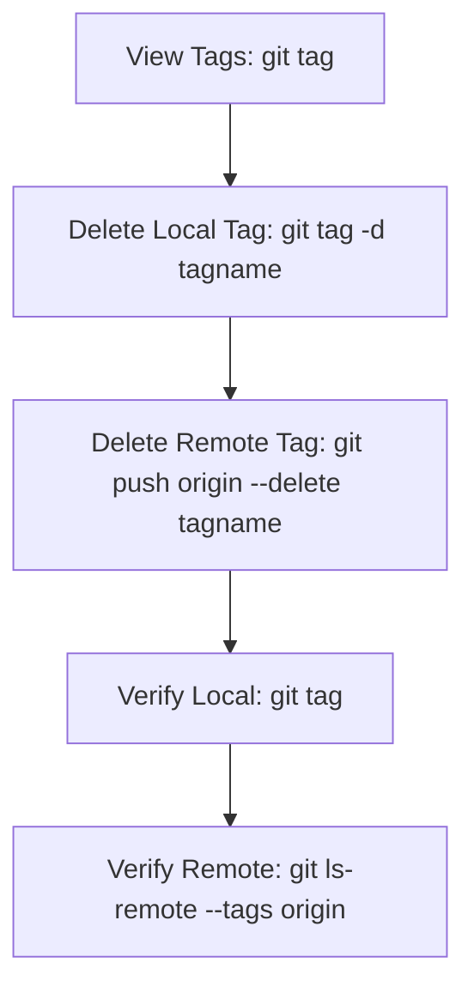

# Git Tag Deletion

## Introduction

Git tags are references that point to specific points in Git history and are often used to mark release points or important milestones in a project. However, there are times when you need to delete tags - perhaps they were created incorrectly, are no longer relevant, or you need to reorganize your repository's tag structure. This guide will walk you through the process of deleting Git tags both locally and remotely.

## Why Delete Git Tags?

Before diving into the how, let's understand why you might need to delete tags:

- **Incorrect tag creation**: You made a mistake when creating the tag
- **Obsolete tags**: The tag is no longer relevant or needed
- **Reorganizing repository**: You're restructuring how you manage releases and milestones
- **Private or temporary tags**: You used tags for personal reference and no longer need them
- **Accidental push**: You pushed a tag to a remote repository by mistake

## Deleting Local Tags

### Viewing Your Tags

Before deleting any tags, you might want to see what tags exist in your repository:

```bash
git tag
```

This will list all tags in your repository. For a more detailed look with annotations, use:

```bash
git tag -n
```

### Basic Tag Deletion Syntax

To delete a tag from your local repository, use the following command:

```bash
git tag -d <tagname>
```

#### Example:

```bash
git tag -d v1.0.0
```

**Output:**
```
Deleted tag 'v1.0.0' (was a1b2c3d)
```

In this example, `a1b2c3d` would be the commit hash that the tag was pointing to.

### Deleting Multiple Tags at Once

You can delete multiple tags in a single command:

```bash
git tag -d <tagname1> <tagname2> <tagname3>
```

#### Example:

```bash
git tag -d v1.0.0 v1.0.1 v1.0.2
```

**Output:**
```
Deleted tag 'v1.0.0' (was a1b2c3d)
Deleted tag 'v1.0.1' (was e5f6g7h)
Deleted tag 'v1.0.2' (was i9j0k1l)
```

### Using Pattern Matching

If you have many tags to delete that follow a pattern, you can use the following approach:

```bash
git tag -l "pattern*" | xargs git tag -d
```

#### Example:
Delete all tags starting with "temp-":

```bash
git tag -l "temp-*" | xargs git tag -d
```

**Output:**
```
Deleted tag 'temp-fix' (was m2n3o4p)
Deleted tag 'temp-feature' (was q5r6s7t)
Deleted tag 'temp-test' (was u8v9w0x)
```

## Deleting Remote Tags

After deleting a tag locally, you may also need to delete it from remote repositories. Tags are not automatically synced between local and remote repositories.

### Basic Remote Tag Deletion

To delete a tag from a remote repository:

```bash
git push origin --delete <tagname>
```

Alternatively, you can use this syntax:

```bash
git push origin :<tagname>
```

#### Example:

```bash
git push origin --delete v1.0.0
```

**Output:**
```
To https://github.com/username/repository.git
 - [deleted]         v1.0.0
```

### Deleting Multiple Remote Tags

To delete multiple remote tags, you'll need to run the command for each tag:

```bash
git push origin --delete <tagname1> <tagname2> <tagname3>
```

#### Example:

```bash
git push origin --delete v1.0.0 v1.0.1 v1.0.2
```

**Output:**
```
To https://github.com/username/repository.git
 - [deleted]         v1.0.0
 - [deleted]         v1.0.1
 - [deleted]         v1.0.2
```

### Script for Bulk Remote Tag Deletion

For deleting many remote tags at once, you can use a script:

```bash
git tag -l "pattern*" | xargs -I% git push origin --delete %
```

#### Example:
Delete all remote tags starting with "temp-":

```bash
git tag -l "temp-*" | xargs -I% git push origin --delete %
```

## Complete Workflow: Deleting Tags Locally and Remotely

Here's a complete workflow for deleting a tag both locally and remotely:



### Step-by-Step Example:

1. **Check existing tags**:
   ```bash
   git tag
   ```
   **Output:**
   ```
   v1.0.0
   v1.0.1
   v1.0.2
   ```

2. **Delete the tag locally**:
   ```bash
   git tag -d v1.0.1
   ```
   **Output:**
   ```
   Deleted tag 'v1.0.1' (was e5f6g7h)
   ```

3. **Delete the tag from the remote repository**:
   ```bash
   git push origin --delete v1.0.1
   ```
   **Output:**
   ```
   To https://github.com/username/repository.git
    - [deleted]         v1.0.1
   ```

4. **Verify the tag is deleted locally**:
   ```bash
   git tag
   ```
   **Output:**
   ```
   v1.0.0
   v1.0.2
   ```

5. **Verify the tag is deleted remotely**:
   ```bash
   git ls-remote --tags origin
   ```
   **Output:**
   ```
   a1b2c3d4e5f6g7h8i9j0k1l2m3n4o5p6q7r8  refs/tags/v1.0.0
   s9t0u1v2w3x4y5z6a7b8c9d0e1f2g3h4i5j6  refs/tags/v1.0.2
   ```

## Best Practices for Tag Deletion

To maintain a clean and organized repository, follow these best practices:

1. **Communicate with your team**: Before deleting tags that others might be using, especially for important releases, communicate with your team.

2. **Document the deletion**: If the tag marked an important milestone, document why it was deleted.

3. **Consider annotated tags**: For important releases, use annotated tags (`git tag -a`) as they contain more metadata and are generally treated with more care.

4. **Be careful with tag reuse**: After deleting a tag, it's possible to create a new tag with the same name pointing to a different commit. This can cause confusion, so avoid reusing names for important tags.

5. **Use a consistent naming convention**: This makes it easier to identify tags that might need deletion in the future.

## Common Issues and Troubleshooting

### Permission Denied When Deleting Remote Tags

If you get a "permission denied" error when trying to delete a remote tag, ensure you have the necessary permissions in the remote repository. Some repositories might have protective measures in place for tags.

```
error: unable to push to unqualified destination: tagname
The destination refspec neither matches an existing ref nor begins with refs/.
error: failed to push some refs to 'https://github.com/username/repository.git'
```

**Solution**: Check your permissions or contact the repository administrator.

### Tag Still Appears After Deletion

If a tag still appears after you've deleted it, it might be cached. Try fetching the latest tags:

```bash
git fetch --prune --prune-tags
```

This command fetches the latest state from the remote and removes any local references that no longer exist on the remote, including tags.

## Summary

Git tag deletion is a straightforward process, but it requires understanding the difference between local and remote operations. Here's a quick recap:

- **Local tag deletion**: `git tag -d <tagname>`
- **Remote tag deletion**: `git push origin --delete <tagname>`
- **View tags**: `git tag` or `git tag -n` for more details
- **Verify remote tags**: `git ls-remote --tags origin`

Remember to follow best practices, especially when working in a team, and always verify that the deletion was successful both locally and remotely.

## Additional Resources

Here are some exercises to help you practice tag deletion:

1. Create several test tags, delete them locally, and verify they're gone.
2. Create a tag, push it to a remote repository, then delete it both locally and remotely.
3. Experiment with pattern matching to delete multiple tags at once.
4. Create a tag, delete it, then create a new tag with the same name pointing to a different commit to understand the implications.

For further learning:

- Explore Git's official documentation on tags
- Practice creating, managing, and deleting tags in a personal test repository
- Learn how tags integrate with Git's release management features in platforms like GitHub or GitLab