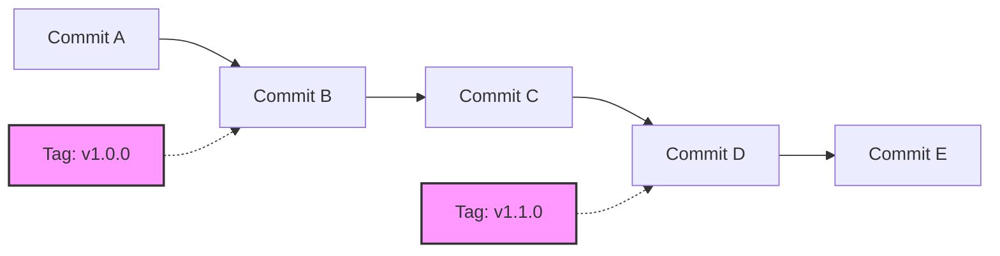
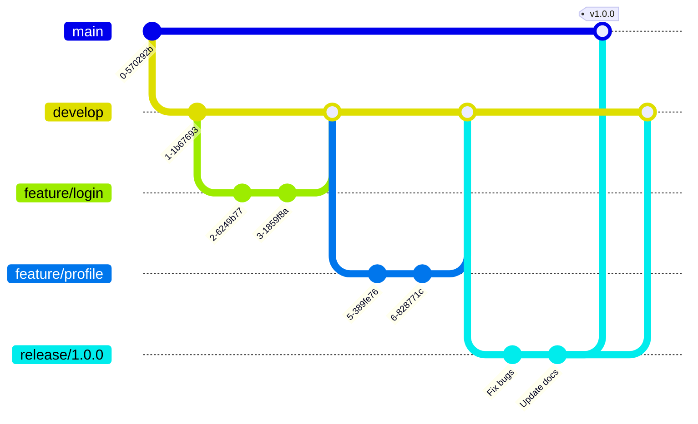

# Git Release Tags

## Introduction

When developing software projects, marking specific points in your repository's history as important milestones is a common practice. Git provides a feature called "tags" that allows you to do exactly this. **Release tags** are a specific use of Git tags that mark release points in your project's history, creating a permanent reference to a specific commit that represents a released version of your software.

Release tags serve as immutable pointers to specific commits, making it easy to navigate through different released versions of your code. Unlike branches, which are designed to move as you add new commits, tags remain fixed to a single commit, providing a stable reference point.

## Understanding Git Release Tags

### What Are Release Tags?

Release tags are special references in Git that:

- Point to a specific commit
- Usually follow semantic versioning (e.g., `v1.0.0`, `v2.1.3`)
- Represent significant milestones or releases in your project
- Can be annotated with additional information about the release
- Can be cryptographically signed for verification

Here's how release tags fit into Git's object model:



## Creating Release Tags

Git offers two types of tags:

1. **Lightweight tags**: Simple pointers to specific commits
2. **Annotated tags**: Full Git objects that contain additional metadata

For release management, **annotated tags** are recommended as they store important information such as:
- The tagger's name and email
- The date of tagging
- A tagging message (like a commit message)

### Creating a Lightweight Release Tag

```bash
git tag v1.0.0
```

### Creating an Annotated Release Tag (Recommended)

```bash
git tag -a v1.0.0 -m "Version 1.0.0 - Initial stable release"
```

### Output:
```
# No output for successful tag creation
```

## Viewing Release Tags

### List All Tags

```bash
git tag
```

### Output:
```
v0.9.0
v1.0.0
v1.0.1
v1.1.0
```

### View Detailed Information About a Tag

```bash
git show v1.0.0
```

### Output:
```
tag v1.0.0
Tagger: Jane Doe <jane@example.com>
Date:   Mon Oct 14 15:30:15 2024 -0700

Version 1.0.0 - Initial stable release

commit a7f3bc9c8d9e6f1d8c0e7b6a5f4e3d2c1b0a9f8
Author: Jane Doe <jane@example.com>
Date:   Mon Oct 14 15:25:10 2024 -0700

    Finalize features for 1.0.0 release

diff --git a/README.md b/README.md
...
```

## Release Tag Naming Conventions

For release tags, following a consistent naming convention is crucial. The most widely adopted convention is [Semantic Versioning (SemVer)](https://semver.org/).

### Semantic Versioning Format

```
v[MAJOR].[MINOR].[PATCH]
```

- **MAJOR**: Increment when you make incompatible API changes
- **MINOR**: Increment when you add functionality in a backward-compatible manner
- **PATCH**: Increment when you make backward-compatible bug fixes

Examples:
- `v1.0.0`: Initial release
- `v1.0.1`: Bug fixes
- `v1.1.0`: New features (backward compatible)
- `v2.0.0`: Breaking changes

## Sharing Release Tags

By default, `git push` doesn't transfer tags to remote repositories. You need to explicitly push tags.

### Push a Specific Tag

```bash
git push origin v1.0.0
```

### Output:
```
Total 0 (delta 0), reused 0 (delta 0)
To github.com:username/repository.git
 * [new tag]         v1.0.0 -> v1.0.0
```

### Push All Tags

```bash
git push origin --tags
```

### Output:
```
Counting objects: 1, done.
Writing objects: 100% (1/1), 164 bytes | 164.00 KiB/s, done.
Total 1 (delta 0), reused 0 (delta 0)
To github.com:username/repository.git
 * [new tag]         v1.0.0 -> v1.0.0
 * [new tag]         v1.0.1 -> v1.0.1
 * [new tag]         v1.1.0 -> v1.1.0
```

## Working with Release Tags

### Checking Out Code at a Release Tag

To examine the code exactly as it was at a particular release:

```bash
git checkout v1.0.0
```

### Output:
```
Note: checking out 'v1.0.0'.

You are in 'detached HEAD' state. You can look around, make experimental
changes and commit them, and you can discard any commits you make in this
state without impacting any branches by performing another checkout.

If you want to create a new branch to retain commits you create, you may
do so (now or later) by using -b with the checkout command again. Example:

  git checkout -b <new-branch-name>

HEAD is now at a7f3bc9... Finalize features for 1.0.0 release
```

> **Note**: When checking out a tag, you enter a "detached HEAD" state. Any changes you commit won't be part of any branch. If you need to make changes based on a tagged version, create a new branch from the tag.

```bash
git checkout -b hotfix-1.0.1 v1.0.0
```

### Deleting a Release Tag

If you made a mistake with a tag (for example, tagging the wrong commit), you can delete it and recreate it.

#### Locally:

```bash
git tag -d v1.0.0
```

#### Output:
```
Deleted tag 'v1.0.0' (was a7f3bc9)
```

#### From Remote:

```bash
git push origin --delete v1.0.0
```

#### Output:
```
To github.com:username/repository.git
 - [deleted]         v1.0.0
```

## Practical Release Workflow Example

Here's a complete workflow showing how release tags fit into a typical development cycle:

1. Develop features on feature branches
2. Merge completed features into a development branch
3. Create a release branch for finalizing the release
4. Test and fix bugs on the release branch
5. Merge the release branch to master/main
6. Tag the release on master/main
7. Push the tag to share the release



### Step-by-Step Release Process

1. **Prepare for release**:
   ```bash
   git checkout develop
   git checkout -b release/1.0.0
   # Make final adjustments, fixes, version number updates
   git commit -am "Prepare for 1.0.0 release"
   ```

2. **Complete the release**:
   ```bash
   # Merge to main/master
   git checkout main
   git merge --no-ff release/1.0.0 -m "Merge release 1.0.0"
   
   # Create the release tag
   git tag -a v1.0.0 -m "Version 1.0.0 - Initial stable release"
   
   # Merge back to develop
   git checkout develop
   git merge --no-ff release/1.0.0 -m "Merge release 1.0.0 back to develop"
   
   # Delete the release branch
   git branch -d release/1.0.0
   
   # Push everything
   git push origin main
   git push origin develop
   git push origin v1.0.0
   ```

## GitHub and GitLab Release Integration

Both GitHub and GitLab enhance Git tags with additional release features:

1. When you push a tag, you can create a formal "Release" in the web interface
2. Releases can include:
   - Release notes
   - Binary assets (compiled executables, packages)
   - Automatically generated changelogs

### Creating a GitHub Release from a Tag

After pushing your tag to GitHub:

1. Navigate to your repository on GitHub
2. Go to "Releases"
3. Find your tag and click "Create release from tag"
4. Add release notes, title, and attachments
5. Publish the release

## Best Practices for Release Tags

- **Always use annotated tags for releases**
- **Follow semantic versioning consistently**
- **Include meaningful release notes in the tag message**
- **Consider signing tags for additional security**:
  ```bash
  git tag -s v1.0.0 -m "Version 1.0.0 - Signed release"
  ```
- **Create releases for significant changes only**
- **Automate release tagging in your CI/CD pipeline**
- **Never change or move a published release tag**

## Summary

Git release tags are an essential tool for tracking software versions and marking important milestones in your project's history. By using release tags effectively, you can:

- Create permanent references to specific versions of your code
- Simplify release management
- Provide clear version references for users and contributors
- Facilitate rollbacks to previous versions if needed
- Organize your project's history in a meaningful way

The practice of tagging releases is fundamental to professional software development and is a key component of version control best practices.

## Exercises

1. Create a simple Git repository and practice creating both lightweight and annotated tags.
2. Set up a sample project with multiple releases following semantic versioning.
3. Push your tags to a remote repository and observe how they appear.
4. Check out your code at different release tags and observe the differences.
5. Create a GitHub or GitLab release from one of your tags.

## Additional Resources

- [Git Documentation on Tagging](https://git-scm.com/book/en/v2/Git-Basics-Tagging)
- [Semantic Versioning Specification](https://semver.org/)
- [GitHub Releases Documentation](https://docs.github.com/en/repositories/releasing-projects-on-github/managing-releases-in-a-repository)
- [GitLab Releases Documentation](https://docs.gitlab.com/ee/user/project/releases/)