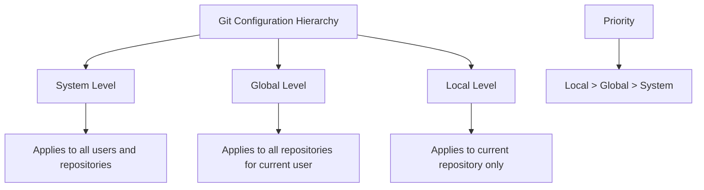

# Git Config Basics

## Introduction

Git configuration is one of the first tasks you'll need to tackle when starting with Git version control. Understanding how to properly configure Git helps you personalize your workflow, maintain consistency across projects, and optimize your Git experience.

In this guide, we'll explore the basics of Git configuration, including where Git stores configuration values, how to set and view configurations, and which essential settings every developer should know.

## Git Configuration Levels

Git maintains configurations at three different levels, each with different scopes and priority:

1. **System level** (`--system`): Applied to every user on the system and all their repositories
2. **Global level** (`--global`): Applied to all repositories for the current user
3. **Local level** (`--local`): Specific to the current repository only

Git follows a hierarchy when applying these configurations. Local settings override global settings, which override system settings.



## Configuration File Locations

Git stores configurations in plain text files that you can edit directly if needed:

- System level: `/etc/gitconfig` or `C:\Program Files\Git\etc\gitconfig` (Windows)
- Global level: `~/.gitconfig` or `~/.config/git/config` (user's home directory)
- Local level: `.git/config` (in the repository directory)

## Viewing Your Git Configuration

To see all your current Git configuration settings:

```bash
git config --list
```

The output might look like:

```
user.name=Jane Doe
user.email=jane@example.com
color.ui=auto
core.editor=vim
```

To view a specific configuration setting:

```bash
git config user.name
```

Output:
```
Jane Doe
```

To see where a specific configuration is defined:

```bash
git config --show-origin user.name
```

Output:
```
file:/home/jane/.gitconfig	Jane Doe
```

## Setting Up Basic Git Configuration

### Setting Your Identity

The first thing you should do after installing Git is to set your user name and email address:

```bash
git config --global user.name "Your Name"
git config --global user.email "your.email@example.com"
```

This configuration is crucial because Git embeds this information in every commit you make. Setting it at the global level means you only need to do this once for all your repositories.

### Configuring Your Editor

Git sometimes needs you to write messages (like for commits). You can specify your preferred text editor:

```bash
# For VS Code
git config --global core.editor "code --wait"

# For Vim
git config --global core.editor "vim"

# For Notepad++ (Windows)
git config --global core.editor "'C:/Program Files/Notepad++/notepad++.exe' -multiInst -notabbar -nosession -noPlugin"
```

### Setting Default Branch Name

Git 2.28 and later allows you to set the default branch name for new repositories:

```bash
git config --global init.defaultBranch main
```

### Configuring Line Endings

Different operating systems handle line endings differently. Configure Git to handle them properly:

```bash
# For Windows
git config --global core.autocrlf true

# For macOS or Linux
git config --global core.autocrlf input
```

## Practical Examples

### Creating User-Specific Configurations for Different Projects

Sometimes you might need different identities for different projects (e.g., work vs. personal):

```bash
# In your work repository
cd /path/to/work/repo
git config user.name "Your Name"
git config user.email "your.name@company.com"

# In your personal repository
cd /path/to/personal/repo
git config user.name "Your Name"
git config user.email "your.personal@example.com"
```

### Setting Up Aliases for Common Commands

Git aliases let you create shortcuts for frequently used commands:

```bash
# Create a 'git st' alias for 'git status'
git config --global alias.st status

# Create a 'git lg' alias for a pretty log format
git config --global alias.lg "log --graph --pretty=format:'%Cred%h%Creset -%C(yellow)%d%Creset %s %Cgreen(%cr) %C(bold blue)<%an>%Creset' --abbrev-commit --date=relative"
```

Now you can use `git st` instead of `git status` and `git lg` for a more readable log.

Example output of `git lg`:

```
* 7d1f3ab - (HEAD -> main) Add user authentication (2 hours ago) <Jane Doe>
* a5d2c1f - Update README with new instructions (1 day ago) <Jane Doe>
* 8e3f6c9 - (origin/main) Initial commit (2 days ago) <Jane Doe>
```

### Configuring Color Output

Make Git's output more readable with color:

```bash
git config --global color.ui auto
```

This enables colored output when it's going directly to a terminal, but omits it when you're redirecting to a file or another program.

## Common Configuration Settings

Here's a table of useful Git configuration settings:

| Setting | Purpose | Example |
|---------|---------|---------|
| `user.name` | Your name for commit identification | `git config --global user.name "Your Name"` |
| `user.email` | Your email for commit identification | `git config --global user.email "your.email@example.com"` |
| `core.editor` | Your preferred text editor | `git config --global core.editor "code --wait"` |
| `init.defaultBranch` | Default branch name for new repos | `git config --global init.defaultBranch main` |
| `color.ui` | Colored command output | `git config --global color.ui auto` |
| `core.autocrlf` | Line ending handling | `git config --global core.autocrlf input` |
| `pull.rebase` | Rebase branches on pull | `git config --global pull.rebase true` |
| `push.default` | Default push behavior | `git config --global push.default simple` |

## Removing Configuration Settings

To remove a setting from your configuration:

```bash
git config --global --unset user.name
```

For a multi-value setting:

```bash
git config --global --unset-all core.editor
```

## Troubleshooting Configuration Issues

If you're experiencing issues with Git configuration:

1. Check your current configuration with `git config --list --show-origin`
2. Verify which configuration level is being applied
3. Remember that local settings override global ones

## Summary

Git configuration gives you control over how Git behaves and provides ways to optimize your workflow. The most important configurations to set initially are your identity (name and email) and editor preferences. As you become more comfortable with Git, you can explore more advanced configurations like aliases and merge strategies to further enhance your experience.

Understanding Git's configuration levels (system, global, and local) helps you manage settings across different projects effectively. Remember that local configurations override global ones, which override system-level settings.

## Additional Resources

- [Official Git Documentation on Configuration](https://git-scm.com/docs/git-config)
- [Pro Git Book - Getting Started - First-Time Git Setup](https://git-scm.com/book/en/v2/Getting-Started-First-Time-Git-Setup)

## Exercises

1. Set up your global Git identity with your name and email.
2. Create a new repository and set a local identity different from your global one.
3. Create at least three useful Git aliases for commands you use frequently.
4. Configure Git to always use a specific merge tool of your choice.
5. Examine your complete Git configuration and identify settings you might want to change.