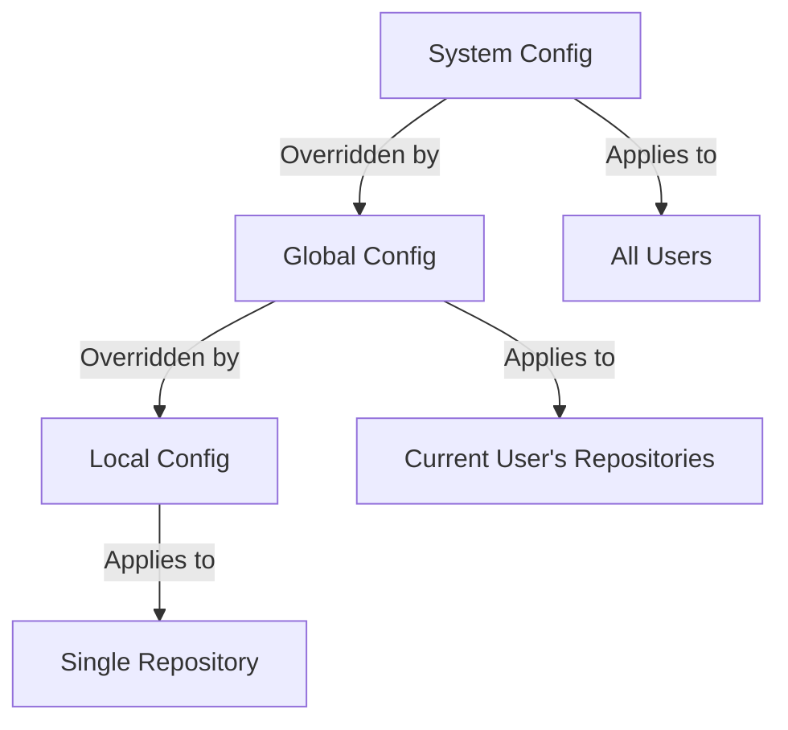

# Git User Configuration

## Introduction

When you start using Git, one of the first things you'll need to do is configure your user information. This is crucial because Git embeds this information into every commit you make, creating a permanent record of who made each change to the codebase. Proper Git user configuration not only helps identify who wrote what code, but also enables collaboration features in platforms like GitHub and GitLab.

In this guide, we'll walk through the essential user configuration settings in Git, explain why they matter, and demonstrate how to customize Git to fit your personal workflow.

## Understanding Git Configuration Levels

Git configuration can be applied at three different levels:

1. **System level** (`--system`): Applies to all users on the system
2. **Global level** (`--global`): Applies to all repositories for the current user
3. **Local level** (`--local`): Applies only to the current repository

These levels follow a hierarchy where local settings override global settings, which in turn override system settings.



## Setting Up Your User Identity

### Setting Your Username and Email

The most fundamental Git configuration is your identity information. Git requires a name and email address for each commit:

```bash
# Set your global username
git config --global user.name "Your Name"

# Set your global email
git config --global user.email "your.email@example.com"
```

This configuration will apply to all your Git repositories. You can verify your settings with:

```bash
# Check your username
git config user.name
# Output: Your Name

# Check your email
git config user.email
# Output: your.email@example.com
```

### Repository-Specific Identity

For some projects, you might want to use a different email address (for example, separating work and personal projects):

```bash
# Navigate to your repository
cd /path/to/your/repo

# Set repository-specific email
git config --local user.email "work.email@company.com"
```

Now when you make commits in this specific repository, they'll use your work email instead of your global email.

## Configuring Your Editor

Git often needs to open a text editor, especially for commit messages. You can configure which editor Git should use:

```bash
# Set default editor to VS Code
git config --global core.editor "code --wait"

# For Vim
git config --global core.editor "vim"

# For Nano
git config --global core.editor "nano"
```

The `--wait` flag for VS Code ensures Git waits for you to close the editor before proceeding.

## Configuring Line Endings

Different operating systems handle line endings differently, which can cause issues in cross-platform projects:

- Windows: Carriage Return + Line Feed (`CRLF`, or `\r
`)
- Unix/Mac: Line Feed only (`LF`, or `
`)

Git can automatically handle these differences:

```bash
# For Windows users (converts LF to CRLF when checking out code)
git config --global core.autocrlf true

# For Mac/Linux users (converts CRLF to LF when checking in code)
git config --global core.autocrlf input
```

## Aliases: Creating Your Own Git Commands

Git aliases let you create shortcuts for frequently used commands:

```bash
# Create a short alias for checkout
git config --global alias.co checkout

# Create an alias for branch
git config --global alias.br branch

# Create an alias for status
git config --global alias.st status

# Create an alias for commit
git config --global alias.ci commit
```

Now you can use these shortcuts:

```bash
# Instead of git checkout
git co main

# Instead of git status
git st
```

You can even create more complex aliases:

```bash
# Create an alias for a detailed log format
git config --global alias.lg "log --graph --pretty=format:'%Cred%h%Creset -%C(yellow)%d%Creset %s %Cgreen(%cr) %C(bold blue)<%an>%Creset' --abbrev-commit"
```

Now run `git lg` to see a colorful, detailed log of your repository.

## Viewing and Editing Your Configuration

### Viewing Your Configuration

To see all your current Git configurations:

```bash
# View all settings
git config --list

# Output example:
# user.name=Your Name
# user.email=your.email@example.com
# core.editor=code --wait
# ...more settings...
```

To see where a specific configuration is set:

```bash
# Check where user.email is configured
git config --show-origin user.email

# Output example:
# file:/home/username/.gitconfig    your.email@example.com
```

### Editing Configuration Files Directly

Git stores configuration in plain text files that you can edit directly:

- System config: `/etc/gitconfig`
- Global config: `~/.gitconfig` or `~/.config/git/config`
- Local config: `.git/config` in your repository

You can edit your global configuration file directly:

```bash
# Open global config in your editor
git config --global --edit
```

## Practical Examples

### Example 1: Setting Up for Multiple GitHub Accounts

If you have both personal and work GitHub accounts, you can configure Git to use different SSH keys for different repositories:

```bash
# In ~/.gitconfig
[includeIf "gitdir:~/personal/"]
    path = ~/.gitconfig-personal
[includeIf "gitdir:~/work/"]
    path = ~/.gitconfig-work
```

Then in `~/.gitconfig-personal`:

```
[user]
    name = Your Name
    email = personal@example.com
[core]
    sshCommand = "ssh -i ~/.ssh/personal_id_rsa"
```

And in `~/.gitconfig-work`:

```
[user]
    name = Your Name
    email = work@company.com
[core]
    sshCommand = "ssh -i ~/.ssh/work_id_rsa"
```

Now Git will automatically use the correct identity and SSH key based on the project location.

### Example 2: Custom Commit Template

You can create a commit message template to standardize your commit messages:

```bash
# Create a template file
echo "# [Feature/Fix/Docs/Style/Refactor/Test/Chore]: 

# Why is this change needed?

# How does it address the issue?

# Any additional notes?" > ~/.gitmessage

# Configure Git to use it
git config --global commit.template ~/.gitmessage
```

Now when you run `git commit` without the `-m` flag, your editor will open with this template.

## Summary

Proper Git user configuration is essential for effective version control and collaboration. In this guide, we've covered:

- Setting up your identity with `user.name` and `user.email`
- Understanding the three configuration levels (system, global, local)
- Configuring your default editor
- Managing line endings for cross-platform compatibility
- Creating aliases to streamline your workflow
- Viewing and editing your Git configuration
- Practical examples for real-world scenarios

By customizing your Git configuration, you can make your version control workflow more efficient and prevent common issues before they arise.

## Additional Resources

- [Git Documentation on Configuration](https://git-scm.com/docs/git-config)
- [Pro Git Book - Getting Started - First-Time Git Setup](https://git-scm.com/book/en/v2/Getting-Started-First-Time-Git-Setup)

## Exercises

1. Configure Git with your name and email address.
2. Create at least three Git aliases for commands you use frequently.
3. Set up a custom commit message template that follows a standard format.
4. Configure Git to use your preferred text editor.
5. For advanced users: Set up different Git configurations for different project directories.