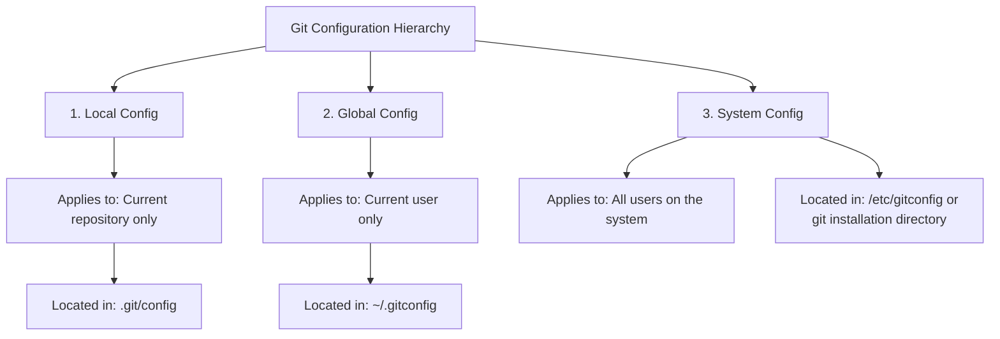

# Git System Config

## Introduction

When working with Git, you can customize its behavior using configuration settings. Git configurations can be applied at three different levels: local, global, and system. In this guide, we'll focus specifically on **system-level configurations**, which affect all users and repositories on your computer.

System configurations are particularly useful in multi-user environments or when you want to enforce certain Git behaviors consistently across your entire system. Understanding how to manage system configurations gives you powerful control over Git's default behavior.

## Understanding Git's Configuration Hierarchy

Before diving into system configs, let's understand where they fit in Git's configuration hierarchy:



The hierarchy works like this:

1. **Local configurations** (highest priority): Specific to a single repository
2. **Global configurations**: Apply to all repositories for the current user
3. **System configurations** (lowest priority): Apply to all users and all repositories on the system

When Git looks for a configuration value, it starts with the local config, then checks global, and finally checks system. The first value found is used.

## Accessing the System Config File

The system configuration file is typically located at:

- **Unix/Linux/macOS**: `/etc/gitconfig`
- **Windows**: `C:\Program Files\Git\etc\gitconfig` or similar installation path

You'll need administrative privileges to modify this file.

## Setting System-Level Configurations

### Using the Command Line

To set a system-level configuration, use the `--system` flag with the `git config` command:

```bash
sudo git config --system user.name "Default User"
sudo git config --system core.editor "nano"
```

Notice we use `sudo` on Unix-like systems since modifying system settings requires administrative privileges.

### Output

When you run these commands successfully, you won't see any output, but the configurations will be written to the system config file.

### Viewing System Configurations

To view all system-level configurations:

```bash
git config --system --list
```

Example output:
```
core.editor=nano
user.name=Default User
core.autocrlf=true
```

## Common System-Level Configurations

Here are some useful system-level configurations you might want to set:

### 1. Core Git Behavior

```bash
# Set default line ending behavior
sudo git config --system core.autocrlf input  # For Linux/Mac
sudo git config --system core.autocrlf true   # For Windows

# Set default editor for commit messages, etc.
sudo git config --system core.editor "vim"

# Make Git case-sensitive 
sudo git config --system core.ignorecase false
```

### 2. Default Template Directory

```bash
# Set a system-wide template directory for new repositories
sudo git config --system init.templatedir /path/to/templates
```

This is especially useful for organizations that want standard Git hooks or files in every new repository.

### 3. Security Settings

```bash
# Disable the credential helper system-wide
sudo git config --system credential.helper ""

# Configure system-wide HTTP proxy
sudo git config --system http.proxy http://proxy.example.com:8080
```

### 4. Default Branch Name

```bash
# Change the default initial branch name for all users
sudo git config --system init.defaultBranch main
```

## Practical Example: Setting Up a Company-Wide Git Configuration

Let's walk through a practical example where you're setting up Git for a company-wide development environment.

### Scenario

You want all developers on a shared system to have:
- Consistent line ending behavior
- The same default branch name (`main` instead of `master`)
- A company-specific commit template
- Specific external merge tool

### Solution

1. First, create a commit template file:

```bash
sudo mkdir -p /etc/git-templates
sudo nano /etc/git-templates/commit-template.txt
```

With content like:
```
# [Feature/Fix/Docs/Style/Refactor/Test/Chore]: Brief description

# Detailed explanation if needed

# Ticket: PROJECT-123
```

2. Then set up your system configuration:

```bash
# Set line ending behavior (ensures Unix-style line endings in repo)
sudo git config --system core.autocrlf input

# Set default branch name
sudo git config --system init.defaultBranch main

# Set commit template
sudo git config --system commit.template /etc/git-templates/commit-template.txt

# Configure merge tool
sudo git config --system merge.tool kdiff3
```

## Removing System Configurations

To remove a system configuration setting:

```bash
sudo git config --system --unset core.editor
```

To remove an entire section:

```bash
sudo git config --system --remove-section http
```

## When to Use System Configs vs. Global or Local

Use system-level configurations when:

- You want to enforce certain settings across all users on a machine
- You're setting up a shared development environment or server
- You need to implement company-wide Git policies

Use global or local configurations when:

- The setting should only affect a single user
- The setting is specific to a particular project
- You need to override a system setting for a specific case

## Troubleshooting System Configurations

### Issue: Permission Denied

```
error: could not lock config file /etc/gitconfig: Permission denied
```

**Solution**: Use administrator privileges (`sudo` on Unix/Linux/macOS, or run as Administrator on Windows).

### Issue: Configuration Not Taking Effect

If your system configuration isn't being applied, check:

1. Whether it's being overridden by global or local settings:
   ```bash
   git config --get core.editor  # Shows effective value
   git config --show-origin --get core.editor  # Shows which config file it's coming from
   ```

2. If the system config file is in the expected location:
   ```bash
   git config --system --list --show-origin
   ```

## Summary

Git system configurations provide a powerful way to standardize Git behavior across an entire system for all users. They are particularly valuable in organizational settings where consistent configuration is important.

Remember these key points:

- System configs apply to all users and all repositories on a system
- They have the lowest priority in Git's configuration hierarchy
- Modifying system configs requires administrative privileges
- They're stored in `/etc/gitconfig` on Unix-like systems or in Git's installation directory on Windows

By effectively using system-level Git configuration, you can create a more consistent and streamlined development environment for all users of your system.

## Additional Resources

- [Git Configuration Documentation](https://git-scm.com/docs/git-config)
- [Pro Git Book - Git Configuration](https://git-scm.com/book/en/v2/Customizing-Git-Git-Configuration)

## Exercises

1. Set up a system-wide Git configuration that enforces using your preferred text editor for all users.
2. Create a system-level configuration that sets a default Git hook to run a linting tool before each commit.
3. Configure Git at the system level to use a specific merge tool, then verify this setting is applied for a new user account.
4. Try to override a system setting with a global setting and observe the behavior.