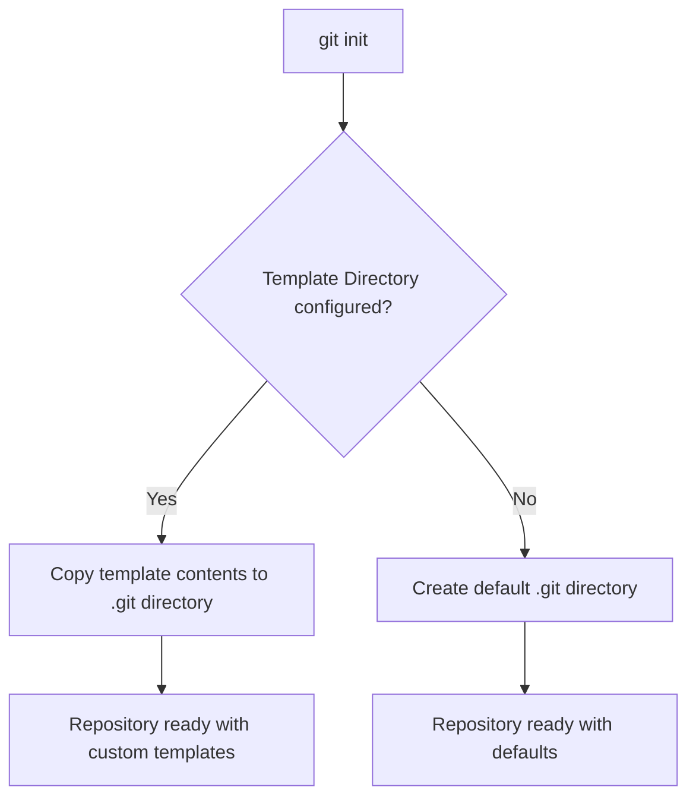

# Git Template Directory

## Introduction

When you initialize a new Git repository with `git init`, Git creates a basic structure with a `.git` directory. But what if you want every new repository to include certain files, hooks, or configurations by default? This is where Git template directories come in handy.

A Git template directory allows you to define a set of files that will be copied to the `.git` directory whenever you create a new repository. This feature is incredibly useful for maintaining consistency across projects, enforcing team standards, and automating repetitive setup tasks.

## What Is a Git Template Directory?

A Git template directory is simply a directory containing files and subdirectories that Git will use as a template when initializing a new repository. When you run `git init`, Git copies everything from the template directory into the new repository's `.git` directory.

This allows you to:
- Customize your Git hooks
- Set up standard Git configuration
- Include useful scripts
- Add template files like README templates or contribution guidelines
- Enforce coding standards

## Configuring a Template Directory

### Setting Up Your Template Directory

First, you need to create a directory that will serve as your template:

```bash
mkdir -p ~/git-templates/hooks
```

### Creating Template Files

Let's create a sample commit message template:

```bash
echo "# [TYPE]: Short description (50 chars or less)

# Body: More detailed explanatory text if needed. Wrap at 72 chars.
# Include motivation for the change and contrast with previous behavior.

# Issue: #123
# Co-authored-by: Name <email@example.com>
" > ~/git-templates/commit-template.txt
```

Next, let's add a pre-commit hook to check for trailing whitespace:

```bash
cat > ~/git-templates/hooks/pre-commit << 'EOF'
#!/bin/sh

# Check for trailing whitespace
if git diff --cached --name-only | xargs grep --with-filename -n '[[:blank:]]$' > /tmp/whitespace.txt 2>&1; then
    echo "Error: Trailing whitespace found in the following files:"
    cat /tmp/whitespace.txt
    exit 1
fi

exit 0
EOF

chmod +x ~/git-templates/hooks/pre-commit
```

### Configuring Git to Use Your Template Directory

Once you've set up your template directory, you need to tell Git to use it. This is done through the `init.templateDir` configuration:

```bash
git config --global init.templateDir ~/git-templates
```

Now, whenever you run `git init`, Git will copy the contents of your template directory to the newly created `.git` directory.

## Using Templates in Practice

### Example 1: Creating a New Repository with Templates

Let's see what happens when we create a new repository:

```bash
mkdir my-new-project
cd my-new-project
git init
```

Output:
```
Initialized empty Git repository in /path/to/my-new-project/.git/
```

If we look in the `.git` directory, we'll see our template files have been copied:

```bash
ls -la .git/hooks/
```

Output:
```
total 16
drwxr-xr-x 2 user user 4096 Nov 15 10:30 .
drwxr-xr-x 8 user user 4096 Nov 15 10:30 ..
-rwxr-xr-x 1 user user  275 Nov 15 10:30 pre-commit
```

### Example 2: Setting Up a Team-wide Template

For team projects, you might want everyone to use the same template. You can create a shared template in your project or organization repository:

```bash
# In your organization's setup repository
mkdir -p git-templates/hooks

# Create various hooks and templates...

# Tell team members to configure Git to use this template
# Instructions for team:
# git config --global init.templateDir /path/to/shared/git-templates
```

This ensures everyone on the team follows the same standards and workflow.

## Common Template Directory Contents

A well-structured Git template directory might include:

1. **Hooks directory** (`hooks/`):
   - `pre-commit`: Run tests or linting before commits
   - `commit-msg`: Validate commit message format
   - `pre-push`: Run integration tests before pushing

2. **Info directory** (`info/`):
   - `exclude`: Global patterns to ignore

3. **Template files**:
   - `description`: Repository description
   - `commit-template.txt`: Standard commit message format

## Customizing Templates for Different Projects

You can have multiple template directories for different project types:

```bash
# For Python projects
git config --local init.templateDir ~/git-templates/python

# For JavaScript projects
git config --local init.templateDir ~/git-templates/javascript
```

## Important Considerations

1. **Template files are only copied on initialization**: Changes to your template directory won't affect existing repositories. They only affect new repositories created after the changes.

2. **Executable permissions matter**: Make sure your hook scripts have executable permissions (`chmod +x`).

3. **Templates can be overridden**: Local repository settings can override template settings.

## Visualizing the Template Process



## Common Use Cases

### Enforcing Code Quality

You can use template hooks to enforce code quality standards:

```bash
# In pre-commit hook
if command -v eslint >/dev/null 2>&1; then
  echo "Running ESLint..."
  eslint . || exit 1
fi
```

### Standardizing Commit Messages

You can configure Git to use your commit template:

```bash
git config --global commit.template ~/git-templates/commit-template.txt
```

### Automating Repository Setup

You can include scripts that set up common configurations:

```bash
# In post-create hook
npm init -y
git flow init -d
```

## Summary

Git template directories provide a powerful way to standardize your Git repositories and automate repetitive setup tasks. By setting up a template directory, you can ensure consistent configurations, hooks, and files across all your new Git repositories.

To get started with Git templates:
1. Create a template directory
2. Add your desired hooks, configurations, and template files
3. Set the `init.templateDir` configuration to point to your template directory
4. Create new repositories with `git init`

Templates are especially valuable for team environments where consistency is crucial, helping to enforce standards and streamline workflows for everyone.

## Further Resources

- [Git Documentation on Templates](https://git-scm.com/docs/git-init#_template_directory)
- [Git Hooks Documentation](https://git-scm.com/docs/githooks)
- [Pro Git Book - Git Configuration](https://git-scm.com/book/en/v2/Customizing-Git-Git-Configuration)

## Exercises

1. Create a template directory with a pre-commit hook that enforces a specific code style.
2. Set up a commit message template that follows the Conventional Commits specification.
3. Create different template directories for different programming languages or frameworks.
4. Add a hook that runs appropriate tests based on the files being committed.