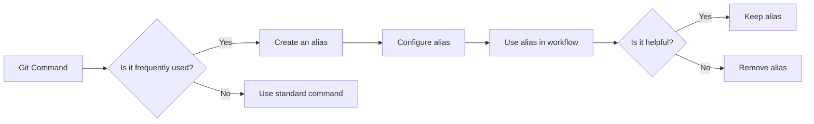

# Git Aliases

## Introduction

Have you ever found yourself typing the same lengthy Git commands over and over again? Git aliases are shortcuts that allow you to create custom, shorter commands for frequently used Git operations. By setting up aliases, you can save time, reduce typing errors, and make your Git workflow more efficient.

Think of Git aliases as creating your own personal Git command shortcuts. Instead of typing `git commit -m "message"` every time, you could set up an alias to simply type `git cm "message"`.

## What Are Git Aliases?

Git aliases are custom shortcuts defined in your Git configuration that map a short command to a longer one. When you execute the alias, Git replaces it with the corresponding command.

For example, you could create an alias `co` for the command `checkout`:

```bash
$ git config --global alias.co checkout
```

After setting this up, instead of typing:

```bash
$ git checkout main
```

You can simply type:

```bash
$ git co main
```

## Setting Up Git Aliases

There are two primary ways to create Git aliases:

### 1. Using Git Config Command

The most straightforward way to create an alias is with the `git config` command:

```bash
$ git config --global alias.alias_name command_to_execute
```

For example:

```bash
$ git config --global alias.st status
```

This creates a global alias `st` for the `status` command.

### 2. Editing the Git Config File Directly

You can also add aliases by editing your `.gitconfig` file directly. This file is typically located in your home directory:

```bash
[alias]
    st = status
    co = checkout
    ci = commit
    br = branch
```

## Practical Examples of Useful Git Aliases

Let's explore some useful Git aliases that can improve your workflow:

### Basic Aliases for Common Commands

```bash
$ git config --global alias.st status
$ git config --global alias.co checkout
$ git config --global alias.ci commit
$ git config --global alias.br branch
```

### More Complex Aliases

#### Shortened Commit with Message

```bash
$ git config --global alias.cm "commit -m"
```

Usage:

```bash
$ git cm "Add new feature"
```

#### Pretty Log Output

```bash
$ git config --global alias.lg "log --graph --pretty=format:'%Cred%h%Creset -%C(yellow)%d%Creset %s %Cgreen(%cr) %C(bold blue)<%an>%Creset' --abbrev-commit"
```

Before:
```bash
$ git log --graph --pretty=format:'%Cred%h%Creset -%C(yellow)%d%Creset %s %Cgreen(%cr) %C(bold blue)<%an>%Creset' --abbrev-commit
```

After:
```bash
$ git lg
```

Output:
```
* a1b2c3d - (HEAD -> main) Add new feature (2 hours ago) <Developer Name>
* e4f5g6h - Fix bug in login form (1 day ago) <Developer Name>
* i7j8k9l - Initial commit (2 days ago) <Developer Name>
```

#### Show Unstaged Changes

```bash
$ git config --global alias.df "diff"
```

#### Show Staged Changes

```bash
$ git config --global alias.dfs "diff --staged"
```

#### Last Commit Details

```bash
$ git config --global alias.last "log -1 HEAD"
```

#### Undo Last Commit (Keeping Changes)

```bash
$ git config --global alias.undo "reset HEAD~1 --soft"
```

## Creating Aliases for Git Workflows

Git aliases can also be used to create shortcuts for common workflows:

### Quick Add and Commit

```bash
$ git config --global alias.ac "!git add . && git commit -m"
```

Usage:

```bash
$ git ac "Update documentation"
```

This adds all changes and commits them with the given message.

### Quick Push to Origin

```bash
$ git config --global alias.po "push origin"
```

Usage:

```bash
$ git po main
```

### Sync with Remote Branch

```bash
$ git config --global alias.sync "!git pull && git push"
```

## Aliases with External Commands

You can create aliases that run external commands by prefixing the command with an exclamation mark (`!`):

```bash
$ git config --global alias.echo "!echo 'Hello from Git'"
```

Usage:

```bash
$ git echo
Hello from Git
```

## Viewing Your Git Aliases

To view all your configured aliases:

```bash
$ git config --global --get-regexp alias
```

Output might look like:

```
alias.st status
alias.co checkout
alias.ci commit
alias.br branch
alias.lg log --graph --pretty=format:'%Cred%h%Creset -%C(yellow)%d%Creset %s %Cgreen(%cr) %C(bold blue)<%an>%Creset' --abbrev-commit
```

## Removing Git Aliases

If you want to remove an alias:

```bash
$ git config --global --unset alias.alias_name
```

For example:

```bash
$ git config --global --unset alias.st
```

## Best Practices for Git Aliases

1. **Keep aliases intuitive**: Use shorthand that makes sense to you and is easy to remember.
2. **Document your aliases**: Consider keeping a personal document with all your aliases and what they do.
3. **Start simple**: Begin with aliases for the commands you use most frequently.
4. **Share with your team**: Share useful aliases with teammates to improve overall workflow.
5. **Don't go overboard**: Too many aliases can become confusing. Focus on the ones that truly save time.



## Common Patterns in Git Aliases

### Shortening Commands
The most common pattern is to shorten a long command:
```bash
$ git config --global alias.unstage "reset HEAD --"
```

### Command Combinations
Combining multiple commands into a single workflow:
```bash
$ git config --global alias.refresh "!git fetch && git pull"
```

### Making Commands More User-Friendly
Creating more intuitive commands:
```bash
$ git config --global alias.branches "branch -a"
$ git config --global alias.tags "tag -l"
```

## Summary

Git aliases are powerful tools that can significantly improve your productivity when working with Git. By creating shortcuts for commands you use frequently, you can save time, reduce errors, and make your Git workflow more efficient.

To get started:
1. Identify the Git commands you use most often
2. Create aliases for these commands
3. Use your aliases regularly to build muscle memory
4. Continuously refine your aliases as your workflow evolves

## Exercises

1. Create aliases for at least five Git commands you use regularly.
2. Create a complex alias that combines multiple Git operations.
3. Share your favorite Git alias with a colleague and explain why it's useful.
4. Review your existing aliases and remove any that you don't use regularly.

## Additional Resources

- [Git Documentation on Aliases](https://git-scm.com/book/en/v2/Git-Basics-Git-Aliases)
- [Pro Git Book - Chapter on Git Configuration](https://git-scm.com/book/en/v2/Customizing-Git-Git-Configuration)
- [GitHub Blog - Git Tips & Tricks](https://github.blog/2020-04-09-github-protips-tips-tricks-hacks-and-secrets-from-lee-reilly/)