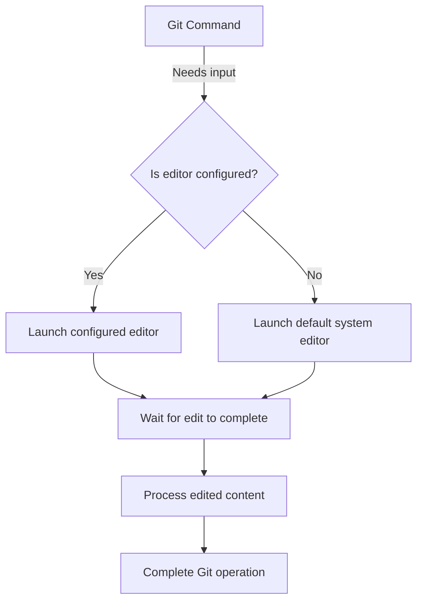

# Git Editor

## Introduction

When using Git, you'll frequently need to write commit messages, edit interactive rebase files, or resolve merge conflicts. Git uses a text editor for these operations. By default, Git uses your system's default editor, which might be Vim, Nano, or something else depending on your operating system. However, you can configure Git to use any text editor of your choice.

In this guide, you'll learn:
- How Git uses text editors
- How to check your current Git editor
- How to change your Git editor
- Common options for different editors
- Troubleshooting editor issues

## How Git Uses Your Editor

Git launches your configured text editor in several scenarios:

1. **Writing commit messages**: When you run `git commit` without the `-m` flag
2. **Interactive rebase**: When performing operations like `git rebase -i`
3. **Resolving merge conflicts**: When Git can't automatically resolve conflicts
4. **Editing patch files**: When using commands like `git add -e`

Having a comfortable editor configured makes these tasks much easier, especially for more complex operations.

## Checking Your Current Git Editor

To see which editor Git is currently configured to use, run:

```bash
git config --global core.editor
```

If you haven't set an editor explicitly, this might not return anything, indicating Git will use the default system editor (often determined by the `EDITOR` or `VISUAL` environment variables).

You can also check all your Git configurations with:

```bash
git config --list
```

And look for the `core.editor` entry in the output.

## Setting Your Git Editor

You can configure your preferred editor using the `git config` command:

```bash
git config --global core.editor "editor-command-with-arguments"
```

The `--global` flag makes this setting apply to all your Git repositories. If you want to set the editor for a specific repository only, you can run the command without this flag from within that repository.

## Common Editor Configurations

Here are configuration commands for popular text editors:

### Visual Studio Code

```bash
git config --global core.editor "code --wait"
```

The `--wait` flag tells the terminal to wait until you close the file in VS Code before proceeding.

### Sublime Text

```bash
git config --global core.editor "subl -n -w"
```

### Atom

```bash
git config --global core.editor "atom --wait"
```

### Vim (already the default on many systems)

```bash
git config --global core.editor "vim"
```

### Nano

```bash
git config --global core.editor "nano"
```

### Notepad++ (Windows)

```bash
git config --global core.editor "'C:/Program Files/Notepad++/notepad++.exe' -multiInst -notabbar -nosession -noPlugin"
```

### TextEdit (macOS)

```bash
git config --global core.editor "open -W -n"
```

## Example: Changing Your Git Editor to VS Code

Let's walk through a complete example of changing your Git editor to Visual Studio Code:

1. First, make sure VS Code is installed and that the `code` command is available in your terminal.
2. Run the following command:

```bash
git config --global core.editor "code --wait"
```

3. To verify the change, check your configuration:

```bash
git config --global core.editor
```

Output:
```
code --wait
```

4. Test it by creating a commit without a message:

```bash
# After making some changes to your files
git add .
git commit
```

VS Code should open with a file for your commit message. After you write your message, save the file and close the tab, the commit will complete.

## Using Different Editors for Different Operations

Git allows you to set different editors for different operations using more specific configuration variables:

- `core.editor`: The default editor for all operations
- `commit.template`: A template file for commit messages
- `merge.tool`: The tool to use for merge conflict resolution

For example, you might want to use a simple editor like Nano for quick commit messages but a more powerful editor like VS Code for resolving merge conflicts:

```bash
git config --global core.editor "nano"
git config --global merge.tool "code --wait"
```

## Troubleshooting Editor Issues

### Editor Doesn't Open

If your editor doesn't open when expected:

1. Make sure the editor is installed and accessible from your command line
2. Check if the path to the editor is correct in your Git configuration
3. Verify that any arguments you're passing to the editor are valid

### Git Command Hangs

If your Git command seems to hang, it might be because:

1. The `--wait` flag is missing, and Git is waiting for the editor to close even though it's already running
2. The editor is open but in a different window or minimized
3. The editor encountered an error

You can abort a hanging Git command with `Ctrl+C` in most terminals.

## Working with Commit Messages

When writing commit messages, following these best practices will make your Git history more useful:

1. Write a concise summary (under 50 characters) on the first line
2. Leave a blank line after the summary
3. Add a detailed explanation if necessary
4. Use the present tense ("Add feature" instead of "Added feature")

Here's an example of a good commit message:

```
Add user authentication feature

- Implement login/logout functionality
- Create JWT token-based auth system
- Add password hashing with bcrypt
- Set up user session management
```

Your configured editor makes following these practices easier, especially if you use an editor with features like syntax highlighting and line wrapping.

## Workflow Diagram

Here's a visualization of how Git interacts with your editor:



## Summary

Configuring your Git editor is a simple but powerful customization that can significantly improve your workflow. By selecting an editor you're comfortable with, you'll make Git operations that require text input more efficient and less prone to errors.

Remember:
- Use `git config --global core.editor "your-editor-command"` to set your preferred editor
- Different editors require different command-line arguments
- Test your configuration with a simple commit to ensure it works properly
- Consider setting different editors for different Git operations if needed

## Additional Resources

- [Git Documentation on Configuration](https://git-scm.com/docs/git-config)
- [Pro Git Book - Customizing Git](https://git-scm.com/book/en/v2/Customizing-Git-Git-Configuration)

## Exercises

1. Configure Git to use your favorite text editor
2. Create a commit without using the `-m` flag and write a multi-line commit message
3. Try setting up different editors for different Git operations
4. Create a custom commit message template and configure Git to use it
5. Practice resolving a merge conflict using your configured editor