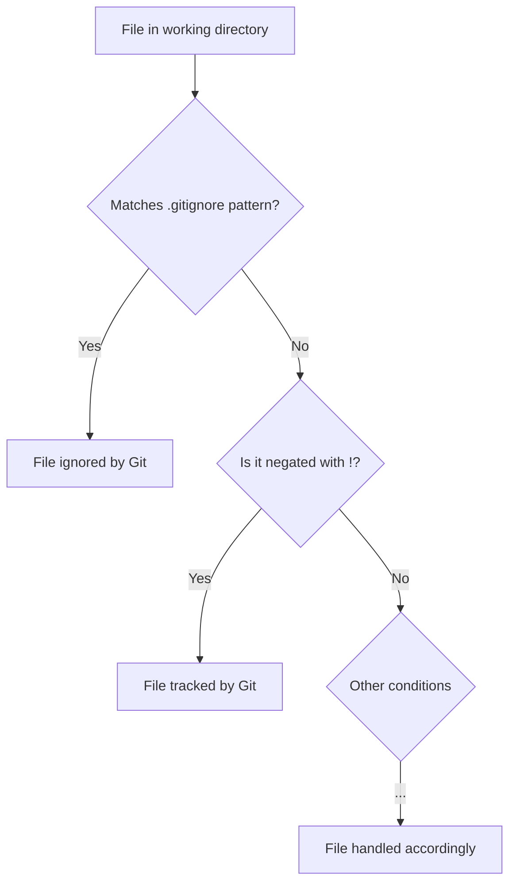

# Git Ignore

## Introduction

When working with Git repositories, you'll often have files that you don't want to track or include in your version control system. These might include:

- Build artifacts and compiled files
- Personal IDE configuration files
- Environment-specific configuration files
- Large binary files
- Dependency directories like `node_modules` or `venv`
- Log files and temporary files

Git provides a powerful mechanism called `.gitignore` that allows you to specify patterns for files and directories that Git should ignore. This tutorial will walk you through how to set up and use `.gitignore` effectively in your projects.

## What is a .gitignore File?

A `.gitignore` file is a plain text file that tells Git which files or folders to ignore in a project. Each line in a `.gitignore` file specifies a pattern, and any file or directory that matches that pattern will be ignored by Git.

## Creating a .gitignore File

You can create a `.gitignore` file in the root directory of your repository using any text editor:

```bash
# Navigate to your repository
cd my-project

# Create a .gitignore file
touch .gitignore

# Open it in your preferred text editor
nano .gitignore
```

## Basic .gitignore Syntax

Let's look at the basic syntax rules for `.gitignore` files:

```plaintext
# This is a comment in .gitignore

# Ignore a specific file
filename.txt

# Ignore all files with a specific extension
*.log

# Ignore a specific directory
node_modules/

# Ignore all files in a directory but keep the directory
logs/*
!logs/.gitkeep

# Use negation to keep specific files
*.pdf
!important.pdf
```

### Key Pattern Rules

- Lines starting with `#` are comments
- `*` matches zero or more characters
- `?` matches exactly one character
- `[abc]` matches any character inside the brackets
- `**` matches nested directories (e.g., `logs/**/*.log` matches all `.log` files in the `logs` directory and all its subdirectories)
- Patterns ending with `/` specify a directory
- Patterns starting with `/` match from the repository root
- Patterns starting with `!` negate a match (include a previously excluded file)

## Common .gitignore Patterns

Here are some commonly used patterns for different programming environments:

### For Node.js Projects

```plaintext
# Dependencies
node_modules/
npm-debug.log
yarn-error.log
yarn-debug.log
.pnpm-debug.log

# Environment variables
.env
.env.local
.env.development.local
.env.test.local
.env.production.local

# Build outputs
/dist
/build
```

### For Python Projects

```plaintext
# Byte-compiled files
__pycache__/
*.py[cod]
*$py.class

# Distribution / packaging
dist/
build/
*.egg-info/

# Virtual environments
venv/
env/
ENV/

# Jupyter Notebook
.ipynb_checkpoints
```

### For Java Projects

```plaintext
# Compiled class files
*.class

# Build directories
/target/
/bin/
/out/

# Package files
*.jar
*.war
*.ear

# Maven
target/
```

## Practical Example: Setting Up .gitignore for a Web Project

Let's walk through a practical example of setting up a `.gitignore` file for a full-stack web application that uses React for the frontend and Node.js for the backend.

1. First, create a `.gitignore` file in your project root:

```bash
touch .gitignore
```

2. Add appropriate patterns to ignore common files and directories:

```plaintext
# Dependencies
/node_modules
/client/node_modules
/server/node_modules

# Production builds
/build
/client/build
/dist

# Environment variables and secrets
.env
.env.local
.env.development.local
.env.test.local
.env.production.local

# Logs
npm-debug.log*
yarn-debug.log*
yarn-error.log*
logs
*.log

# IDE specific files
.idea/
.vscode/
*.sublime-project
*.sublime-workspace

# Operating System Files
.DS_Store
.DS_Store?
._*
.Spotlight-V100
.Trashes
ehthumbs.db
Thumbs.db

# Test coverage
/coverage
```

## Global .gitignore

Sometimes, you may want to ignore certain files across all of your Git repositories. For example, you might want to ignore IDE configuration files or OS-specific files. Instead of adding these to every project's `.gitignore`, you can create a global `.gitignore` file:

```bash
# Create a global .gitignore file
git config --global core.excludesfile ~/.gitignore_global

# Edit the global .gitignore file
nano ~/.gitignore_global
```

Add patterns for files you want to ignore globally:

```plaintext
# IDE files
.idea/
.vscode/
*.sublime-project
*.sublime-workspace

# OS files
.DS_Store
.DS_Store?
._*
.Spotlight-V100
.Trashes
ehthumbs.db
Thumbs.db

# Temporary files
*.swp
*.swo
*~
```

## Checking Ignored Status

To check if a file is being ignored by Git, use the `git check-ignore` command:

```bash
git check-ignore -v filename.txt
```

The output will show which pattern in which `.gitignore` file is causing the file to be ignored:

```
.gitignore:3:*.txt    filename.txt
```

## Ignoring Already Tracked Files

If you've already committed a file that you now want to ignore, you'll need to remove it from Git's tracking first:

```bash
# Remove the file from Git tracking but keep it locally
git rm --cached filename.txt

# Update .gitignore to include the file pattern
echo "filename.txt" >> .gitignore

# Commit these changes
git commit -m "Stop tracking filename.txt"
```

## .gitignore Templates

GitHub maintains a repository of `.gitignore` templates for various programming languages and frameworks. You can find them at [github.com/github/gitignore](https://github.com/github/gitignore) and use them as a starting point for your projects.

Alternatively, you can use [gitignore.io](https://www.gitignore.io/) (now at [toptal.com/developers/gitignore](https://www.toptal.com/developers/gitignore)) to generate custom `.gitignore` files based on your project's languages and tools.

## Visualizing .gitignore Flow

Here's a diagram that illustrates how Git processes files with `.gitignore` rules:



## Summary

The `.gitignore` file is an essential tool for keeping your Git repositories clean and focused on the code and assets that matter. By properly configuring `.gitignore`, you can prevent unwanted files from being tracked, avoid committing sensitive information, and reduce repository bloat.

Key points to remember:

- Create a `.gitignore` file in your repository root
- Use patterns to specify which files and directories to ignore
- You can have multiple `.gitignore` files in different directories
- Set up a global `.gitignore` for system-specific files
- Use templates from GitHub or gitignore.io as starting points
- Remove already tracked files with `git rm --cached` before ignoring them

## Exercises

1. Create a `.gitignore` file for a project in your preferred programming language.
2. Set up a global `.gitignore` file for your system-specific files.
3. Clone an existing repository, add appropriate `.gitignore` patterns, and verify which files are now ignored using `git status`.
4. Experiment with nested `.gitignore` files to apply different ignore rules to different subdirectories in your project.
5. Try using the negation pattern (`!`) to include a specific file that would otherwise be ignored by a broader pattern.

## Additional Resources

- [Git Documentation on gitignore](https://git-scm.com/docs/gitignore)
- [GitHub's collection of .gitignore templates](https://github.com/github/gitignore)
- [gitignore.io - Generate useful .gitignore files](https://www.toptal.com/developers/gitignore)
- [Pro Git Book - Chapter on .gitignore](https://git-scm.com/book/en/v2/Git-Basics-Recording-Changes-to-the-Repository#_ignoring)