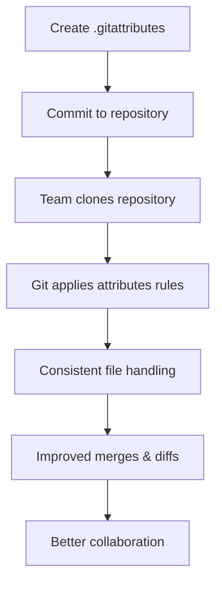

# Git Attributes

## Introduction

Git Attributes are a powerful feature in Git that allow you to customize how Git handles specific files or directories in your repository. Just as `.gitignore` helps you control which files Git tracks, `.gitattributes` helps you control how Git processes those tracked files.

Whether you need to enforce consistent line endings across different operating systems, define custom merge strategies for certain file types, or specify how Git should display binary files in diffs, Git Attributes provide the solution.

## What Are Git Attributes?

Git Attributes are rules defined in a `.gitattributes` file that tell Git how to handle specific files or file patterns. These rules can control:

- Line ending conversions
- Diff and merge strategies
- How files appear in `git diff` output
- Whether Git should treat certain files as text or binary
- And much more!

The `.gitattributes` file should be committed to your repository so that all contributors follow the same rules.

## Basic Syntax

The syntax for Git Attributes is straightforward:

```
pattern attr1 attr2 ...
```

Where:
- `pattern` is a file pattern (similar to `.gitignore` patterns)
- `attr1`, `attr2`, etc. are the attributes to apply to files matching that pattern

Attributes can be set to:
- `true` (or simply stating the attribute name)
- `false` (prefixing with a dash: `-attribute`)
- A specific value (using equals sign: `attribute=value`)

## Creating a .gitattributes File

To start using Git Attributes, create a file named `.gitattributes` in the root of your repository:

```bash
touch .gitattributes
```

Then, add rules to the file using your text editor. Here's an example of a basic `.gitattributes` file:

```
# Set default behavior to automatically normalize line endings
* text=auto

# Explicitly declare text files to always be normalized and converted
# to native line endings on checkout
*.txt text
*.md text
*.js text

# Declare files that will always have CRLF line endings on checkout
*.bat text eol=crlf

# Denote all files that are truly binary and should not be modified
*.png binary
*.jpg binary
```

## Common Use Cases

### 1. Line Ending Normalization

One of the most common uses for Git Attributes is managing line endings across different operating systems. Windows typically uses CRLF (`\r
`) while Unix-based systems use LF (`
`).

```
# Normalize all text files
* text=auto

# Always use LF for these files
*.sh text eol=lf
*.py text eol=lf

# Always use CRLF for these files
*.bat text eol=crlf
*.cmd text eol=crlf
```

This configuration ensures:
- All text files are normalized to LF in the repository
- Shell and Python scripts always keep LF endings, even on Windows
- Batch files always use CRLF, which is required for Windows

### 2. Defining Custom Diff Strategies

For file types that aren't plain text, Git's default diff output might not be very helpful. You can specify custom diff drivers for these files:

```
# Use word-diff for documentation
*.md diff=markdown
*.txt diff=text

# Use special diff for image files
*.png diff=image
*.jpg diff=image

# Custom diff for Word documents
*.docx diff=word
```

To use these custom diff strategies, you'll need to configure them in your Git config:

```bash
git config --global diff.markdown.wordRegex '[^[:space:][:punct:]]+'
git config --global diff.image.textconv 'identify -format "%wx%h"'
git config --global diff.word.textconv 'pandoc --to=markdown'
```

### 3. Handling Binary Files

Git can sometimes misidentify binary files as text. You can explicitly mark files as binary:

```
# Mark as binary (no diff, no merge, no text conversion)
*.png binary
*.jpg binary
*.pdf binary
*.zip binary
```

The `binary` attribute is actually a macro that sets multiple attributes: `-text -diff -merge`.

### 4. Export Ignore

When creating archives with `git archive`, you might want to exclude certain files:

```
# Exclude these files/directories from archives
.gitattributes export-ignore
.gitignore export-ignore
/tests export-ignore
README.dev.md export-ignore
```

### 5. Language-specific Attributes

You can set language-specific attributes for better syntax highlighting in diffs:

```
# Define language for syntax highlighting
*.js linguist-language=JavaScript
*.jsx linguist-language=JavaScript
*.ts linguist-language=TypeScript
*.tsx linguist-language=TypeScript
```

## Working with .gitattributes

### Checking Effective Attributes

To see what attributes Git has assigned to a file:

```bash
git check-attr -a -- filename
```

For example:

```
$ git check-attr -a -- README.md
README.md: text: auto
README.md: diff: markdown
```

### Global vs. Local Attributes

Git Attributes can be defined at different levels:

1. Repository-specific: in `.gitattributes` files throughout your repository
2. Globally for all repositories: in `~/.gitconfig` or `~/.config/git/attributes`

For repository-specific settings, you can have multiple `.gitattributes` files in different directories. Rules in deeper directories override rules from parent directories.

For global settings, configure them with:

```bash
git config --global core.attributesfile ~/.gitattributes
```

## Practical Examples

### Example 1: Setting Up a Cross-Platform Project

If you're working on a project that needs to be consistent across Windows, macOS, and Linux, you might use:

```
# Default: normalize line endings
* text=auto

# Scripts must use LF
*.sh text eol=lf
*.bash text eol=lf
*.py text eol=lf

# Windows scripts must use CRLF
*.bat text eol=crlf
*.cmd text eol=crlf

# Binary files
*.png binary
*.jpg binary
*.gif binary
*.ico binary
```

### Example 2: Managing a Web Development Project

For a web project, you might want specific rules for different file types:

```
# Source code
*.html text diff=html
*.css text diff=css
*.js text diff=javascript
*.json text

# Graphics
*.png binary
*.jpg binary
*.svg text

# Enforce LF line endings for all text files
* text=auto eol=lf

# Don't include certain files in exports/archives
/tests export-ignore
/.github export-ignore
.eslintrc.json export-ignore
```

### Example 3: Handling Generated Files

For projects with generated files that shouldn't be merged normally:

```
# Generated files - don't try to merge these
package-lock.json -diff -merge
yarn.lock -diff -merge
*.min.js -diff -merge

# Generated source maps
*.map -diff -merge
```

## Integration with Git Workflows

Git Attributes become even more powerful when integrated into your development workflow:



## Common Mistakes and Troubleshooting

### Mistake 1: Not Committing .gitattributes

The `.gitattributes` file should be committed to your repository so all team members benefit from the same rules.

### Mistake 2: Incorrect Syntax

Make sure you're using the correct syntax. Common errors include:

- Forgetting to separate patterns and attributes with spaces
- Using incorrect file patterns
- Misusing the attribute specifiers (`=`, `-`, etc.)

### Mistake 3: Order of Rules

Git applies rules in order, with later rules overriding earlier ones for matching files. Review your rules carefully if you see unexpected behavior.

### Troubleshooting

If attributes aren't working as expected:

1. Check effective attributes with `git check-attr -a -- [filename]`
2. Ensure your `.gitattributes` file is correctly formatted
3. Check if you have conflicting global attributes
4. Try clearing the Git attribute cache: `git update-index --refresh`

## Summary

Git Attributes provide a powerful way to customize Git's behavior for specific files in your repository. By properly configuring a `.gitattributes` file, you can:

- Ensure consistent line endings across platforms
- Improve diff and merge handling for different file types
- Control which files are included in archives
- Define how Git treats binary files

Understanding and using Git Attributes will help you maintain a cleaner repository and improve collaboration within your team.

## Additional Resources

- [Git Documentation: gitattributes](https://git-scm.com/docs/gitattributes)
- [GitHub: gitattributes templates](https://github.com/gitattributes/gitattributes)
- [Pro Git Book: Customizing Git - Git Attributes](https://git-scm.com/book/en/v2/Customizing-Git-Git-Attributes)

## Exercises

1. Create a `.gitattributes` file for a project that includes JavaScript, CSS, HTML, and image files.
2. Configure custom diff strategies for at least two different file types in your project.
3. Set up line ending normalization that ensures shell scripts always use LF, while batch files use CRLF.
4. Use `git check-attr` to verify your attributes are correctly applied to different files.
5. Configure export-ignore for test and documentation files in your project.